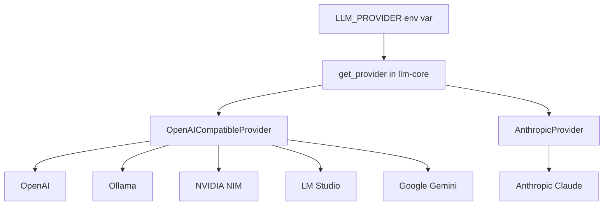

# Module 00 — Setup & Providers

Your first contact with the course. By the end you'll have sent a real prompt to
a real model and seen the answer, the model id, and the token count — from
**both** Python and TypeScript, against **two different providers**.

This module is deliberately small. Its job is to make the rest of the course
_just work_: one tiny interface (`get_provider()` / `getProvider()`) that you'll
reuse in every later module, and a clear mental model of what's actually
happening when you "call an LLM".

---

## Concepts

### What is an "LLM provider"?

A large language model (LLM) is a big neural network that, given some text,
predicts what text should come next. You almost never run that network
yourself — it's tens of gigabytes and wants a GPU (Graphics Processing Unit). Instead a **provider** hosts
it behind an HTTP (HyperText Transfer Protocol) API (Application Programming Interface): you POST some messages, they stream back tokens.

In this course a _provider_ is any service that can answer the same three
questions:

1. **chat** — given a conversation, produce a reply.
2. **chat (streaming)** — same, but emit the reply token-by-token as it's generated.
3. **embed** — turn text into a vector of numbers (used from module 04 on).

`llm-core` (in `packages/`) wraps six of them — OpenAI, Anthropic (Claude),
Ollama, NVIDIA NIM (NVIDIA Inference Microservices), LM Studio, and Google Gemini — behind one interface so your
exercise code never hard-codes a vendor. You'll see _why_ that abstraction is
possible below, and _where it leaks_ in module 02.

The whole routing story in one picture — one env var picks the provider, one
shared class covers five of the six:



### Why the OpenAI HTTP shape is a de-facto standard

When OpenAI shipped `/v1/chat/completions`, the request/response JSON (JavaScript Object Notation) shape was
simple and good enough that everyone copied it. Today **Ollama, NVIDIA NIM,
vLLM, LM Studio, Together, Groq, Google Gemini** and many more expose the _exact
same_ endpoint shape. That's huge: a single client class — change only the
`base_url`, the API key, and the model id — talks to all of them.

That's exactly what `OpenAICompatibleProvider` does in `llm-core`. One class
covers **five of our six providers** (OpenAI, Ollama, NVIDIA, LM Studio, Gemini).
You point it at `http://localhost:11434/v1` for Ollama, `http://localhost:1234/v1`
for LM Studio, `https://integrate.api.nvidia.com/v1` for NVIDIA, or
`https://generativelanguage.googleapis.com/v1beta/openai/` for Gemini, and the
rest of the code is identical.

```text
            same request/response shape
 your code ───────────────────────────────▶  /v1/chat/completions
                                              ├─ api.openai.com      (OpenAI)
                                              ├─ localhost:11434     (Ollama)
                                              ├─ localhost:1234      (LM Studio)
                                              ├─ integrate.api.nvidia.com (NVIDIA)
                                              └─ generativelanguage.googleapis.com (Gemini)
```

### Why Anthropic is different

Anthropic (the maker of Claude) shipped its API independently, with its own
shape: a top-level `system` field instead of a system _message_, a different
JSON structure for the response, `input_tokens`/`output_tokens` instead of
`prompt_tokens`/`completion_tokens`, and **no embeddings endpoint at all**. So
`llm-core` has a separate `AnthropicProvider` that adapts Claude's API to the
same interface. When you ask Claude for an embedding it errors — use OpenAI,
Ollama, NVIDIA, LM Studio, or Gemini for embeddings.

This split (one shared OpenAI-compatible class + one bespoke Anthropic class) is
itself a lesson: abstractions hold until a vendor does something genuinely
different, then you adapt at the edge.

### Tokens, briefly

Models don't see characters or words — they see **tokens** (sub-word chunks).
Every response tells you how many tokens went in (`input_tokens`) and came out
(`output_tokens`); that's what you're billed on with paid providers. We print
it in every exercise so the cost stays visible. Module 01 builds a tokenizer
from scratch so you understand exactly what a token is.

---

## Getting set up

### Pick a path

You only need **one** working provider to start. The zero-cost paths are Ollama
and LM Studio (both run models locally, no key).

| Path                     | Cost                         | How                                                                                                                                                                   |
| ------------------------ | ---------------------------- | --------------------------------------------------------------------------------------------------------------------------------------------------------------------- |
| **Ollama** (recommended) | free                         | [Install Ollama](https://ollama.com), then `ollama pull llama3.2 && ollama pull nomic-embed-text`. Leave `LLM_PROVIDER=ollama`.                                       |
| **LM Studio**            | free                         | [Install LM Studio](https://lmstudio.ai), load a model, **Start Server** (port 1234). Set `LLM_PROVIDER=lmstudio` and `LMSTUDIO_CHAT_MODEL` to the loaded model's id. |
| **NVIDIA NIM**           | free tier                    | Get a key at [build.nvidia.com](https://build.nvidia.com), put it in `NVIDIA_API_KEY`.                                                                                |
| **Google Gemini**        | free tier                    | Get a key at [aistudio.google.com/apikey](https://aistudio.google.com/apikey) → `GEMINI_API_KEY`. Set `LLM_PROVIDER=gemini` (OpenAI-compatible endpoint).             |
| **OpenAI**               | paid (~$5 covers the course) | Key at [platform.openai.com](https://platform.openai.com/api-keys) → `OPENAI_API_KEY`.                                                                                |
| **Anthropic**            | paid                         | Key at [console.anthropic.com](https://console.anthropic.com) → `ANTHROPIC_API_KEY`. Set `ANTHROPIC_MODEL=claude-haiku-4-5` for cheap iteration.                      |

Copy the env template and fill in keys for whatever path(s) you chose:

```bash
cp .env.example .env   # from the repo root; edit it
```

`LLM_PROVIDER` (default `ollama`) decides which provider `get_provider()` /
`getProvider()` return when you don't pass a name. To try a specific one without
editing `.env`, pass the name explicitly: `get_provider("anthropic")`.

### Run the exercises

**Python** (from the repo root):

```bash
uv run python modules/00-setup/py/hello.py
uv run python modules/00-setup/py/compare_providers.py
uv run python modules/00-setup/py/streaming.py
```

**TypeScript** (from the repo root):

```bash
pnpm tsx modules/00-setup/ts/hello.ts
pnpm tsx modules/00-setup/ts/compare_providers.ts
pnpm tsx modules/00-setup/ts/streaming.ts
```

These three files are **worked reference implementations** — they already run.
Read them top to bottom; they're the template every later exercise copies.

---

## Tasks

### Task 1 — Hello, LLM 🟢

**Goal:** send one prompt and print the answer, the model id, and the token usage.

**Steps**

1. Run `hello.py` / `hello.ts` as-is against your default provider.
2. Read the file: notice it calls `get_provider()` with no argument (so it uses
   `LLM_PROVIDER`), builds one `user` message, and reads `.text`, `.model`,
   `.usage` off the result.
3. Re-run forcing a _second_ provider — either change `LLM_PROVIDER` in `.env`,
   or edit the file to call `get_provider("ollama")` (or `"nvidia"`, etc.).

**Acceptance:** you see a 2-sentence explanation, the model id, and a token
count, against **at least two** providers.

### Task 2 — Compare providers side by side 🟢

**Goal:** send the _same_ prompt to all six providers and print the answers
together — skipping any provider whose key/server is missing, without crashing.

**Steps**

1. Run `compare_providers.py` / `compare_providers.ts`.
2. Note how it wraps each provider call in try/except (Python) / try/catch (TS):
   a missing key or an unreachable Ollama server prints a friendly _skipped_
   message instead of blowing up the whole script.
3. Compare the answers. Same prompt, different models — do they differ in
   length, tone, token count?

**Acceptance:** the script runs to completion even with only one provider
configured, clearly labelling which providers ran and which were skipped.

### Task 3 — Streaming 🟢

**Goal:** print tokens as they arrive instead of waiting for the whole answer.

**Steps**

1. Run `streaming.py` / `streaming.ts`.
2. Watch the output appear incrementally. This uses `chat_stream()` /
   `chatStream()`, which yields text chunks as the model generates them.
3. Notice the loop just concatenates/prints chunks with no newline until the end.

**Acceptance:** you see the answer materialise progressively, not all at once.

---

## Done when

- [ ] You ran `hello` against **at least two** providers and saw answer + model + tokens.
- [ ] `compare_providers` runs cleanly with missing providers skipped, not crashing.
- [ ] You watched `streaming` print tokens incrementally.
- [ ] You can explain, in a sentence, why one client class covers OpenAI + Ollama + NVIDIA + LM Studio + Gemini but Anthropic needs its own.

---

## Going deeper

- [OpenAI Chat Completions reference](https://platform.openai.com/docs/api-reference/chat) — the shape everyone copied.
- [Ollama OpenAI-compatibility docs](https://github.com/ollama/ollama/blob/main/docs/openai.md) — same endpoints, locally.
- [Anthropic Messages API](https://docs.anthropic.com/en/api/messages) — see how it differs (top-level `system`, `input_tokens`).
- [NVIDIA NIM](https://build.nvidia.com) — free-tier OpenAI-compatible hosting.
- [Gemini OpenAI-compatibility docs](https://ai.google.dev/gemini-api/docs/openai) — Google's `/v1beta/openai/` endpoint; free tier at [aistudio.google.com/apikey](https://aistudio.google.com/apikey).
- Read `packages/ts/llm-core/src/providers/` and `packages/py/llm_core/llm_core/providers/` — the actual adapters you're using.

---

## 📚 Read more

- [OpenAI platform docs](https://platform.openai.com/docs) — the full reference for the request/response shape that became the de-facto standard five of our six providers speak.
- [Anthropic docs](https://docs.anthropic.com) — the one API that _didn't_ copy that shape; browse the Messages API to see exactly what our `AnthropicProvider` adapts.
- [Ollama docs](https://docs.ollama.com) — everything about the zero-cost local path: pulling models, the server, and its OpenAI-compatible endpoint.
- [Andrej Karpathy's YouTube channel](https://www.youtube.com/@AndrejKarpathy) (video) — his "Intro to Large Language Models" and "Deep Dive into LLMs" talks are the best big-picture view of what's behind the API you just called.
- [Hugging Face LLM course](https://huggingface.co/learn/llm-course) — a free hands-on course on what these hosted models actually are, useful context before module 01.
