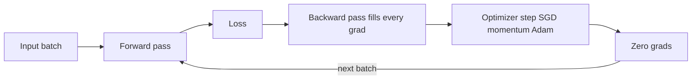

# Module 01c — Deep Learning Essentials

> **Depth tags** 🟢 app-level · 🟡 build-one-piece-by-hand · 🔴 from-scratch

This is the "Deep Learning Essentials" interview round, built from first principles.
Modern LLM (Large Language Model) work sits on a stack of ideas that predate transformers: **backpropagation**
(the chain rule run in reverse), **optimizers** (SGD (Stochastic Gradient Descent) → momentum → Adam (Adaptive Moment Estimation)), **weight
initialisation** (He / Xavier), **regularisation** (dropout, batchnorm, L2), and the
**recurrent network** (the pre-transformer way to model sequences). This module makes
each of those concrete in pure numpy (Python) and plain arrays (TypeScript) — no ML (Machine Learning)
framework, no network, no LLM. Everything is seeded and deterministic; the data is
generated in-code.

What this module deliberately does **not** re-teach:

- **2-D convolution** — module 09 owns that. There is no conv here.
- **A single attention head** — module 01 owns that. We do the _recurrent_ sequence
  model instead, which is the genuine gap.
- **Softmax / plain gradient descent from zero** — module 08 owns that. Here softmax is
  a building block you already understand; the new material is autograd, optimizers,
  regularisation, and BPTT.

---

## Concepts

Every task in this module lives somewhere on the same training loop — forward,
loss, backward, step, zero, repeat:



### 1. Backpropagation as a graph of scalars (Task 1)

Every neural network is a big composite function. Backprop is nothing more than the
**chain rule** applied mechanically to the computation graph.

Represent every intermediate value as a node that remembers _how it was produced_. A
node holds `data` (its forward value), `grad` (∂L/∂data, filled in later), and a closure
`_backward` that knows how to push gradient from this node to its inputs.

For the three primitive ops, the local derivatives are:

**Addition** `c = a + b`. Both inputs affect the sum one-for-one, so gradient flows
through unchanged:

```
∂c/∂a = 1        →   a.grad += 1 * c.grad
∂c/∂b = 1        →   b.grad += 1 * c.grad
```

**Multiplication** `c = a * b`. Each input's local derivative is _the other input_:

```
∂c/∂a = b        →   a.grad += b.data * c.grad
∂c/∂b = a        →   b.grad += a.data * c.grad
```

**tanh** `o = tanh(x)`. Its derivative has a famous closed form in terms of the output:

```
d/dx tanh(x) = 1 - tanh(x)^2 = 1 - o^2
                 →   x.grad += (1 - o.data^2) * o.grad
```

(**relu** `o = max(0, x)` passes gradient only where the input was positive:
`x.grad += (x.data > 0 ? 1 : 0) * o.grad`.)

The `+=` matters: if a node feeds _two_ downstream consumers, its gradient is the **sum**
of the contributions (multivariable chain rule). That is why grads accumulate and must be
zeroed between steps.

**The backward pass** seeds the output with `grad = 1` (∂L/∂L = 1), then walks every node
in **reverse topological order** so each node's `grad` is fully accumulated _before_ its
`_backward` closure runs and pushes to its parents. Topological order = a node appears
after all nodes it depends on; reverse it and you process outputs before inputs.

An MLP (Multi-Layer Perceptron) neuron is `tanh(Σ wᵢ·xᵢ + b)`; a layer is a list of neurons; an MLP is a stack of
layers. Because every op is a `Value`, calling `.backward()` on the loss fills `.grad` on
**every weight** automatically. Then SGD is one line per parameter:

```
p.data -= lr * p.grad          # then zero all grads before the next step
```

**Gradient checking** — verify autograd against the definition of a derivative
(finite differences):

```
numeric_grad ≈ (f(x + h) - f(x - h)) / (2h)      with small h (e.g. 1e-5)
```

A correct engine matches this to ~1e-4.

### 2. Optimizers and initialisation (Task 2)

Given a gradient `g = ∂L/∂θ`, an optimizer decides the actual parameter step.

**Plain SGD** — step straight downhill:

```
θ ← θ - lr · g
```

**Momentum** — keep a running velocity so consistent gradients accumulate speed and noisy
ones cancel:

```
v ← β·v + (1 - β)·g            (β ≈ 0.9)
θ ← θ - lr · v
```

**Adam** — per-parameter adaptive learning rates. Track a first moment `m` (mean of
gradients) and second moment `v` (mean of squared gradients), **bias-correct** both
(they start at 0, so early estimates are biased toward 0), then step:

```
m ← β1·m + (1 - β1)·g
v ← β2·v + (1 - β2)·g²
m̂ = m / (1 - β1^t)            (t = step count, 1-indexed)
v̂ = v / (1 - β2^t)
θ ← θ - lr · m̂ / (sqrt(v̂) + ε)   (β1=0.9, β2=0.999, ε=1e-8)
```

Dividing by `sqrt(v̂)` gives parameters with large, noisy gradients a _smaller_ effective
step and rarely-updated parameters a _larger_ one. This is why Adam usually reaches a
target loss in **fewer epochs** than plain SGD.

**Weight initialisation.** If weights are too big, activations explode; too small, they
vanish. The fix is to scale initial random weights by the layer's fan-in so the variance
of activations stays ~constant across layers.

```
He (for ReLU):        W ~ Normal(0, sqrt(2 / fan_in))
Xavier/Glorot (tanh): W ~ Normal(0, sqrt(2 / (fan_in + fan_out)))
```

ReLU (Rectified Linear Unit) zeroes half its inputs, so it needs the extra factor of 2 (that is the `2/fan_in`).

**Vanishing gradients.** The sigmoid `σ(x)=1/(1+e^-x)` has derivative `σ·(1-σ)`, which
**peaks at 0.25** and is near 0 in the tails. Backprop multiplies one such factor per
layer, so in a deep sigmoid net the first-layer gradient is a product of many numbers
≤ 0.25 → it shrinks toward zero and the early layers barely learn. ReLU's derivative is
exactly 1 for positive inputs, so gradients pass through undiminished. The demo prints the
first-layer gradient norm for both: **ReLU ≫ sigmoid**.

### 3. Regularisation: dropout, batchnorm, L2 (Task 3)

A model with enough capacity memorises the training set: **train accuracy high, test
accuracy low**. That gap is the thing regularisation shrinks.

**Inverted dropout.** During training, randomly zero each activation with probability `p`,
then divide the survivors by `(1 - p)` so the expected sum is unchanged. At test time do
**nothing** (identity) — the scaling was already paid at train time.

```
train:  mask ~ Bernoulli(1 - p);   out = (x * mask) / (1 - p)
test:   out = x
```

This stops the network relying on any single neuron (co-adaptation), acting like an
ensemble of sub-networks.

**Batch normalisation (forward).** Normalise each feature across the batch to mean 0,
variance 1, then let the network rescale/shift with learnable `γ`, `β`:

```
μ    = mean(x, over the batch)        (per feature)
σ²   = var(x,  over the batch)         (per feature)
x̂    = (x - μ) / sqrt(σ² + ε)
out  = γ · x̂ + β
```

With `γ=1, β=0` the output has per-feature **mean ≈ 0 and variance ≈ 1** — that is the
Task-3 acceptance check. Normalised activations keep every layer in a healthy range, which
lets you train deeper nets with higher learning rates.

**L2 weight decay.** Add `(λ/2)·Σ W²` to the loss. Its gradient is simply `λ·W`, so every
step you also nudge weights toward zero:

```
L_total = L_data + (λ/2)·Σ W²
∂/∂W [ (λ/2)·Σ W² ] = λ·W
W ← W - lr·(dW_data + λ·W)
```

Smaller weights → a smoother decision surface → less overfitting. Enabling dropout + L2
**shrinks the (train_acc − test_acc) gap** versus an unregularised model on the same split.

### 4. Recurrent networks and BPTT (Task 4)

Sequences (characters, time-series, words) need a model with **memory**. A vanilla RNN (Recurrent Neural Network)
carries a hidden state `h` from one timestep to the next and re-uses the _same_ weights at
every step:

```
h_t     = tanh(Wxh · x_t + Whh · h_{t-1} + bh)      hidden state (memory)
logits  = Why · h_t + by                            output scores
p_t     = softmax(logits)                           next-token distribution
```

`Whh` mixes the previous memory into the current one; `Wxh` injects the current input.
Unrolled over `T` steps, an RNN is just a very deep feed-forward net where **every layer
shares the same weights**.

**Backprop through time (BPTT)** is ordinary backprop over that unrolled graph. Two things
make it special:

1. The tanh local gradient reappears at every step: with `h = tanh(a)`,
   `∂L/∂a = (1 - h²) · ∂L/∂h`.
2. Because `Wxh, Whh, Why` are **shared** across timesteps, their gradients are the **sum**
   of the per-step contributions:

```
for t = T-1 down to 0:
    dy         = p_t - one_hot(target_t)          # softmax+CE gradient (module 08)
    dWhy      += dy · h_tᵀ ;   dby += dy
    dh         = Whyᵀ · dy + dh_next              # output path + gradient from the future
    da         = (1 - h_t²) · dh                  # backprop through tanh
    dbh       += da
    dWxh      += da · x_tᵀ
    dWhh      += da · h_{t-1}ᵀ
    dh_next    = Whhᵀ · da                        # pass memory-gradient to the previous step
```

`dh_next` is the term that carries error _backwards in time_ — the hidden state at step t
influenced the loss at every later step, so its gradient collects contributions from the
whole future. (Multiplying by `Whh` repeatedly is exactly why long-range gradients vanish
or explode in vanilla RNNs — the motivation for LSTMs (Long Short-Term Memory) / GRUs (Gated Recurrent Unit) and, later, attention.)

Trained on a short repeating string, the RNN learns the pattern and predicts the next
character far better than random (1/vocab).

### 5. LSTM and GRU: gating, in enough depth to interview on (concept only)

Task 4 shows the disease — repeated multiplication by `Whh` makes long-range
gradients vanish or explode. The **LSTM (Long Short-Term Memory)** is the classic
cure, and "why does an LSTM fix vanishing gradients?" is a perennial interview
question. The trick: add a **cell state** `c_t`, a separate memory lane that is
updated **additively**, with three learned sigmoid **gates** (values in `(0,1)`)
deciding what flows:

```
f_t = σ(W_f·[h_{t-1}, x_t] + b_f)        # forget gate: what to erase from c
i_t = σ(W_i·[h_{t-1}, x_t] + b_i)        # input gate:  what new info to write
c̃_t = tanh(W_c·[h_{t-1}, x_t] + b_c)     # candidate content
c_t = f_t ⊙ c_{t-1} + i_t ⊙ c̃_t          # ← the additive highway
o_t = σ(W_o·[h_{t-1}, x_t] + b_o)        # output gate: what to reveal
h_t = o_t ⊙ tanh(c_t)
```

The key line is the cell update: `c_t = f_t ⊙ c_{t-1} + i_t ⊙ c̃_t`. Backprop
through it multiplies the gradient by `f_t` (a value the network can learn to
hold near 1), **not** by `Whh` over and over — so gradients can flow across many
timesteps unattenuated. That additive-shortcut idea is the same one you meet as
**residual connections** in module 01d.

The **GRU (Gated Recurrent Unit)** is the budget LSTM: it merges the cell and
hidden state and uses two gates (update `z_t`, reset `r_t`) instead of three —
fewer parameters, usually similar quality:

```
h_t = (1 - z_t) ⊙ h_{t-1} + z_t ⊙ h̃_t    # interpolate old state and candidate
```

Interview sound bites: LSTM fixes vanishing gradients via an additively-updated,
gate-protected cell state; GRU is a cheaper 2-gate variant; both still process
tokens **sequentially** (no parallelism over the time axis), which is the
bottleneck transformers removed by replacing recurrence with attention.

---

## Tasks

### Task 1 🔴 — autograd-mlp

**Goal:** Build a micro scalar autograd engine (micrograd-style) and train an MLP on XOR
with it — proving your backward pass computes correct gradients.

**Files:**

- `py/01_autograd_mlp.py`
- `ts/01-autograd-mlp.ts`

**Steps:**

1. Implement the local-gradient closures inside the `Value` ops:
   - `__add__` / `add`: `a.grad += out.grad`, `b.grad += out.grad`.
   - `__mul__` / `mul`: `a.grad += b.data * out.grad`, `b.grad += a.data * out.grad`.
   - `tanh`: `x.grad += (1 - out.data²) * out.grad`.
   - `relu`: `x.grad += (out.data > 0 ? 1 : 0) * out.grad`.
2. Implement `backward()`: build the reverse **topological order** of the graph, seed the
   root's `grad = 1.0`, then call each node's `_backward` closure in that order.
3. Implement the **SGD update** in the training loop: after `loss.backward()`, for every
   parameter do `p.data -= lr * p.grad`; then zero every `p.grad` before the next step.

The `Value` class scaffold, `Neuron` / `Layer` / `MLP`, the XOR dataset, MSE (Mean Squared Error) loss, the
training loop skeleton, and a finite-difference `grad_check` helper are all provided.

**Acceptance:**

- Final XOR loss **< 0.05** after training.
- All 4 XOR predictions have the **correct sign** (matching target ±1).
- `grad_check` reports autograd gradients match numerical finite-difference gradients to
  within **1e-4** on the sample scalar expression.

---

### Task 2 🟡 — optimizers-init

**Goal:** Implement SGD / momentum / Adam and He / Xavier init in a matrix-form 2-layer
MLP; race the optimizers to a target loss and show ReLU beats sigmoid on vanishing
gradients.

**Files:**

- `py/02_optimizers.py`
- `ts/02-optimizers.ts`

**Steps:**

The 2-layer MLP forward pass and the **manual backprop** are provided, along with a seeded
synthetic dataset. You implement:

1. `sgd_update` — `θ ← θ - lr·g`.
2. `momentum_update` — keep velocity `v ← β·v + (1-β)·g`; `θ ← θ - lr·v`.
3. `adam_update` — first/second moments, **bias-correction** with step `t`, `ε` in the
   denominator (formulas in Concepts §2).
4. `he_init` scale = `sqrt(2 / fan_in)`; `xavier_init` scale = `sqrt(2 / (fan_in + fan_out))`.

**Acceptance:**

- **Adam reaches the target loss in strictly fewer epochs than plain SGD** (both from the
  same seed/data).
- In the vanishing-gradient demo, the **ReLU first-layer gradient norm is > 5× the sigmoid
  first-layer gradient norm**.

---

### Task 3 🟡 — regularization

**Goal:** Implement inverted dropout, batchnorm-forward, and the L2 gradient term, then show
they close the generalisation gap on a small noisy dataset.

**Files:**

- `py/03_regularization.py`
- `ts/03-regularization.ts`

**Steps:**

A 2-layer MLP that _can_ overfit a small noisy dataset is provided, with training loop and a
fixed split. You implement:

1. `dropout_forward(x, p, training)` — inverted dropout: train-time Bernoulli mask scaled by
   `1/(1-p)`; identity when `training=False`.
2. `batchnorm_forward(x, gamma, beta)` — per-feature normalise to mean 0 / var 1, then
   `γ·x̂ + β`.
3. `l2_grad(W, lam)` — return `lam · W` (added onto the data gradient of each weight).

**Acceptance:**

- Batchnorm output has **per-feature mean ≈ 0** (|mean| < 1e-6) and **var ≈ 1**
  (|var − 1| < 1e-3) with `γ=1, β=0`.
- Training **with** dropout + L2 yields a **smaller (train_acc − test_acc) gap** than
  training without regularisation, on the same split and seed.

---

### Task 4 🔴 — rnn-bptt

**Goal:** Implement a vanilla RNN cell and backprop-through-time; train it on a tiny
deterministic char-level next-character task until it clearly beats chance.

**Files:**

- `py/04_rnn_bptt.py`
- `ts/04-rnn-bptt.ts`

**Steps:**

The corpus (a short repeating string), char↔index vocab, one-hot encoding, parameter
initialisation, the softmax+cross-entropy output, the Adam-lite update, and the sampling /
evaluation harness are all provided. You implement:

1. `rnn_step(x, h_prev)` — `h = tanh(Wxh·x + Whh·h_prev + bh)`; `logits = Why·h + by`.
2. `forward(inputs, h0)` — unroll `rnn_step` over the sequence, **storing** every hidden
   state and the per-step probabilities (needed for BPTT).
3. `backward(...)` — the BPTT loop: the softmax+CE output gradient is given; you fill the
   **tanh local gradient** `(1 - h²)` and the **through-time accumulation** of
   `dWxh`, `dWhh`, `dWhy`, `dbh`, `dby`, plus `dh_next = Whhᵀ · da`.

**Acceptance:**

- Cross-entropy loss **decreases substantially** over training (final loss < ~40% of the
  initial loss).
- On the repeating pattern, next-char prediction accuracy is **≥ 0.90** — far above the
  chance baseline of `1 / vocab_size` (printed for reference).

---

## Done when

- [ ] `01_autograd_mlp` / `01-autograd-mlp` trains XOR to loss < 0.05 with all 4 signs
      correct, and `grad_check` passes within 1e-4.
- [ ] `02_optimizers` / `02-optimizers` prints epochs-to-target per optimizer (Adam <
      SGD) and the ReLU-vs-sigmoid first-layer grad norms (ReLU > 5× sigmoid).
- [ ] `03_regularization` / `03-regularization` prints batchnorm mean≈0 / var≈1 and shows
      the regularised generalisation gap is smaller than the unregularised one.
- [ ] `04_rnn_bptt` / `04-rnn-bptt` shows loss dropping substantially and next-char
      accuracy ≥ 0.90 on the repeating pattern.

---

## Going deeper

- **Karpathy — micrograd** — the scalar autograd engine this module's Task 1 is modelled on:
  <https://github.com/karpathy/micrograd>
- **Karpathy — "The spelled-out intro to neural networks and backpropagation"** (builds
  micrograd live): <https://www.youtube.com/watch?v=VMj-3S1tku0>
- **Karpathy — min-char-rnn.py** — the 100-line RNN + BPTT that Task 4 follows:
  <https://gist.github.com/karpathy/d4dee566867f8291f086>
- **Kingma & Ba — "Adam: A Method for Stochastic Optimization"**:
  <https://arxiv.org/abs/1412.6980>
- **Ioffe & Szegedy — "Batch Normalization"**: <https://arxiv.org/abs/1502.03167>
- **Srivastava et al. — "Dropout"**: <https://jmlr.org/papers/v15/srivastava14a.html>
- **He et al. — "Delving Deep into Rectifiers" (He initialisation)**:
  <https://arxiv.org/abs/1502.01852>
- **Glorot & Bengio — "Understanding the difficulty of training deep feedforward networks"
  (Xavier init)**: <https://proceedings.mlr.press/v9/glorot10a.html>

---

## Environment

No env vars, no provider, no network. These are pure-math exercises:

- **Python:** `numpy` only (a base dependency — `uv sync` is enough, no extra).
  Run: `uv run python modules/01c-deep-learning/py/01_autograd_mlp.py`
- **TypeScript:** plain arrays / plain TS math, no npm math libraries.
  Run: `pnpm tsx modules/01c-deep-learning/ts/01-autograd-mlp.ts`

All randomness is seeded, so every run prints the same numbers.

---

## 📚 Read more

- [Karpathy — Neural Networks: Zero to Hero](https://karpathy.ai/zero-to-hero.html) (video course) — the first lecture builds Task 1's autograd engine live, and the series continues through exactly this module's stack.
- [3Blue1Brown — Neural networks](https://www.3blue1brown.com/topics/neural-networks) — animated backprop and gradient-descent chapters; watch before (or after) writing your `_backward` closures.
- [Deep Learning book — deeplearningbook.org](https://www.deeplearningbook.org) — chapters 6–8 are the formal version of Concepts 1–3: backprop, regularisation, and optimization.
- [Lilian Weng's blog](https://lilianweng.github.io) — long-form deep dives that pick up where this module stops, including recurrent architectures and attention.
- [StatQuest](https://www.youtube.com/@statquest) (video) — gentle step-by-step explainers for backprop, ReLU, and gradient descent if the math above moves too fast.
