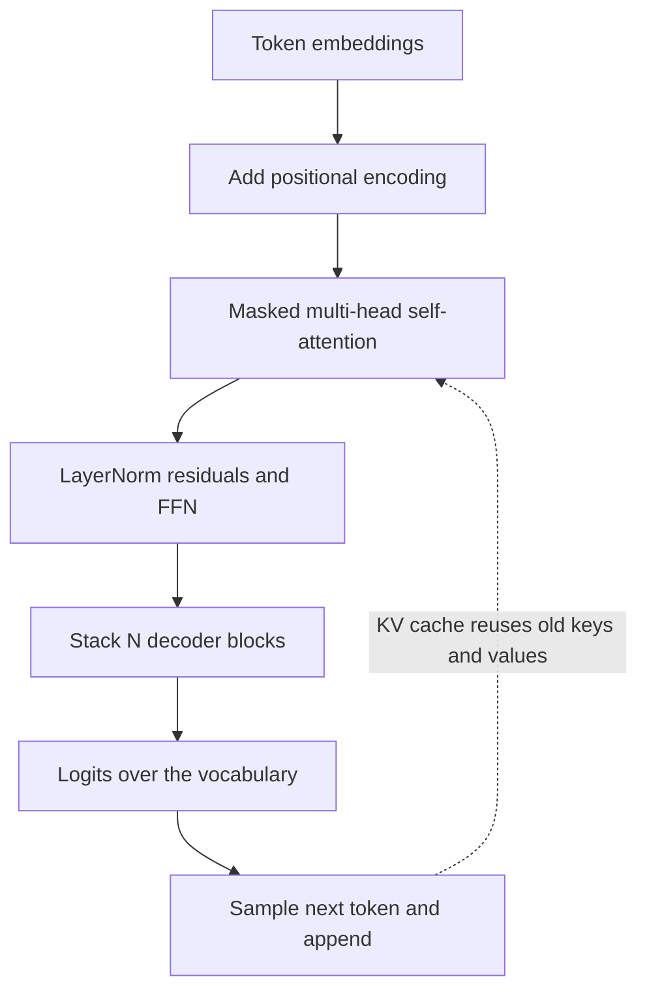

# Module 01d — Transformer Architecture

> **Depth tags** 🟢 app-level · 🟡 build-one-piece-by-hand · 🔴 from-scratch

Module 01 gave you a single toy attention head. This deep-dive companion builds the
**whole decoder** the way GPT (Generative Pre-trained Transformer)-style models are actually assembled: multi-head
self-attention with causal masking, sinusoidal positional encodings, a pre-LN (pre-Layer Normalization) block
(LayerNorm (Layer Normalization) + residual + feed-forward), and the KV cache (Key-Value cache) that makes generation fast.
A fifth task then contrasts the decoder you built with BERT (Bidirectional Encoder
Representations from Transformers)-style **encoders** — same attention, different mask,
different training objective.

Everything here is **pure numpy (Python) / plain arrays (TypeScript)**, offline, and
deterministic. No provider, no network, no ML (Machine Learning) framework — the point is to see the
machinery with nothing hidden. This is the course's most-asked interview material;
"explain the KV cache and attention masking" is Task 4.

---

## Concepts

The whole module in one picture — the path a token takes through the decoder you
are about to build:



### 1. Scaled dot-product attention

Attention lets every token pull information from every other token. Given three
matrices derived from the input — **queries** `Q`, **keys** `K`, **values** `V` —
the output is a weighted average of the value vectors, where the weights come from
how well each query matches each key:

```
scores  = Q @ Kᵀ / √d_k        # (n_q × n_k) raw affinities
weights = softmax(scores)       # row-wise; each row sums to 1
output  = weights @ V           # (n_q × d_v)
```

**Why divide by √d_k?** The dot product of two `d_k`-dimensional vectors has variance
proportional to `d_k`. Without scaling, large `d_k` pushes the scores into the tails
of the softmax, where gradients vanish and the distribution collapses onto one token.
Dividing by `√d_k` keeps the scores at unit scale so the softmax stays soft.

**Numerically stable softmax** — subtract the row max before exponentiating (same
result, no overflow):

```
softmax(z)_j = exp(z_j − max(z)) / Σ_k exp(z_k − max(z))
```

### 2. Causal masking

A decoder generates left-to-right, so position `i` must never attend to a _future_
position `j > i` (that would be cheating — looking at the answer). We enforce this
with an **additive mask** added to the scores before softmax:

```
mask[i, j] = 0        if j ≤ i     (allowed)
mask[i, j] = −∞       if j > i     (blocked)
```

`exp(−∞) = 0`, so every future weight becomes exactly 0 and the row still sums to 1
over the allowed positions. In code we use a large negative number (e.g. `−1e9`) as
a stand-in for `−∞`.

### 3. Multi-head attention

One attention head can only average things one way. **Multi-head** attention runs `h`
independent attention operations in parallel, each in its own `d_k = d_model / h`
subspace, so different heads can specialise (one tracks syntax, another long-range
coreference, etc.):

```
Q, K, V = X @ W_q,  X @ W_k,  X @ W_v      # each (n × d_model)
for each head h:  slice its d_k columns, run scaled dot-product attention
concat the h head outputs  →  (n × d_model)
output = concat @ W_o                       # final mix across heads
```

With `h = 1` and identity projections this collapses back to plain single-head
attention — a useful correctness check.

### 4. Positional encoding

Attention is **permutation-equivariant**: it has no notion of order. Shuffle the input
tokens and the outputs shuffle identically — "dog bites man" and "man bites dog" would
be indistinguishable. We inject order by **adding** a position-dependent vector to each
token embedding before attention. The sinusoidal PE (Positional Encoding) scheme:

```
PE[pos, 2i]   = sin( pos / 10000^(2i/d) )
PE[pos, 2i+1] = cos( pos / 10000^(2i/d) )
```

Even dimensions get sines, odd dimensions get cosines, and the wavelength grows
geometrically across the dimension axis (fast oscillation early, slow later). Two
consequences you'll verify: every value lies in `[−1, 1]`, and the **PE dot-product
is highest at zero distance and generally falls off for nearby offsets** — the
harness checks an adjacent pair against the sequence endpoint. (The decay isn't
strictly monotonic across _all_ position pairs — the sum of sinusoids can wobble —
but the local trend gives the model a smooth sense of distance.)

### 5. LayerNorm, residuals, and the feed-forward network

**LayerNorm** normalizes each token's feature vector to mean 0 / variance 1, then
applies a learned scale `γ` and shift `β` (unlike BatchNorm (Batch Normalization) it works per-token, so it's
independent of batch size):

```
μ    = mean(x)                    # over the feature axis, per row
σ²   = mean((x − μ)²)
x̂    = (x − μ) / √(σ² + ε)
out  = γ · x̂ + β
```

**GELU (Gaussian Error Linear Unit)** is the smooth activation used in GPT-family models (tanh approximation):

```
gelu(x) = 0.5 · x · (1 + tanh( √(2/π) · (x + 0.044715 · x³) ))
```

**FFN** (position-wise Feed-Forward Network) applies the same two-layer MLP (Multi-Layer Perceptron) to every
position, typically widening to `4 × d_model` in the middle:

```
h = gelu(x @ W1 + b1)      # (n × d_model) → (n × d_ff)
y = h @ W2 + b2            # (n × d_ff) → (n × d_model)
```

**Pre-LN block.** GPT-2 and successors normalize the _input_ to each sublayer and add a
residual connection around it. The clean residual path (input flows straight through,
sublayer only adds a correction) is what lets deep stacks train stably:

```
x = x + MHA(LN1(x), causal_mask)      # attention sublayer
x = x + FFN(LN2(x))                   # feed-forward sublayer
```

Stack `N` of these and you have a decoder.

### 6. The KV cache

Generation is autoregressive: one token at a time, each attending over the whole prefix
so far. The **naive** approach recomputes the keys and values for the _entire_ prefix at
every step — `1 + 2 + … + n = n(n+1)/2` key projections to emit `n` tokens (quadratic).
But the keys and values of old tokens never change.

The **KV cache** stores each token's `k` and `v` once. At step `t` you project only the
new token's `q, k, v`, append `k, v` to the cache, and attend the single new query over
all cached keys/values:

```
naive : n(n+1)/2 key projections   (recompute prefix each step)
cached : n key projections          (one new key per step)
```

Identical outputs, linear instead of quadratic work. This is why real LLM (Large Language Model) inference is
fast — and why longer context costs proportionally more memory (the cache grows).

### 7. Encoder vs decoder — BERT vs GPT

The classic interview question "what's the difference between BERT and GPT?" has a
surprisingly small answer: **both are stacks of exactly the transformer blocks you
built above**. What differs is the **attention mask** and the **training objective**
— and everything else (what each is good at) follows from those two choices.

- **Encoder-only (BERT).** No mask: attention is **bidirectional**, every position
  sees the whole sequence, left _and_ right. Trained with a **masked-LM** objective —
  hide ~15% of tokens, predict them from full two-sided context. The result is
  excellent contextual _representations_ (each position summarises its whole
  neighbourhood), but the model can't generate text left-to-right: producing token
  `t` bidirectionally would require already knowing tokens `> t`.
- **Decoder-only (GPT).** The **causal mask** from Task 1: position `i` sees only
  `j ≤ i`. Trained with the **next-token** objective — predict token `t+1` from
  tokens `0..t`. That's precisely what makes autoregressive generation possible
  (and what the KV cache from Task 4 accelerates), at the price of never using
  right context when representing a position.
- **Encoder–decoder (T5, the original transformer).** A bidirectional encoder reads
  the input; a causal decoder generates the output while **cross-attending** to the
  encoder's representations. Natural for sequence-to-sequence jobs — translation,
  summarization — where the whole source is known up front.

| Architecture    | Mask                                              | Training objective          | Great at                              | Example models                       |
| --------------- | ------------------------------------------------- | --------------------------- | ------------------------------------- | ------------------------------------ |
| Encoder-only    | none (bidirectional)                              | masked-LM (cloze)           | embeddings, classification, retrieval | BERT, RoBERTa, most embedding models |
| Decoder-only    | causal (`j ≤ i`)                                  | next-token prediction       | text generation, chat, agents         | GPT-4, Llama, Claude                 |
| Encoder–decoder | none in encoder, causal in decoder (+ cross-attn) | denoising / span corruption | translation, summarization            | T5, BART, original transformer       |

One practical consequence you'll meet again: the **embedding models** used in
modules 04/05 (`text-embedding-3-small`, `nomic-embed-text`) are encoder-style —
bidirectional context is exactly what makes a good sentence representation — while
every **chat model** you call through `llm_core` is a decoder. Task 5 makes the
difference measurable: replace one token with `[MASK]` and only the bidirectional
model can use the disambiguating word to the mask's _right_.

---

## Tasks

### Task 1 🔴 — Multi-head self-attention with causal masking

**Goal:** Implement scaled dot-product attention, a causal mask, and multi-head
attention from scratch.

**Files:**

- `py/01_attention.py`
- `ts/01-attention.ts`

**Steps:**

1. Implement `scaled_dot_product_attention(Q, K, V, mask=None)` /
   `scaledDotProductAttention(Q, K, V, mask=null)`:
   - `scores = Q @ Kᵀ / √d_k`
   - add `mask` if provided
   - row-wise **numerically stable** softmax (subtract row max before `exp`)
   - `output = weights @ V`; return `(output, weights)`.

2. Implement `causal_mask(n)` / `causalMask(n)` — an `n × n` additive mask, `0` on and
   below the diagonal, `−∞` (use the provided `NEG_INF`) strictly above it.

3. Implement `multi_head_attention(...)` / `multiHeadAttention(...)` — project `X` to
   `Q, K, V`, split `d_model` into `h` heads of width `d_k`, run SDPA (Scaled Dot-Product Attention) per head,
   concatenate the head outputs, apply the output projection `W_o`.

**Acceptance:**

- Every attention-weight row sums to `1.0` (±1e-6).
- With the causal mask, position `i` has **zero** weight on any `j > i`.
- Multi-head with `h = 1` and identity projections is `allclose` to single-head SDPA.
- MHA (Multi-Head Attention) output shape is `(n, d_model)` and all values are finite.

---

### Task 2 🟡 — Sinusoidal positional encoding

**Goal:** Build the sinusoidal PE table and demonstrate why order matters.

**Files:**

- `py/02_positional_encoding.py`
- `ts/02-positional-encoding.ts`

**Steps:**

1. Implement `sinusoidal_encoding(max_len, d_model)` / `sinusoidalEncoding(maxLen, dModel)`:
   - `PE[pos, 2i]   = sin(pos / 10000^(2i/d))`
   - `PE[pos, 2i+1] = cos(pos / 10000^(2i/d))`
   - return shape `(max_len, d_model)`.

2. The harness runs the **permutation-equivariance experiment** for you: it takes a
   sequence and a fixed permutation of its rows, and runs self-attention with and
   without PE. Study the printed result — without PE the outputs are just a permutation
   of each other; adding PE by absolute slot breaks that symmetry.

3. The harness also runs the **locality check**: `PE[0]·PE[1]` (adjacent) vs
   `PE[0]·PE[n−1]` (far apart).

**Acceptance:**

- PE shape is `(max_len, d_model)` and every value lies in `[−1, 1]`.
- The permutation-equivariance test **passes without PE** (`out(perm(X)) == perm(out(X))`)
  and **fails with PE** (the outputs differ once order is encoded).
- The adjacent-pair PE dot-product `PE[0]·PE[1]` exceeds the endpoint pair
  `PE[0]·PE[n−1]` (a local decay, not strict monotonicity across all pairs).

---

### Task 3 🔴 — Pre-LN transformer decoder block

**Goal:** Assemble LayerNorm, GELU, an FFN, and residual connections into a decoder
block, then stack `N` of them.

**Files:**

- `py/03_decoder_block.py`
- `ts/03-decoder-block.ts`

The attention helpers from Task 1 are **copied into this file** so it is self-contained.

**Steps:**

1. Implement `layer_norm(x, gamma, beta, eps)` / `layerNorm(...)` — per-row
   `(x − μ) / √(σ² + ε) · γ + β` (population variance).

2. Implement `gelu(x)` — the tanh approximation
   `0.5·x·(1 + tanh(√(2/π)·(x + 0.044715·x³)))`.

3. Implement `ffn(x, W1, b1, W2, b2)` — `Linear → GELU → Linear`.

4. Implement `TransformerBlock.forward(x)` — the pre-LN residual block:
   - `x = x + MHA(LN1(x), causal_mask)`
   - `x = x + FFN(LN2(x))`

5. The harness stacks `N = 3` blocks and prints the result.

**Acceptance:**

- `layer_norm` output per row has mean ≈ 0 (±1e-6) and variance ≈ 1 (±1e-5) before
  `γ/β` are applied (identity `γ=1, β=0`).
- One block preserves the input shape `(n, d_model)`.
- Stacking `N = 3` blocks runs and produces all-finite output.

---

### Task 4 🟡 — The KV cache

**Goal:** Implement incremental causal decoding with a KV cache and prove it equals the
naive recompute — at a fraction of the work.

**Files:**

- `py/04_kv_cache.py`
- `ts/04-kv-cache.ts`

The naive recompute path (`decode_naive` / `decodeNaive`) is **provided** as ground
truth. You implement the cached path.

**Steps:**

1. Implement `decode_with_cache(X, Wq, Wk, Wv, Wo)` / `decodeWithCache(...)`:
   - keep growing `K_cache` and `V_cache` lists
   - at each step `t`: project **only** the new token `X[t]` into `q_t, k_t, v_t`
   - **append** `k_t, v_t` to the cache (old entries are reused, not recomputed)
   - attend `q_t` over all cached keys/values; append `context @ Wo` to the logits
   - count exactly **one** key projection per step.

2. Compare against `decode_naive`, which reprojects the whole prefix each step and
   counts `n(n+1)/2` key projections.

**Acceptance:**

- Cached logits equal naive logits at **every** step (`allclose`, `atol = 1e-5`).
- Key-projection op count is **n** for cached vs **n(n+1)/2** for naive — both printed.

---

### Task 5 🟡 — Encoder vs decoder (BERT vs GPT)

**Goal:** Show that BERT and GPT share the exact same attention machinery and differ
only in the mask (and the training objective that mask allows) — then prove it with a
masked-token experiment where the answer sits to the mask's _right_.

**Files:**

- `py/05_encoder_vs_decoder.py`
- `ts/05-encoder-vs-decoder.ts`

The toy vocabulary/embedding table, the five masked sentences, and the stable
`softmax` helper are **provided** — the file is self-contained.

**Steps:**

1. Implement `full_attention(Q, K, V)` / `fullAttention(Q, K, V)` — bidirectional
   (encoder-style) scaled dot-product attention: exactly Task 1's SDPA with the mask
   branch deleted. Return `(output, weights)`.

2. Implement `causal_attention(Q, K, V)` / `causalAttention(Q, K, V)` — the same, but
   build and add Task 1's additive causal mask (`0` for `j ≤ i`, `−∞` for `j > i`)
   before the softmax.

3. Implement `attention_mass_on_future(weights)` / `attentionMassOnFuture(weights)` —
   for each row `i`, sum the weights strictly above the diagonal (`j > i`), then
   average over rows. This measures how much a weight matrix "looks right".

4. Implement `nearest_token(repr, E)` / `nearestToken(repr, E)` — cosine-similarity
   argmax of a contextual representation against the embedding table.

5. The harness runs the **masked-token readout**: each sentence is
   `the big [MASK] <sound> today`, where only the sound (to the **right** of the
   mask) says which animal is hidden. It computes the mask position's representation
   under both attention types and reads out the nearest vocabulary token.

**Acceptance:**

- Causal future mass is **exactly** `0.0`; bidirectional future mass is `> 0.2`.
- Bidirectional attention recovers the true masked token in **≥ 4/5** sentences.
- Causal attention recovers **strictly fewer** (the left context is identical across
  all five sentences, so its prediction can't depend on the hidden animal).

---

## Done when

- [ ] `01_attention` / `01-attention` runs: weight rows sum to 1, the causal mask zeroes
      out future positions, and `h=1` MHA matches single-head SDPA.
- [ ] `02_positional_encoding` / `02-positional-encoding` prints the PE shape/range, the
      permutation-equivariance result (passes without PE, fails with PE), and the
      locality check.
- [ ] `03_decoder_block` / `03-decoder-block` shows LayerNorm rows with mean≈0/var≈1, a
      shape-preserving block, and a finite output from a 3-block stack.
- [ ] `04_kv_cache` / `04-kv-cache` shows identical per-step logits and prints the
      `n` vs `n(n+1)/2` key-projection counts.
- [ ] `05_encoder_vs_decoder` / `05-encoder-vs-decoder` shows exactly-zero causal
      future mass vs `> 0.2` bidirectional, and the masked-token readout: the
      bidirectional model recovers ≥ 4/5 hidden tokens, the causal model strictly
      fewer.
- [ ] You can answer, in one breath: "BERT vs GPT — what's actually different?"
      (mask + objective; the blocks are the same).

---

## How this maps to a real transformer

| Piece you built here           | In a production LLM                                                                                                 |
| ------------------------------ | ------------------------------------------------------------------------------------------------------------------- |
| `scaled_dot_product_attention` | The kernel every attention library optimizes (FlashAttention fuses these steps)                                     |
| `causal_mask`                  | Applied by every decoder; batched/packed sequences also use padding masks                                           |
| `multi_head_attention`         | 12–128 heads in real models; often with grouped-query attention to shrink the KV cache                              |
| `sinusoidal_encoding`          | Replaced in modern models by RoPE (Rotary Positional Embedding) / ALiBi, but the "add order info" idea is identical |
| pre-LN `TransformerBlock`      | The repeated unit; GPT-2 = 12 layers, GPT-3 = 96                                                                    |
| KV cache                       | Exactly what `use_cache=True` / paged-attention servers do at inference                                             |

---

## Beyond this module — the modern LLM stack (interview notes)

Five upgrades that separate the decoder you just built from a 2024+ production model.
These are **notes, not tasks** — read them so the names don't surprise you in an
interview or a model card.

### RoPE — rotary positional embeddings

Task 2 **added** a position vector to each embedding (absolute positions). RoPE (Rotary
Positional Embedding) instead **rotates** each 2-D pair of query/key dimensions by a
position-dependent angle: pair `i` at position `pos` is rotated by `θ_i · pos`, with
`θ_i = 10000^(−2i/d)` — the same geometric frequency ladder as your sinusoids, applied
as a rotation instead of an addition. Because a dot product between two rotated vectors
depends only on the _difference_ of their angles, the attention score `q_m · k_n`
depends only on the **relative offset** `m − n`, not on absolute positions — which is
what you actually want for language. RoPE is the standard in Llama, Qwen, and DeepSeek,
and it enables context-window extension via NTK-aware / YaRN scaling: stretch the
rotation frequencies so pretrained relative-position behaviour covers longer sequences.

### GQA / MQA — grouped-query and multi-query attention

In your Task 1 MHA, every one of the `h` query heads has its own K and V head — so the
Task 4 KV cache stores `h` keys and `h` values per token per layer. MQA (Multi-Query
Attention) keeps all `h` query heads but shares **one** K/V head among them; GQA
(Grouped-Query Attention) is the middle ground — `g` K/V heads, each shared by `h/g`
query heads (Llama-3-70B: 64 query heads, 8 KV heads). The KV cache shrinks by exactly
the sharing factor (`h/g`, e.g. 8×). The motivation is **inference memory and memory
bandwidth, not FLOPs** — at generation time the cache is what fills GPU memory and what
each new token must stream through, so shrinking it directly buys longer contexts and
bigger batches at nearly no quality cost.

### FlashAttention — exact attention, IO-aware

FlashAttention computes **exactly** the same softmax attention you implemented — it is
_not_ an approximation. The insight is that attention on GPUs (Graphics Processing Units) is
**memory-bandwidth-bound**, not compute-bound: the naive implementation writes the full
`n × n` score matrix to slow HBM (High-Bandwidth Memory), reads it back for the softmax,
writes the weights, reads them again for `· V`. FlashAttention tiles Q, K, V into blocks
that fit in fast on-chip SRAM and fuses `QKᵀ → softmax → · V` into one kernel using the
**online softmax** trick (maintain the running row max and running normaliser as blocks
stream by — the same `subtract-the-max` stabilisation you wrote, computed incrementally).
The `n × n` matrix never materialises in HBM; memory drops from `O(n²)` to `O(n)` and
wall-clock speed jumps several-fold at long sequence lengths.

### MoE — mixture-of-experts FFNs

In an MoE (Mixture of Experts) block, the single FFN from Task 3 is replaced by `E`
independent FFNs ("experts") plus a tiny **router**: for each token, the router scores
all experts and sends the token through only the **top-k** (typically `k = 2`), summing
their outputs weighted by the router probabilities. This splits **total** from
**active** parameters — Mixtral 8×7B has ≈ 47 B parameters in total but only ~13 B are
active per token — so you get big-model capacity at small-model FLOPs (Floating-Point
Operations) per token. A **load-balancing** auxiliary loss nudges the router to spread
tokens evenly across experts, otherwise it collapses onto a favourite few. The trade:
all experts must still sit in memory, and routing complicates serving.

### Scaling laws — Kaplan and Chinchilla

Kaplan et al. (2020) showed loss falls as smooth **power laws** in parameters `N`,
dataset tokens `D`, and compute `C` (`L ∝ N^−α`, roughly `α ≈ 0.076` for parameters) —
predictable enough to extrapolate from cheap runs to expensive ones. Chinchilla (2022)
re-derived the compute-optimal allocation and found earlier models badly undertrained:
for a fixed training budget you should scale `N` and `D` **together**, landing near
**≈ 20 training tokens per parameter** (Chinchilla: 70 B params × 1.4 T tokens beat the
4× larger Gopher). Modern models deliberately "overtrain" far past that ratio (e.g.
Llama-3-8B saw ~15 T tokens, ≈ 1 900 per parameter) because the Chinchilla optimum only
minimises _training_ compute — once **inference cost dominates** a model's lifetime, a
smaller model trained on far more tokens is cheaper to serve at equal quality.

---

## Going deeper

- **"Attention Is All You Need"** — the original transformer paper:
  <https://arxiv.org/abs/1706.03762>
- **The Illustrated Transformer** — Jay Alammar's diagram-first walkthrough:
  <https://jalammar.github.io/illustrated-transformer/>
- **Karpathy, "Let's build GPT: from scratch, in code, spelled out"** — the canonical
  from-scratch video: <https://www.youtube.com/watch?v=kCc8FmEb1nY>
- **nanoGPT** — a minimal, readable GPT implementation:
  <https://github.com/karpathy/nanoGPT>
- **"The Annotated Transformer"** — Harvard NLP (Natural Language Processing)'s line-by-line PyTorch version:
  <https://nlp.seas.harvard.edu/annotated-transformer/>
- **RoPE (Rotary Positional Embeddings)** — what modern models use instead of
  sinusoidal PE: <https://arxiv.org/abs/2104.09864>

---

## Environment

No env vars, no provider, no network — these exercises are pure numpy / plain TS and run
fully offline.

- **Python:** `uv run python modules/01d-transformer/py/01_attention.py` (numpy is a base
  dependency; no extra needed).
- **TypeScript:** `pnpm build:core` once, then
  `pnpm tsx modules/01d-transformer/ts/01-attention.ts`.

---

## 📚 Read more

- **"Attention Is All You Need"** — the 2017 paper; §3.2 is the exact SDPA/MHA
  math you implement in Task 1: <https://arxiv.org/abs/1706.03762>
- **The Illustrated Transformer** (Jay Alammar) — the best diagram-first
  walkthrough of Q/K/V, heads, and the encoder–decoder split:
  <https://jalammar.github.io/illustrated-transformer/>
- **3Blue1Brown, Neural Networks series** — the animated attention and
  transformer chapters build the same geometric intuition as Tasks 1–3 (video):
  <https://www.3blue1brown.com/topics/neural-networks>
- **Karpathy, Neural Networks: Zero to Hero** — includes "Let's build GPT",
  the canonical from-scratch coding session that mirrors this module (video):
  <https://karpathy.ai/zero-to-hero.html>
- **The Annotated Transformer** (Harvard NLP) — the original paper re-typeset
  as runnable, line-by-line PyTorch: <https://nlp.seas.harvard.edu/annotated-transformer/>
