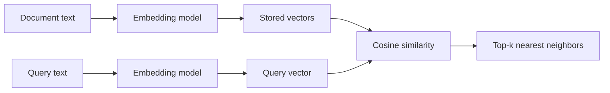

# Module 04 — Embeddings & Vectors

> **Depth tags** 🟢 app-level · 🟡 build-one-piece-by-hand · 🔴 from-scratch

Embeddings turn meaning into geometry. Once text lives in a vector space, "find
related passages" becomes "find nearby points" — and that's the engine that
powers search, RAG (Retrieval-Augmented Generation), recommendations, and anomaly detection.

This module builds that engine in layers: first by hand, then with a real
vector database, then by exploring how chunking and hybrid search change what
you retrieve.

---

## Concepts

The whole module in one picture — documents and the query pass through the same
embedding model, and retrieval is just geometry:



### What is an embedding?

An embedding model maps a string to a fixed-length list of floats — a _vector_
in high-dimensional space (often 768 or 1536 dimensions). The model is trained
so that semantically similar strings land close together in that space. "The
cat sat on the mat" and "A feline rested on the rug" will have vectors much
closer to each other than either is to "The stock market fell sharply."

### Cosine similarity

The standard distance metric is **cosine similarity**:

```
cosine(a, b) = dot(a, b) / (|a| × |b|)
```

It measures the _angle_ between two vectors regardless of their magnitudes.
Most embedding models L2-normalise their output (`|v| = 1`), which reduces
cosine to a plain dot product — fast and simple.

Values: 1 = identical direction, 0 = orthogonal (unrelated), −1 = opposite.

### Brute-force vs ANN

With _n_ documents of dimension _d_, brute-force similarity takes O(n·d) per
query. At 1 million docs × 1536 dims that's 1.5 billion multiplications per
query — too slow. **Approximate Nearest Neighbour** (ANN) algorithms like
**HNSW** (Hierarchical Navigable Small World) build a graph at index time and
only visit a tiny fraction of vectors at query time. Trade-off: a small risk of
missing the true nearest neighbour, usually negligible in practice (recall@10

> 99 % at typical settings).

### Chunking

Embedding models have a token limit (commonly 256–512 tokens). Stuffing a whole
10-page document into one embedding loses detail. **Chunking** splits a document
into smaller overlapping passages. Key trade-offs:

| Strategy       | Pro                            | Con                         |
| -------------- | ------------------------------ | --------------------------- |
| Fixed-size     | Simple, predictable            | Can split mid-sentence      |
| Sentence-based | Natural boundaries             | Variable chunk sizes        |
| Overlapping    | No lost context at boundaries  | More storage, more embeds   |
| Semantic       | Boundaries follow topic shifts | Embedding cost per sentence |

Good chunk size depends on your embedding model's window and the nature of your
queries (fine-grained fact questions vs. broad summaries).

The first three strategies are **content-blind** — they cut at a character or
sentence count, so one chunk can straddle two unrelated topics. **Semantic
chunking** places boundaries where the _meaning_ shifts: embed each sentence,
then start a new chunk wherever consecutive sentences are unusually
embedding-distant (a **semantic breakpoint**). Concretely: compute
`distance(i, i+1) = 1 − cosine(v[i], v[i+1])` for every adjacent sentence pair,
take a high **percentile** of those distances as the threshold, and break where a
gap exceeds it. Using a percentile (not an absolute cutoff) lets the same code
adapt to any corpus without hand-tuning. Cost: one embedding per sentence at
index time; benefit: each chunk stays topically coherent, which lifts retrieval
precision.

### Hybrid search & Reciprocal Rank Fusion

Dense retrieval excels at _semantic_ queries ("find text about felines" matches
"cats"). Sparse retrieval (BM25, Best Matching 25) excels at _exact-match_ queries — product
codes, model names, rare technical terms. **Hybrid search** runs both and
merges the ranked lists with **Reciprocal Rank Fusion** (RRF):

```
RRF_score(d) = Σ_ranker  1 / (k + rank(d, ranker))
```

`k = 60` is the standard smoothing constant. RRF doesn't require calibrating
scores across rankers — it only uses rank order, which makes it robust.

---

## Tasks

### Task 1 🔴 — Vector store from scratch

**Goal:** Understand exactly what a vector DB does by implementing one without
any library.

**Files:**

- `py/01_vector_store_scratch.py`
- `ts/01-vector-store-scratch.ts`

**Steps:**

1. Implement `VectorStore.add()` — store `(id, vector, text, metadata)`.
2. Implement `_cosine_similarity()` / `cosineSimilarity()` — the full formula
   with magnitude normalisation.
3. Implement `VectorStore.query()` — brute-force top-k using cosine.
4. Run the harness; it embeds the inline corpus and prints top-3 results for
   three queries.

**Acceptance:**

- Queries return sensible results (e.g. "cosine similarity" query returns a
  similarity-topic chunk at the top).
- `_cosine_similarity([1,0], [1,0])` returns 1.0;
  `_cosine_similarity([1,0], [0,1])` returns 0.0.

---

### Task 2 🟢 — Real vector DB (ChromaDB + Qdrant)

**Goal:** Index and query the same corpus using a production vector database.

**Files:**

- `py/02_real_vector_db.py`
- `ts/02-real-vector-db.ts`

**Steps:**

1. Embed the corpus with `get_provider().embed()`.
2. Implement `index_into_chroma()` — upsert documents with their vectors.
3. Implement `query_chroma()` — call `collection.query()` and convert
   L2 distances to similarity scores: `score = 1 / (1 + distance)`.
4. Run and compare results to Task 1.
5. (Optional) Implement the `QdrantVariant` stub at the bottom of each file.
   Start Qdrant with `docker run -p 6333:6333 qdrant/qdrant`.

**Acceptance:**

- The program indexes 8 documents, prints collection count = 8, and returns
  top-3 results for each query without errors.

**Why use a real DB?**
Chroma handles: persistence, HNSW indexing (fast ANN), metadata filtering,
multi-tenancy, and collection management. Your hand-rolled store from Task 1
has none of that.

---

### Task 3 🟡 — Chunking strategies

**Goal:** See how chunk boundaries affect retrieval quality.

**Files:**

- `py/03_chunking_strategies.py`
- `ts/03-chunking-strategies.ts`

**Steps:**

1. Implement `fixed_size_chunker` — split on word boundaries every ~N chars.
2. Implement `sentence_chunker` — group N sentences per chunk.
3. Implement `overlapping_chunker` — fixed-size with a sliding overlap window.
4. The harness embeds the same query against all three strategies and shows
   which strategy's top chunk is most relevant.

**Acceptance:**

- Each chunker returns a non-empty list of non-empty strings.
- The long document produces more chunks with smaller chunk sizes.
- Overlapping always produces at least as many chunks as fixed-size.

**Reflection:** Run with `chunk_size=100` vs `chunk_size=500`. Which queries
benefit from smaller chunks? Which benefit from larger ones?

---

### Task 4 🟡 — Hybrid search

**Goal:** Combine BM25 and dense retrieval with Reciprocal Rank Fusion.

**Files:**

- `py/04_hybrid_search.py`
- `ts/04-hybrid-search.ts`

**Steps:**

1. (Python) Implement `build_bm25()` using `rank_bm25.BM25Okapi`.
   (TypeScript) Implement `BM25.rank()` — the BM25 scorer is provided; fill in
   the term-scoring loop.
2. Implement `reciprocal_rank_fusion()` — sum `1 / (k + rank)` per document
   across all rankers, sort descending.
3. Run all three queries. Compare dense-only, BM25-only, and hybrid rankings.

**Acceptance:**

- For the query `"BM25 keyword ranking function"`, the doc about BM25 appears
  in the top 3 for BM25-only and hybrid, even if dense misses it.
- For the semantic query, dense retrieval finds semantically related docs that
  BM25 misses due to different wording.

---

### Task 5 🟡 — Semantic chunking

**Goal:** Chunk a document at topic boundaries instead of arbitrary counts, by
detecting semantic breakpoints between sentences.

**Files:**

- `py/05_semantic_chunking.py`
- `ts/05-semantic-chunking.ts`

**Steps:**

1. Implement `percentile()` — p-th percentile of a list via linear
   interpolation (no numpy; sort + interpolate).
2. Implement `semantic_chunks()` / `semanticChunks()` — split into sentences,
   embed all in one call, compute `1 − cosine` distance between each adjacent
   pair, threshold at `breakpoint_percentile`, and cut a new chunk wherever the
   gap exceeds the threshold.
3. Run the harness on the two-topic sample (coffee → train signalling) and
   compare against the fixed 3-sentence baseline.

**Acceptance:**

- `percentile([0, 10], 50)` returns `5.0`; `percentile([1], 90)` returns `1.0`.
- The semantic chunker places a boundary at the coffee→trains topic switch
  (the two topics land in different chunks).
- Raising `breakpoint_percentile` from 90 to 95 produces the same or fewer
  chunks (only the sharpest shifts qualify).

---

## Done when

- [ ] `01_vector_store_scratch` / `01-vector-store-scratch` runs end-to-end and
      returns plausible top-k results.
- [ ] `02_real_vector_db` / `02-real-vector-db` indexes and queries via Chroma
      without errors.
- [ ] `03_chunking_strategies` / `03-chunking-strategies` shows different chunk
      counts and best-chunk text per strategy.
- [ ] `04_hybrid_search` / `04-hybrid-search` demonstrates that BM25 finds
      exact-match docs and hybrid beats either alone.
- [ ] `05_semantic_chunking` / `05-semantic-chunking` splits the two-topic doc
      at the topic boundary, not mid-topic.

---

## Going deeper

- **HNSW internals:** Read the [HNSW paper](https://arxiv.org/abs/1603.09320)
  and the Qdrant blog on how the index is built layer by layer.
- **Matryoshka embeddings:** OpenAI's `text-embedding-3-small` supports
  truncating vectors to smaller dimensions (e.g. 256) with minimal quality loss.
  Try `provider.embed(texts)` and then slice `vector[:256]` — does retrieval
  quality hold up?
- **Chunking overlap ablation:** Systematically vary `chunk_size` and `overlap`
  across 5 queries and measure mean reciprocal rank (MRR). What's the sweet spot?
- **SPLADE / learned sparse:** Beyond BM25, models like SPLADE learn sparse
  representations that combine keyword precision with semantic generalisation.
- **Metadata filtering:** Chroma and Qdrant support `where` clauses
  (`{"topic": "rag"}`). Add a metadata filter to Task 2 and verify only
  on-topic docs are returned.

---

## Environment variables

No new env vars beyond what module 00 set up.

For Qdrant (Task 2 optional):

```
QDRANT_URL=http://localhost:6333   # already in .env.example
```

## Extra Python deps

```bash
uv sync --extra vectors   # installs chromadb, qdrant-client, rank-bm25
```

---

## 📚 Read more

- [Simon Willison — Embeddings: What they are and why they matter](https://simonwillison.net/2023/Oct/23/embeddings/) — the best plain-English intuition for "meaning as geometry", with worked examples.
- [OpenAI — Embeddings guide](https://platform.openai.com/docs/guides/embeddings) — official reference for a production embeddings API: dimensions, distance metrics, and use cases.
- [Pinecone learning center](https://www.pinecone.io/learn/) — a deep article series covering vector similarity, ANN indexes (HNSW), chunking, and hybrid search — everything in this module, one level deeper.
- 🎬 [StatQuest](https://www.youtube.com/@statquest) — short, clear videos on cosine similarity and word embeddings if the math needs a second pass.
- 🎬 [3Blue1Brown — Neural networks series](https://www.3blue1brown.com/topics/neural-networks) — visual intuition for high-dimensional vector spaces and how models learn them.
