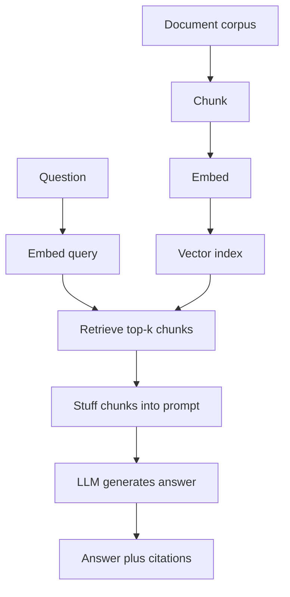

# Module 05 — RAG (Retrieval-Augmented Generation)

> **Depth tags** 🟢 app-level · 🟡 build-one-piece-by-hand · 🔴 from-scratch

RAG is the most widely deployed pattern in production LLM (Large Language Model) applications. Instead
of fine-tuning a model with your private data (expensive, slow, requires ML (Machine Learning)
expertise), you keep the data in a retrieval store and inject the relevant
passages into the prompt at query time. The model stays generic; the knowledge
stays fresh and auditable.

This module builds a full RAG pipeline from scratch: chunk, embed, retrieve,
generate, cite, and evaluate. Then it improves on the naive version with
reranking and HyDE (Hypothetical Document Embeddings), and measures quality with LLM-as-judge.

Prereq: complete module 04 first (the VectorStore, chunking, and hybrid-search
concepts are used here).

---

## Concepts

### The RAG pipeline



The offline path (chunk → embed → index) runs once; the online path runs on
every query:

```
Document corpus
   │
   ▼  (offline, once)
[Chunk] ──► [Embed] ──► [Vector Store / Index]
                                │
                                │ (online, per query)
   Question ──► [Embed query] ──┘
                    │
                    ▼
               [Retrieve top-k chunks]
                    │
                    ▼
         [Stuff chunks into prompt]
                    │
                    ▼
               [LLM generates answer]
                    │
                    ▼
              Answer + Citations
```

### Why RAG reduces hallucination

A base LLM interpolates from training data. When asked about something it
doesn't know (or something that changed after training), it guesses — often
confidently and wrongly. RAG constrains the model: the system prompt says
"answer ONLY from the provided context." The model's job is extraction and
summarisation, not invention.

Caveat: RAG doesn't eliminate hallucination. The model can still ignore context,
misread it, or blend context with its training knowledge. This is exactly why
task 3's evaluation matters.

### Retrieval quality is the bottleneck

The most common failure mode: _the right chunk wasn't retrieved_. If the answer
doesn't exist in the context window, the model cannot produce it correctly. This
is why module 04's chunking strategy, hybrid search, and this module's reranking
all matter: they're all about getting the right chunks into the prompt.

Rule of thumb: if your RAG system gives wrong answers, the first thing to check
is retrieval, not generation.

### Reranking

The first-stage retriever (bi-encoder) encodes query and passage _separately_,
then computes cosine in embedding space. This is fast but imprecise — it can't
model the interaction between a specific query phrase and a specific passage
phrase. A cross-encoder (or LLM reranker) sees both together and does much
better — at the cost of speed.

Practical pattern: retrieve broad candidates (top-50) with the fast bi-encoder,
then rerank with the LLM or a cross-encoder, keep top-5 for generation.

### HyDE — Hypothetical Document Embeddings

Problem: the question "What is HNSW (Hierarchical Navigable Small World)?" lives in question-space; corpus chunks
live in answer-space. The embedding gap causes retrieval misses.

Solution: ask the LLM to write a _hypothetical_ answer, embed that, and use the
hypothesis embedding to retrieve. A hypothesis like "HNSW is a graph-based ANN (Approximate Nearest Neighbor)
index..." will match corpus chunks about HNSW far better than the original
question would.

HyDE adds one LLM call per query. It works best when query and answer surface
forms diverge (technical Q&A, foreign-language queries against English docs).

### Reverse HyDE — generate the questions at index time

HyDE closes the query/answer gap on the _query_ side, paying one LLM call on
_every_ query. **Reverse HyDE** closes the same gap on the _index_ side, paying
once. At index time, for each chunk ask the LLM: _"what questions does this
passage answer?"_ Embed those hypothetical **questions** and store them pointing
back at the chunk. At query time the real user question is compared
question-to-question — same surface form — so no per-query LLM call is needed and
query latency stays flat.

|               | Forward HyDE       | Reverse HyDE                     |
| ------------- | ------------------ | -------------------------------- |
| When it runs  | per query          | once at index time               |
| Cost          | 1 LLM call / query | N LLM calls / chunk (amortised)  |
| Query latency | +1 generation      | none extra                       |
| Storage       | 1 vector / chunk   | several question vectors / chunk |

They compose with everything else: reverse-HyDE question vectors can sit
alongside the chunk-text vectors, and a reranker (Task 2) still runs on top.

### RAG evaluation (LLM-as-judge)

Three metrics, inspired by [RAGAS](https://docs.ragas.io/):

| Metric                | Question                              | How to score                                                                   |
| --------------------- | ------------------------------------- | ------------------------------------------------------------------------------ |
| **Faithfulness**      | Is every claim grounded in context?   | Decompose answer into claims; check each against context. Score = % supported. |
| **Context relevance** | Are the retrieved chunks relevant?    | Rate 0–10 how useful the context is for answering.                             |
| **Answer relevance**  | Does the answer address the question? | Rate 0–10 how well the answer addresses the question.                          |

All three use the LLM to judge — which means the judge can be fooled by
plausible-sounding but wrong text. Treat scores as signal, not ground truth.

### Retrieval metrics: recall@k, MRR, NDCG (interview notes)

LLM-as-judge scores the _generation_; the retriever itself is scored with classic
ranking metrics over a labelled set of (query → relevant chunks):

- **Recall@k** — fraction of queries whose relevant chunk appears anywhere in the
  top k. The first number to tune: if the right chunk isn't in the top k, nothing
  downstream can save you.
- **MRR (Mean Reciprocal Rank)** — average of `1/rank` of the _first_ relevant
  result (1.0 = always first, 0.5 = typically second). Right metric when one good
  chunk is enough — which is most RAG.
- **NDCG (Normalized Discounted Cumulative Gain)** — sums graded relevance
  discounted by `1/log₂(rank+1)`, normalized by the ideal ordering. Right metric
  when relevance is graded (very/somewhat/not) and several results matter.

Practical recipe: measure recall@k to choose k and the retriever, MRR to judge
the reranker (module 05 Task 2 should raise MRR), and quote NDCG when someone
asks "how do you evaluate search?" in an interview. The capstone's M2 milestone
uses MRR@5 for exactly this reason.

### Citations

Citations make RAG auditable. Instead of one opaque answer, you get a list of
claims, each linked to the source chunk. This lets you:

- Detect hallucinations (claim with no valid citation)
- Trace where each fact came from
- Build UI (User Interface) that highlights cited passages

---

## Tasks

### Task 1 🟢 — Naive RAG end-to-end

**Goal:** Build the complete RAG pipeline in one file.

**Files:**

- `py/01_naive_rag.py`
- `ts/01-naive-rag.ts`

**Steps:**

1. Implement `chunk_documents()` — word-based fixed-size chunker.
2. Implement `build_index()` — batch-embed all chunks.
3. Implement `retrieve()` — brute-force cosine top-k.
4. Implement `build_rag_prompt()` — system + user messages with context
   block and citation instruction.
5. Run the harness; it answers 4 questions and prints retrieved chunk ids.

**Acceptance:**

- Answers reference content from the inline corpus.
- Each answer includes at least one chunk id citation.
- The system doesn't crash on any of the 4 questions.

---

### Task 2 🟡 — Better retrieval

**Goal:** Add LLM reranking and HyDE to improve retrieval precision.

**Files:**

- `py/02_better_retrieval.py`
- `ts/02-better-retrieval.ts`

**Steps:**

1. Implement `llm_rerank()` — score each candidate 0–10 using the LLM,
   return top-k. Run scoring in parallel for speed.
2. Implement `hyde_query_vector()` — generate a hypothetical answer, embed
   it, return the vector.
3. The harness compares standard retrieval vs. HyDE side by side.

**Acceptance:**

- `llm_rerank` returns k items sorted by LLM relevance score.
- `hyde_query_vector` returns a vector of the same dimension as the index.
- For the HNSW question, HyDE retrieves the HNSW chunk in top-3 even if the
  raw question embedding doesn't (this may or may not happen — the
  interesting thing is _observing_ whether it does).

---

### Task 3 🟡 — RAG evaluation

**Goal:** Implement LLM-as-judge metrics: faithfulness, context relevance,
answer relevance.

**Files:**

- `py/03_rag_evaluation.py`
- `ts/03-rag-evaluation.ts`

**Steps:**

1. Implement `score_faithfulness()` — decompose the answer into claims, check
   each against context, return fraction supported.
2. Implement `score_context_relevance()` — 0–10 LLM score / 10.
3. Implement `score_answer_relevance()` — 0–10 LLM score / 10.
4. Run the harness over the 3 eval cases (one has an intentional hallucination
   about GPU (Graphics Processing Unit) support for HNSW — check if faithfulness catches it).

**Acceptance:**

- All three functions return a float in [0, 1].
- The HNSW case scores faithfulness < 1.0 (the hallucination should be detected).
- The harness prints per-case and aggregate scores without crashing.

---

### Task 4 🟢 — Citations & attribution

**Goal:** Ensure answers cite which chunk/source each claim came from, and
validate those citations.

**Files:**

- `py/04_citations.py`
- `ts/04-citations.ts`

**Steps:**

1. Implement `build_citation_prompt()` — prompt the LLM to output structured
   JSON (JavaScript Object Notation): `{"claims": [{"text": "...", "citation": "chunk-id-or-null"}]}`.
2. Implement `cited_rag()` — call the LLM, parse the JSON, classify citations
   as valid / invalid / missing.
3. Run the harness over 3 questions; print any invalid or uncited claims.

**Acceptance:**

- The LLM's JSON is parsed correctly (or fails gracefully).
- Valid citations reference chunk ids that were actually retrieved.
- Invalid citations (hallucinated ids) are reported separately.
- Uncited claims are flagged.

---

### Task 5 🟡 — Reverse HyDE

**Goal:** Close the query/answer embedding gap at index time by embedding the
questions each chunk answers, so no per-query LLM call is needed.

**Files:**

- `py/05_reverse_hyde.py`
- `ts/05-reverse-hyde.ts`

**Steps:**

1. Implement `generate_questions()` / `generateQuestions()` — prompt the LLM for
   N short, distinct questions a chunk would answer; parse one per line.
2. Implement `build_reverse_hyde_index()` / `buildReverseHydeIndex()` — generate
   questions per chunk, embed all questions in one batch, emit one entry per
   (chunk, question, vector).
3. Implement `retrieve_reverse_hyde()` / `retrieveReverseHyde()` — embed the
   query, score against question vectors, collapse to chunks by best-matching
   question (max), return top-k.
4. Run the harness; it compares reverse-HyDE retrieval against the naive
   embed-the-chunk baseline on deliberately-reworded questions.

**Acceptance:**

- The index holds several question vectors per chunk (≈ N × chunk count).
- Chunk score is the MAX over its question vectors (a chunk is not counted once
  per question).
- For at least one reworded question, reverse HyDE ranks the intended chunk
  higher (or ties) versus the baseline.

---

## Done when

- [ ] Naive RAG answers questions about the corpus with chunk citations.
- [ ] Reranker changes which top-3 chunks are used (you can see this in the
      output).
- [ ] Evaluation prints faithfulness / context-relevance / answer-relevance
      scores for all 3 test cases.
- [ ] The HNSW eval case scores faithfulness < 1.0 (hallucination detected).
- [ ] Citation validator flags invalid and uncited claims.
- [ ] Reverse HyDE builds an index of per-chunk question vectors and retrieves by
      question-to-question match (no per-query LLM call).

---

## Going deeper

- **RAGAS:** The [RAGAS library](https://docs.ragas.io/) automates all three
  metrics with better prompts and averaging. Swap your hand-written evaluators
  with RAGAS and compare scores.
- **Contextual compression:** Instead of stuffing full chunks into the prompt,
  ask the LLM to extract only the sentences relevant to the question. This
  reduces prompt length and noise.
- **Multi-hop RAG:** Some questions require multiple retrieval steps ("Who
  founded the company that makes HNSW?" — first retrieve the HNSW chunk to
  find the company, then retrieve the founder chunk). Implement a loop that
  detects when a second retrieval is needed.
- **Streaming answers:** In task 1, switch `provider.chat()` to
  `provider.chat_stream()` and stream the answer token by token.
- **Cross-encoder reranking:** Instead of the LLM, use a dedicated cross-
  encoder from HuggingFace (`cross-encoder/ms-marco-MiniLM-L-6-v2`) which is
  much cheaper per call.
- **Faithfulness without LLM:** Use NLI (Natural Language Inference) models
  to check whether each claim is entailed by the context — no LLM calls
  required.

---

## Environment variables

No new env vars beyond module 00/04.

## Extra Python deps

```bash
uv sync --extra vectors   # chromadb, qdrant-client, rank-bm25 (from module 04)
```

---

## 📚 Read more

- [Retrieval-Augmented Generation (Lewis et al., 2020)](https://arxiv.org/abs/2005.11401) — the original RAG paper that named the pattern you just built.
- [Pinecone — Retrieval-Augmented Generation](https://www.pinecone.io/learn/retrieval-augmented-generation/) — a practical walkthrough of the full pipeline, with the same retrieval-is-the-bottleneck framing as this module.
- [RAGAS documentation](https://docs.ragas.io/) — the library behind Task 3's metrics; read how faithfulness and relevance are actually prompted and averaged.
- [Hugging Face LLM course](https://huggingface.co/learn/llm-course) — free course covering the transformer and retrieval foundations under RAG.
- 🎬 [Andrej Karpathy's channel](https://www.youtube.com/@AndrejKarpathy) — his "Intro to Large Language Models" talk situates RAG among the other ways to get knowledge into an LLM.
