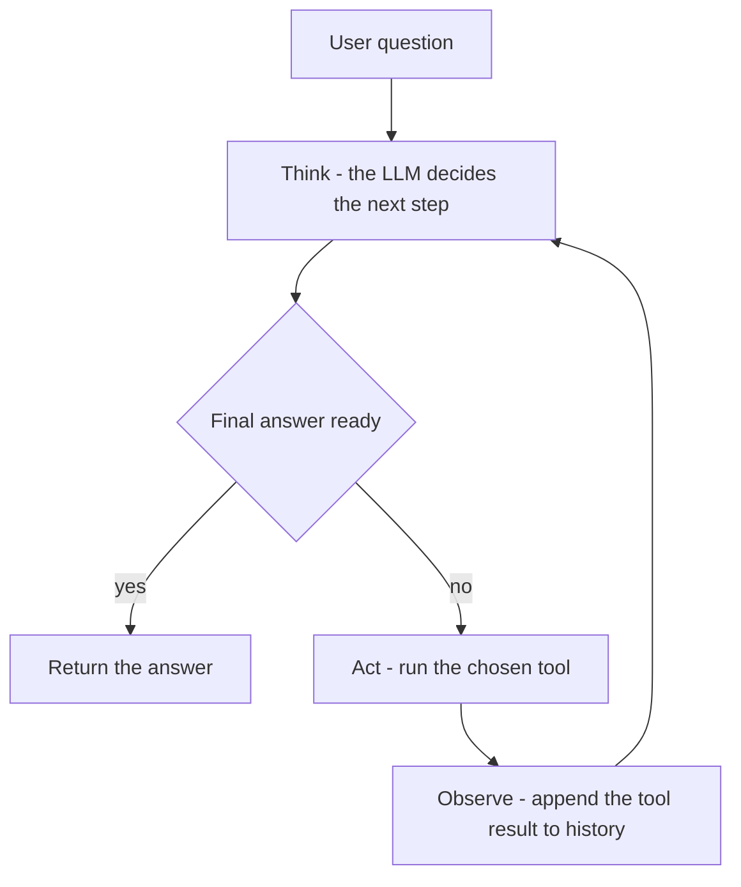

# Module 06 — Agents

An agent is not a new type of model. It's a **loop**: the LLM (Large Language Model) decides what to
do, a tool runs, the result comes back as an observation, and the LLM decides
again — until it has enough information to answer.

Everything else (memory, multi-agent, frameworks) is scaffolding around that
loop. This module builds the loop from scratch so the scaffolding is transparent.

---

## Concepts

### What an agent really is

Strip away the hype. An agent is:

```
loop:
    response = llm.chat(history)           # LLM decides
    if "Final Answer" in response:
        return response                    # done
    tool_result = run_tool(response)       # tool runs
    history.append(tool_result)            # observation feeds back
```

The same loop as a picture — every iteration either answers or acts:



That's it. Every agent framework (LangGraph, AutoGen, CrewAI) is an opinionated
implementation of that loop with added persistence, routing, and tracing.

### ReAct — Reason + Act

ReAct is a prompting pattern where the LLM structures its output as:

```
Thought: I need to find the height of the Eiffel Tower first.
Action: search
Action Input: eiffel tower height
```

Then you (the agent loop) run the tool and inject the result:

```
Observation: The Eiffel Tower is 330 metres tall.
```

And the loop continues. The model's text _is_ the control flow. This works on
any model that can follow instructions — including local Ollama models. The cost
is that free-text parsing is fragile: the model might spell `Action Input:` as
`Action input:` or skip the format entirely on the first try. You'll feel this
in Task 1.

### Native tool calling — structured vs. parsed

OpenAI and Anthropic added first-class tool support to their APIs (Application Programming Interfaces). Instead of
returning free text you parse, the model returns a structured JSON (JavaScript Object Notation) object:

```json
{ "name": "search", "arguments": { "query": "eiffel tower height" } }
```

More reliable, but you're now tied to providers that support it. The `llm_core`
abstraction intentionally does **not** expose this — advanced API features are
taught at the SDK (Software Development Kit) level so you see the real shape of each provider (same
rationale as module 02).

### Memory

LLMs are stateless. "Memory" is something you build:

| Kind       | How                                 | Limit                       |
| ---------- | ----------------------------------- | --------------------------- |
| In-context | append messages to the history list | context window              |
| Persistent | read/write a file or DB (Database)  | unlimited (latency cost)    |
| Summarised | compress old turns so they fit      | quality loss on compression |

A **scratchpad** is a middle ground: the agent writes structured notes (not the
full conversation) to a file, and the system prompt injects those notes at the
top of every turn. The agent "remembers" its prior conclusions without the full
history filling up the context window.

### Framework agents — LangGraph

LangGraph models an agent as a **typed state machine**:

- **Nodes** are Python/JS functions that receive state and return updates.
- **Edges** (including conditional edges) decide which node runs next.
- **State** is a typed dict that flows through the graph and gets accumulated.

The standard ReAct agent graph looks like:

```
START -> agent_node
agent_node -> tools_node   (if tool_calls present)
agent_node -> END          (if no tool_calls)
tools_node -> agent_node   (cycle back)
```

Frameworks add checkpointing (resume a run), streaming (emit each step),
and tracing (inspect every message) with minimal extra code. The trade-off is
abstraction: when something goes wrong, you need to understand both your code
and the framework's internals. Building from scratch first (Task 1) makes
debugging transparent.

### Multi-agent

A single context window has limits. When a task is too complex or too long,
split it:

- **Planner**: decompose the question into subtasks, decide which worker handles each.
- **Workers**: focused agents (researcher, calculator, writer) each with a
  specialised system prompt and tools.
- **Synthesiser**: combine worker results into a coherent final answer.

Workers can run in parallel (each gets its own LLM call). The planner's job is
routing and decomposition, not execution. This pattern appears everywhere in
production: it's essentially a map-reduce with LLMs.

### Stop conditions & failure modes — hardening the loop

The loop at the top of this page has exactly one exit: the model stops emitting
tool calls. A production harness never trusts that alone. Real agent loops check
a whole **exit-criteria list** on every iteration:

- **Terminal message** — the model produced a final answer instead of a tool call.
- **Goal predicate** — a programmatic check that the goal is _actually_ met
  (inspect world state: was the file written? is the email in the outbox?).
- **Iteration cap** — a hard budget on loop turns.
- **Wall-clock timeout** — a hard budget on elapsed time.
- **Unrecoverable error** — a tool failure that no retry will fix.
- **Stuck detection** — the model is looping without progress (below).
- **Explicit exit action** — some harnesses give the model a `finish`/`give_up`
  tool so "I'm done" and "I'm stuck" are structured, not parsed from prose.

The subtle one: **a terminal message is not goal completion**. When the model
stops calling tools and says "Which email address should I send this to?", the
loop is over — but the task isn't done. That's why the goal predicate is a
_separate_ check from "no more tool calls": success requires both a terminal
message _and_ the predicate passing; a terminal message alone is merely
"incomplete".

The classic **stuck signal** is the agent calling the _same tool with identical
arguments_ N times in a row — it didn't like the observation, so it asks again,
forever. Its cousin is A/B/A/B **oscillation** between two calls. Both are cheap
to detect: keep a sliding window of `(tool, canonical-args)` signatures and
compare. Exiting at iteration 5 of a 10-iteration cap with a diagnostic beats
burning the remaining budget on identical calls.

Finally, **idempotency** for side-effecting tools: retries are unavoidable
(networks blip), but a retried `send_email` must not send twice — and a model
that re-issues the same call after a confusing error must not either. Assign
each _logical_ call a stable **idempotency key** (tool name + arguments
serialised in a canonical order) and dedupe at execution time: if the key was
already executed, return the recorded result instead of running the tool again.
Note this is **harness-level, not model-level** engineering — the model never
sees the key; the loop guarantees at-most-once side effects no matter what the
model does. (Payment APIs like Stripe expose exactly this as an
`Idempotency-Key` header.) Task 6 builds all of it, with an injected fake clock
so even the timeout branch is deterministically testable.

---

## Setup

```bash
# Python extras (langgraph, langchain-core):
uv sync --extra agents

# TypeScript — first install (LangGraph.js declared in ts/package.json):
pnpm install
```

**Note on providers:**

- Tasks 1, 3, 5: work with any provider including Ollama (`LLM_PROVIDER=ollama`).
- Task 2: requires `OPENAI_API_KEY` or `ANTHROPIC_API_KEY` (native tool calling).
- Task 4: requires a LangChain-compatible chat model (install `langchain-openai`
  or `langchain-anthropic` separately, or write an adapter).
- Task 6: fully offline with `--stub` (no provider, no key); the optional live
  path works with any provider via `get_provider()` / `getProvider()`.

---

## Tasks

### Task 1 — ReAct loop from scratch 🔴

**Goal:** Build a working agent using only `provider.chat()` and plain text
parsing. No SDKs, no frameworks — just the loop.

**Steps (Python):**

1. Open `py/01_react_loop.py`. Read the tool definitions, system prompt, and
   loop skeleton.
2. Implement `calculator`, `fake_search`, `retrieve` (TODOs 1–3).
3. Implement `parse_model_output` to extract Thought / Action / Action Input /
   Final Answer from the model's text (TODO 4).
4. Implement the loop body in `run_react_agent` (TODO 5): call the model, parse,
   dispatch a tool, append the observation, repeat.
5. Run it: `uv run python modules/06-agents/py/01_react_loop.py`
6. Watch it reason through a multi-step problem. Notice when the format breaks.

**Steps (TypeScript):**

1. Open `ts/01-react-loop.ts`. Implement the same three tools (TODO 1).
2. Implement `parseModelOutput` (TODO 2).
3. Implement the loop body in `runReActAgent` (TODO 3).
4. Run: `pnpm tsx modules/06-agents/ts/01-react-loop.ts`

**Acceptance:**

- The agent finds the Eiffel Tower height via `search`, converts it via
  `calculator`, and returns a Final Answer in 3–6 steps.
- You can trace every Thought / Action / Observation in the output.

---

### Task 2 — Native tool-calling agent 🟢

**Goal:** Re-implement the same task using the provider's structured tool-calling
API. Compare reliability and ergonomics to Task 1.

**Steps (Python):**

1. Open `py/02_native_tools.py`.
2. Declare the tool schemas in OpenAI format (TODO 4) and Anthropic format
   (TODO 6). Note how they differ.
3. Implement the OpenAI loop (TODO 5): check `finish_reason`, dispatch tools,
   append `tool` role messages.
4. Implement the Anthropic loop (TODO 7): check `stop_reason == "tool_use"`,
   find `tool_use` blocks in content, return `tool_result` messages.
5. Run both: `LLM_PROVIDER=openai uv run python modules/06-agents/py/02_native_tools.py`

**Steps (TypeScript):**

1. Open `ts/02-native-tools.ts`. Declare `openAITools` (TODO 1).
2. Implement `runOpenAIAgent` (TODO 3) and `runAnthropicAgent` (TODO 4).
3. Run: `LLM_PROVIDER=openai pnpm tsx modules/06-agents/ts/02-native-tools.ts`

**Acceptance:**

- Both providers reach a correct Final Answer.
- You can articulate the structural difference between OpenAI's `tool_calls`
  and Anthropic's `tool_use` content blocks.

---

### Task 3 — Memory 🟡

**Goal:** Add persistent scratchpad memory so the agent accumulates notes across
turns and across restarts.

**Steps (Python):**

1. Open `py/03_memory.py`.
2. Implement `read_scratchpad` and `write_scratchpad` (TODO 1).
3. Implement `trim_history` to prevent context overflow (TODO 2).
4. Write the system prompt that injects the scratchpad (TODO 3).
5. Implement `process_response` to extract `SCRATCHPAD:` commands (TODO 4).
6. Complete the chat loop body (TODO 5).
7. Run and chat for a few turns, type `scratchpad` to inspect it.

**Steps (TypeScript):**

1. Open `ts/03-memory.ts`. Implement `readScratchpad`, `writeScratchpad` (TODO 1).
2. Implement `trimHistory` (TODO 2), `buildSystemPrompt` (TODO 3),
   `processResponse` (TODO 4), and the loop body (TODO 5).

**Acceptance:**

- The agent uses `SCRATCHPAD: <note>` to save information.
- Restart the script — the scratchpad persists and the new session sees it.
- History never exceeds `MAX_HISTORY_TURNS` pairs.

---

### Task 4 — Framework agent (LangGraph) 🟢

**Goal:** Re-build the same ReAct agent using LangGraph's state machine model.
Contrast how much less code you write vs. what you give up in control.

**Steps (Python):**

1. Run `uv sync --extra agents` to install LangGraph.
2. Open `py/04_framework.py`. Follow TODOs 1–9 in order:
   - Import LangGraph + a LangChain chat model (install `langchain-openai` or
     `langchain-anthropic`).
   - Define state, tools, agent node, tools node, routing function.
   - Wire the graph, compile, and invoke.
3. Run: `uv run python modules/06-agents/py/04_framework.py`

**Steps (TypeScript):**

1. `@langchain/langgraph` and `@langchain/core` are in `ts/package.json`.
   Run `pnpm install`.
2. Open `ts/04-framework.ts`. Follow TODOs 1–9.
3. Run: `pnpm tsx modules/06-agents/ts/04-framework.ts`

**Acceptance:**

- The compiled LangGraph app solves the same question as Task 1.
- You can point to the part of the graph that corresponds to each step of your
  from-scratch loop.

---

### Task 5 — Multi-agent 🟡

**Goal:** Build a planner-worker architecture where a planner decomposes a
question and delegates subtasks to specialised worker agents.

**Steps (Python):**

1. Open `py/05_multi_agent.py`.
2. Write the planner prompt (TODO 1) and implement `run_planner` to parse its
   JSON output (TODO 2).
3. Write worker prompts (TODO 3) and implement `run_worker` (TODO 4).
4. Implement `run_synthesiser` (TODO 5) and the orchestrator `run_multi_agent`
   (TODO 6).
5. Run: `uv run python modules/06-agents/py/05_multi_agent.py`

**Steps (TypeScript):**

1. Open `ts/05-multi-agent.ts`. Implement `runPlanner` (TODO 2), `runWorker`
   (TODO 4), `runSynthesiser` (TODO 5), `runMultiAgent` (TODO 6).

**Acceptance:**

- The planner produces a valid JSON task list with 2–4 subtasks.
- Each worker produces a useful result.
- The synthesiser produces a final answer that incorporates all worker results.
- (Stretch) Workers run in parallel (Promise.all / ThreadPoolExecutor).

---

### Task 6 — Harden the loop: stop conditions, failure detection, idempotency 🟡

**Goal:** Turn the naive loop into a production-grade harness: iteration cap,
fake-clock timeout, a goal predicate distinct from "the model stopped", stuck
detection with an early-exit diagnostic, and at-most-once side effects via
idempotency keys. Deterministic by default — a scripted `StubModel` replays
misbehaving-model scenarios so _your guards_ are the only thing under test.

**Files:**

- `py/06_harden_loop.py`
- `ts/06-harden-loop.ts`

**Steps (Python):**

1. Open `py/06_harden_loop.py`. Read the provided pieces: `StubModel` (replays
   scripted decisions), the tools (`search` returns canned text; `send_email`
   appends to an in-memory outbox, with a flaky wrapper that fails the first
   attempt), the `FakeClock`, and the scenario harness.
2. Implement `idempotency_key(tool_name, args)` — a stable key per logical call.
3. Implement `detect_stuck(recent_calls, window)` — repeated-identical-call and
   A/B/A/B oscillation detection over a sliding window of call signatures.
4. Implement `execute_with_retry(tool, args, executed)` — dedupe by key, retry
   a transient failure exactly once.
5. Implement `run_agent_loop(...)` — the guarded loop: timeout, terminal-message
   exit with goal check, stuck exit, iteration cap.
6. Run: `uv run python modules/06-agents/py/06_harden_loop.py --stub`
7. (Optional) Run without `--stub` to drive the same loop with a live model via
   `get_provider()`.

**Steps (TypeScript):**

1. Open `ts/06-harden-loop.ts`. Implement `idempotencyKey` (use the provided
   `stableJson` helper), `detectStuck`, `executeWithRetry`, and `runAgentLoop`.
2. Run: `pnpm tsx modules/06-agents/ts/06-harden-loop.ts --stub`

**Acceptance (`--stub`):**

- The stuck scenario exits via a `detect_stuck` diagnostic at iteration 5 of a
  10-iteration cap (printed) — before burning the remaining budget; the
  oscillation scenario exits at iteration 4.
- A terminal clarifying question does NOT count as success: the loop reports
  `incomplete` (goal predicate false), distinct from the `success` run.
- The timeout scenario exits via the injected fake clock, well before the
  iteration cap — no real sleeps anywhere.
- Idempotency: the outbox contains EXACTLY 1 email despite 1 transient failure
  - retry and a duplicate re-issued call (with args in a different key order).
- The full run ends with "All acceptance checks passed."

---

## Done when

- [ ] Task 1: a from-scratch ReAct agent solves a multi-step question on Ollama.
- [ ] Task 2: the same question via native tool calling on OpenAI and Anthropic.
- [ ] Task 3: the agent writes/reads a scratchpad file that persists across runs.
- [ ] Task 4: the same ReAct behaviour reproduced with LangGraph.
- [ ] Task 5: planner decomposes a question, workers solve subtasks, synthesiser
      combines results.
- [ ] Task 6: `06_harden_loop --stub` / `06-harden-loop --stub` prints
      "All acceptance checks passed." — stuck exits early with a diagnostic,
      a clarifying terminal message is `incomplete` (not success), the fake
      clock trips the timeout, and the outbox holds exactly one email.
- [ ] You can list the exit criteria a production agent loop checks on every
      iteration, and explain why an idempotency key lives in the harness, not
      the model.

---

## The loops around the loop (interview notes)

"Does the agent learn while it runs?" is a favourite interview probe, and the
answer needs three different loops kept straight. The first is the **training
loop**: gradient descent over a dataset, run **offline**, producing **frozen
weights**. Nothing in this module touches it. When an agent seems to "learn"
in a session — recalling your name, building on earlier conclusions — that is
**retrieval from memory** (Task 3's scratchpad, module 04/05's vector stores)
injected back into the context window, **not a weight update**. Restart the
process without the memory file and the "learning" is gone.

The second is the **feedback loop** — signals routed back into the system at
different timescales. Per iteration: tool results feed back as observations
(that _is_ the agent loop). Per session: user corrections and ratings get
captured and mined (module 22, Task 4 builds the capture UX). Per release: eval
metrics and production traces (module 21) tell you whether a prompt, retrieval
corpus, or fine-tune dataset change actually improved things. None of these
change weights at runtime either — they change the _context, corpus, or next
training run_.

The third is the **human loop**: a human-in-the-loop pause is an **autonomy
boundary**, not a UX nicety. The harness stops before a risky side effect
(sending the email, spending the money) and waits for approval — 06b Task 4
builds this with LangGraph's `interrupt()`, and module 22 Task 5 designs the
approval flow around it. It composes with Task 6's guards: stop conditions
bound what the agent may do alone; the human loop gates what it may do at all.
The likely convergence of all three is **continual learning** — agent
experience distilled into training signal so today's feedback loop feeds
tomorrow's training loop; see module 13b for how that training actually
happens (post-training and alignment).

---

## Going deeper

- **ReAct paper**: Yao et al. 2022 — the original paper coining the Thought/Action/Observation format.
- **Reflexion**: add a self-critique step after each action to catch errors before they compound.
- **Tree of Thought**: branch multiple reasoning paths and pick the best.
- **Human-in-the-loop**: add an edge in LangGraph that pauses for human approval before tool execution.
- **Agent evals**: use Task 1's multi-step questions as a test suite — measure how often the agent reaches the correct Final Answer within N steps.

---

## 📚 Read more

- **ReAct paper (Yao et al., 2022)** — <https://arxiv.org/abs/2210.03629> — the original Thought/Action/Observation format you build in Task 1.
- **Anthropic — Building effective agents** — <https://www.anthropic.com/research/building-effective-agents> — when a workflow beats an agent, and why simple composable loops win in production.
- **Native tool calling — OpenAI & Anthropic docs** — <https://platform.openai.com/docs/guides/function-calling> · <https://docs.anthropic.com> — the structured `tool_calls` / `tool_use` APIs behind both of Task 2's loops.
- **Lilian Weng — LLM Powered Autonomous Agents** — <https://lilianweng.github.io/posts/2023-06-23-agent/> — the classic survey tying planning, memory, and tool use into one picture.
- 🎥 **DeepLearning.AI — Functions, Tools and Agents with LangChain** — <https://www.deeplearning.ai/short-courses/functions-tools-agents-langchain/> — short video course walking the same tool-calling-to-agent progression.
