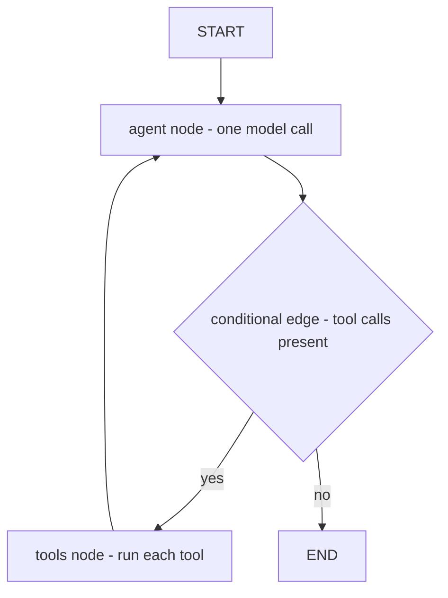

# Module 06b — LangGraph deep dive

Module 06 built a ReAct (Reasoning and Acting) agent **from scratch** (Task 1) and then rebuilt it once
with LangGraph (Task 4) to see the same loop as a state machine. That single task
is enough to recognise LangGraph. It is **not** enough to pass an interview that
asks "have you used LangGraph in production?" — those questions are about
**persistence, human-in-the-loop, streaming, subgraphs, multi-agent handoff, and
time travel**, not about wiring two nodes together.

This module is that depth. You already understand the agent loop; here you learn
the framework's actual value-add: the parts you'd otherwise rebuild badly.

> **Prerequisite:** finish module 06 (at least Tasks 1 and 4). This module assumes
> you can already explain "an agent is a loop" and have seen `StateGraph` once.

---

## Why LangGraph exists

A raw `while` loop (module 06, Task 1) works until you need any of these, at which
point you start reinventing a framework:

| You need…                                          | Hand-rolled cost                    | LangGraph gives you                           |
| -------------------------------------------------- | ----------------------------------- | --------------------------------------------- |
| Resume a run after a crash / next day              | serialise+reload all state yourself | **checkpointer** + `thread_id`                |
| Pause for human approval before a tool fires       | bespoke flag plumbing               | `interrupt()` / `interrupt_before`            |
| Stream tokens _and_ steps to a UI (User Interface) | manual fan-out                      | `stream_mode` (`values`/`updates`/`messages`) |
| Branch / retry / fork a conversation               | snapshot bookkeeping                | **time travel** over checkpoints              |
| Several specialists routing to each other          | ad-hoc dispatch                     | **`Command(goto=…)`** handoff + subgraphs     |
| See every message that flowed                      | print debugging                     | LangSmith tracing                             |

LangGraph is **the runtime**, not the prompting library. It's a typed,
checkpointed, streamable state machine for LLM (Large Language Model) workflows. LangChain (chains,
chat-model wrappers, `@tool`) is a _dependency_ it leans on for the model layer —
but the graph engine is the product.

---

## The mental model (one paragraph)

A LangGraph app is a **graph over a shared state object**. **Nodes** are plain
functions `(state) -> partial_state_update`. **Edges** decide which node runs next
— fixed edges (`A -> B`) or **conditional edges** (a function returns the name of
the next node). **State** is a typed dict whose fields are **channels**; each
channel has a **reducer** that says how a node's update is merged in (overwrite by
default; _append_ for message lists). You `compile()` the graph into an `app`,
optionally with a **checkpointer**; then `invoke`/`stream` it with a `config`
that carries a `thread_id`. Everything else in this module is a feature layered on
that core: persistence, interrupts, streaming, subgraphs, handoff, time travel.

```
        ┌─────────┐  tool_calls?  ┌─────────┐
START ──▶│  agent  │──────yes─────▶│  tools  │
        └─────────┘               └─────────┘
             │  no                     │
             ▼                         │
            END  ◀── (cycle back) ─────┘
```



That diagram is the **prebuilt ReAct agent** — `create_react_agent(model, tools)`
builds exactly it. You'll use the prebuilt where it fits and hand-build the graph
where you need control. Knowing _both_ is the interview signal.

---

## Concepts

### 1. State, channels, reducers

State is the contract between nodes. A node returns only the keys it wants to
change; LangGraph merges each key through that channel's **reducer**:

- default reducer = **last write wins** (overwrite).
- `add_messages` (Python) / the messages reducer (TS) = **append + dedupe by id**,
  and it upgrades plain dicts to `Message` objects. This is why the messages
  channel "just grows" without you concatenating.

Custom reducers let a channel _accumulate_ (sum a counter, union a set, keep a
running list). Picking the right reducer per channel is most of "designing the
state." `MessagesState` (Python) / `MessagesAnnotation` (TS) is the prebuilt
state that's just `{ messages }` with the append reducer — most agents start there.

### 2. Nodes, edges, conditional edges, `ToolNode`

- **Node**: `def agent(state): return {"messages": [model.invoke(state["messages"])]}`.
- **Normal edge**: `add_edge("tools", "agent")` — always go tools→agent.
- **Conditional edge**: `add_conditional_edges("agent", route)` where `route(state)`
  returns the next node's name (or `END`). This _is_ the agent's control flow.
- **`ToolNode`** (prebuilt): a node that reads the last AI message's `tool_calls`,
  runs each tool, and returns `ToolMessage`s. **`tools_condition`** (prebuilt) is
  the matching router: "tools if there are tool_calls, else END." Together they
  replace the ~30 lines you wrote by hand in module 06.

### 3. Persistence — checkpointers & threads

Compile with a **checkpointer** and every super-step is saved:

```python
app = workflow.compile(checkpointer=InMemorySaver())
app.invoke(inputs, {"configurable": {"thread_id": "user-42"}})
```

A **`thread_id`** is one conversation/run. Same thread → the next `invoke`
continues where the last left off (the saved messages are loaded automatically).
This is how you get **memory across turns** _and_ **resume across process
restarts** — for real persistence swap `InMemorySaver` for `SqliteSaver` /
`PostgresSaver` (separate packages). The checkpointer is also the foundation for
interrupts and time travel — they're impossible without it.

### 4. Human-in-the-loop — `interrupt()`

The single most-asked LangGraph production feature. Two flavours:

- **Static**: `compile(..., interrupt_before=["tools"])` pauses _before_ the tools
  node every time. Inspect/edit state, then resume by calling `invoke(None, config)`.
- **Dynamic**: call `interrupt(payload)` _inside a node_. The graph stops, surfaces
  `payload` to your app (e.g. "approve sending this email?"), and **resumes from
  that exact line** when you call `invoke(Command(resume=answer), config)`. The
  node re-runs from the top but `interrupt` returns the resumed value.

Use it for approval gates, missing-input prompts, and edit-before-execute. It only
works because the checkpointer snapshotted state at the pause.

### 5. Streaming

A graph emits a stream; `stream_mode` picks the granularity:

| mode       | yields                                       | use for                  |
| ---------- | -------------------------------------------- | ------------------------ |
| `values`   | full state after each step                   | "show me state now"      |
| `updates`  | just the delta each node returned            | step-by-step progress UI |
| `messages` | **LLM tokens** as they generate (+ metadata) | token-by-token chat UI   |
| `custom`   | whatever you emit via the stream writer      | tool progress bars       |

You can pass a **list** of modes. `messages` is what powers a ChatGPT-style typing
effect from inside a multi-node graph.

### 6. Subgraphs

A compiled graph can be **used as a node** in a bigger graph. That's a subgraph.
Use it to (a) reuse a whole agent as one step, and (b) keep separate state schemas
(the parent only shares the channels whose names match). Stream with
`subgraphs=True` to see the inner steps. This is how large systems stay
composable instead of becoming one 40-node spaghetti graph.

### 7. Multi-agent — handoff with `Command`

Module 06 Task 5 did planner→workers→synthesiser by hand. LangGraph's primitive is
**`Command`**: a node can return `Command(goto="researcher", update={...})` to set
state **and** jump to another node in one move. Patterns:

- **Supervisor**: one router node decides which worker runs next via `Command(goto=…)`;
  workers hand control back to the supervisor. (`langgraph-supervisor` /
  `create_react_agent` build this for you, but the `Command` primitive is the thing
  to understand.)
- **Swarm / network**: workers hand off _directly_ to each other.

A handoff is just "update shared state + goto another node." That sentence is the
whole interview answer.

### 8. Time travel

With a checkpointer you get the full history:

- `get_state(config)` → the current snapshot (`StateSnapshot`: values, next nodes,
  `checkpoint_id`).
- `get_state_history(config)` → every past checkpoint, newest first.
- Resume from an **old** checkpoint by passing its `checkpoint_id` in config — the
  graph **forks** a new branch from that point.
- `update_state(config, values)` → edit state (write through channel reducers) to
  create a corrected checkpoint, then continue.

This gives you debugging ("replay from step 3"), what-if branching, and
human-edits-then-continue — all for free once persistence is on.

### 9. Where the platform fits (know the names)

You won't build these here, but interviewers name-drop them:

- **LangSmith** — tracing/eval/observability dashboard (set `LANGCHAIN_TRACING_V2=true`).
- **LangGraph Studio** — visual graph debugger; step through nodes, edit state, time-travel in a UI.
- **LangGraph Platform / Server** — hosted deployment: turns your compiled graph
  into an API (Application Programming Interface) with a managed checkpointer, scheduling, and a task queue.

---

## Setup

```bash
# Python — the `agents` extra now bundles langgraph + langchain-core + the three
# chat-model adapters (ollama / openai / anthropic) + the sqlite checkpointer:
uv sync --extra agents
#   Free / local default: ollama pull llama3.2     (zero cost, no API key)
#   Hosted: set OPENAI_API_KEY or ANTHROPIC_API_KEY, then LANGGRAPH_MODEL_PROVIDER=openai|anthropic

# TypeScript — this module's package.json declares langgraph, core, and the three
# model adapters. (Task 3's restart demo: pnpm add @langchain/langgraph-checkpoint-sqlite)
pnpm install
```

Each exercise's header comment names the exact import for the model. We default
the snippets to **Ollama + llama3.2** so the whole module runs at zero cost; swap
the model import to switch providers. (LangGraph needs a real LangChain
`ChatModel` that implements `.bind_tools()`, so these tasks go through
`langchain-*` directly rather than `llm_core` — same exception as module 06 Task 4.)

> **Note on `llm_core`:** the course rule is "exercise code goes through the
> shared client." Framework tasks are the documented exception: LangGraph is built
> on LangChain's `ChatModel` interface, and the _lesson_ is the framework itself.
> Everywhere outside these framework tasks, keep using `get_provider()`.

---

## Tasks

Lanes: 🟢 use it · 🟡 use it + hand-build one piece · 🔴 build the machinery.

### Task 1 — State, channels & reducers 🟡

**Goal:** Prove you understand _why_ messages accumulate but other fields don't.

**Steps:** Open `01_state_reducers.(py|ts)`.

1. Define a state with three channels: `messages` (append reducer), `step_count`
   (custom reducer that **sums**), and `last_tool` (default = overwrite).
2. Write two tiny nodes that each return updates to all three channels.
3. Run the graph and print state after each — watch `messages` grow, `step_count`
   accumulate, `last_tool` overwrite.

**Acceptance:** You can state, for each channel, what its reducer did and why.
Change `step_count`'s reducer to overwrite and explain the new output before running.

---

### Task 2 — Conditional edges & the prebuilt `ToolNode` 🟢

**Goal:** Rebuild module 06's ReAct loop two ways and feel the abstraction ladder.

**Steps:** Open `02_conditional_toolnode.(py|ts)`.

1. **Hand-built:** wire `agent` + `ToolNode` with your own conditional-edge router.
2. **Prebuilt router:** replace your router with `tools_condition`.
3. **Fully prebuilt:** delete the graph and call `create_react_agent(model, tools)`;
   confirm identical behaviour.

**Acceptance:** Same answer from all three. You can point at the exact lines that
`tools_condition` and `create_react_agent` collapsed.

---

### Task 3 — Persistence: checkpointer + threads 🟡

**Goal:** Memory across turns and across process restarts.

**Steps:** Open `03_persistence.(py|ts)`.

1. Compile the Task 2 graph with `InMemorySaver` and a `thread_id`.
2. Ask "My name is Ada." then (same thread) "What's my name?" — it remembers.
3. Switch `thread_id` and confirm the new thread has **no** memory.
4. Swap in `SqliteSaver` (Python) / a file-backed saver, restart the script, and
   confirm memory survives the restart.

**Acceptance:** Same thread remembers; different thread doesn't; memory survives a
restart with the persistent checkpointer.

---

### Task 4 — Human-in-the-loop: `interrupt()` 🔴

**Goal:** Pause before a dangerous tool, get approval, resume — the production gate.

**Steps:** Open `04_human_in_the_loop.(py|ts)`.

1. Give the agent a `send_email(to, body)` tool that must **never** fire without
   approval.
2. Inside the tools path, call `interrupt({...})` with the pending action so the
   graph stops and surfaces it.
3. From "the human," resume with `Command(resume="approve")` → tool runs; resume
   with `"deny"` → agent is told it was rejected and replans.
4. (Stretch) Also demonstrate the static form: `interrupt_before=["tools"]`.

**Acceptance:** No email "sends" without an explicit approve resume. A deny makes
the agent change course instead of crashing.

---

### Task 5 — Streaming modes 🟢

**Goal:** Drive a UI from a multi-node graph.

**Steps:** Open `05_streaming.(py|ts)`.

1. Stream the Task 2 graph with `stream_mode="updates"` and print each node's delta.
2. Re-stream with `"values"` and contrast (full state vs delta).
3. Stream with `"messages"` and print **LLM tokens** as they arrive for the typing
   effect.
4. (Stretch) Pass `["updates", "messages"]` and tag each event by its mode.

**Acceptance:** You can explain when you'd choose each mode, and you see real
token-by-token output under `messages`.

---

### Task 6 — Subgraphs 🟡

**Goal:** Reuse a whole agent as one node and keep state schemas isolated.

**Steps:** Open `06_subgraphs.(py|ts)`.

1. Compile your Task 2 ReAct agent as a **subgraph**.
2. Build a parent graph: `preprocess -> research_subgraph -> summarise`.
3. Stream the parent with `subgraphs=True` and observe inner steps.
4. Give the subgraph a private channel the parent doesn't share; confirm isolation.

**Acceptance:** The parent runs the subgraph as a single node; `subgraphs=True`
reveals the inner steps; the private channel never leaks to the parent.

---

### Task 7 — Multi-agent supervisor with `Command` 🔴

**Goal:** Routing/handoff between specialists, the LangGraph-native way.

**Steps:** Open `07_supervisor.(py|ts)`.

1. Build `researcher` and `mathematician` worker nodes (each its own system prompt
   - tools).
2. Build a `supervisor` node that returns `Command(goto=<worker or END>)` based on
   what's left to do.
3. Each worker returns `Command(goto="supervisor", update={...})` to hand back.
4. Run a question that needs **both** workers; trace the handoffs.

**Acceptance:** The supervisor routes to both workers and then to `END`; you can
read the `Command(goto=…)` handoffs in the trace. (Bonus: note how
`create_react_agent` / `langgraph-supervisor` would generate this.)

---

### Task 8 — Time travel 🟡

**Goal:** Replay, fork, and edit-then-continue over checkpoints.

**Steps:** Open `08_time_travel.(py|ts)`.

1. Run a multi-step thread with a checkpointer.
2. `get_state_history(config)` and print each checkpoint's `checkpoint_id` + `next`.
3. Resume from an **earlier** checkpoint (pass its `checkpoint_id`) → a forked run.
4. Use `update_state` to correct a value, then continue from the edit.

**Acceptance:** You can list the checkpoints, fork from an old one, and show that
`update_state` changed the branch the run took.

---

## Done when

- [ ] Task 1: you can name each channel's reducer and predict its merge behaviour.
- [ ] Task 2: ReAct rebuilt hand-wired, with `tools_condition`, and with `create_react_agent` — all equal.
- [ ] Task 3: same `thread_id` remembers; different doesn't; persistent saver survives restart.
- [ ] Task 4: a tool cannot fire without an explicit `Command(resume="approve")`.
- [ ] Task 5: `updates`, `values`, and token-level `messages` streaming all demonstrated.
- [ ] Task 6: a compiled agent runs as a subgraph with an isolated private channel.
- [ ] Task 7: a supervisor routes between two workers via `Command(goto=…)` and ends.
- [ ] Task 8: list checkpoints, fork from an old one, and edit-then-continue.

---

## Interview cheat-sheet

Questions companies actually ask (answers live in `docs/LANGGRAPH.md`):

- "LangGraph vs a plain agent loop — when reach for it?" → persistence, HITL (Human-in-the-Loop),
  streaming, branching, multi-agent. Not for a single linear prompt.
- "What's a reducer and why does the messages list grow?" → Task 1.
- "How do you add human approval before a tool runs?" → `interrupt()` / `interrupt_before` (Task 4).
- "How does memory persist across sessions?" → checkpointer + `thread_id`, swap saver (Task 3).
- "How do agents hand off to each other?" → `Command(goto=…)` + shared state (Task 7).
- "How would you debug a bad run in prod?" → checkpoints + time travel + LangSmith trace (Task 8).
- "LangGraph vs LangChain?" → LangChain = model/chain/tool layer; LangGraph = the
  stateful, checkpointed graph runtime built on top.

---

## Going deeper

- **`langgraph-supervisor` / `langgraph-swarm`** — prebuilt multi-agent topologies.
- **Durable execution** — `SqliteSaver`/`PostgresSaver` + LangGraph Platform for
  crash-safe long-running agents.
- **Map-reduce with `Send`** — fan a node out over a list of items dynamically
  (the `Send` API) and gather results.
- **Structured output nodes** — bind a schema so a node returns typed data, not prose.
- **Evaluation** — reuse module 21's harness: graph in, final state out, score the run.

---

## 📚 Read more

- **LangGraph docs** — <https://langchain-ai.github.io/langgraph/> — the official concepts + how-tos for everything in this module: state, checkpointers, interrupts, streaming, subgraphs, `Command`.
- **`docs/LANGGRAPH.md` (this repo)** — the local companion reference, including the answers behind the interview cheat-sheet above.
- **LangChain docs** — <https://python.langchain.com/docs/> — the model/tool/chain layer LangGraph is built on; useful when a task needs `@tool` or a chat-model adapter.
- **Anthropic — Building effective agents** — <https://www.anthropic.com/research/building-effective-agents> — the "do you even need a graph?" sanity check: workflows vs agents, and when to keep it simple.
- 🎥 **DeepLearning.AI — AI Agents in LangGraph** — <https://www.deeplearning.ai/short-courses/ai-agents-in-langgraph/> — short video course covering the same graph, persistence, and human-in-the-loop features hands-on.
