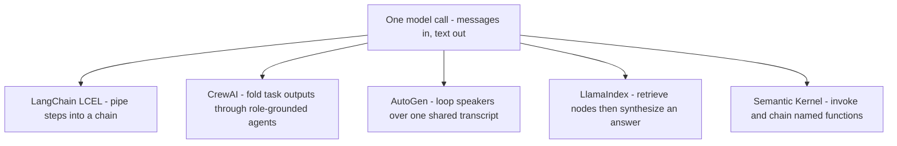

# Module 06c — Agent Frameworks: LangChain, CrewAI, AutoGen, LlamaIndex, Semantic Kernel

> **Depth tags** 🟢 app-level · 🟡 build-one-piece-by-hand · 🔴 from-scratch

Module 06 built an agent loop from scratch and 06b went deep on **LangGraph**.
But interviews and real teams also ask about the other names everyone drops:
**LangChain** (the `|` pipe / LCEL (LangChain Expression Language), memory, retrievers), **CrewAI** (role-based
Agents / Tasks / Crew), **AutoGen** (conversable agents in a group chat),
**LlamaIndex** (Documents → index → query engine for RAG), and **Semantic Kernel**
(a kernel of named functions you invoke and chain).

The framework landscape this module covers — **LangChain, CrewAI, AutoGen,
LlamaIndex, and Semantic Kernel** — is exactly the set of names that show up in
production GenAI / agent-orchestration job descriptions (alongside LangGraph from 06b).

Rather than teach five APIs by rote, this module keeps our from-scratch pedagogy:
you **reimplement each framework's core abstraction in ~60–100 lines** through a
plain model function. Once you've built the machinery, the README maps each of your
classes to the real library's API (Application Programming Interface) — so you can speak fluently to both "how it works"
and "what to import."

The single dependency each framework needs is a **chat model**. To stay verifiable
**offline**, every exercise is written against a tiny seam:

```
ChatFn = (messages) => string        # Python: Callable[[list[dict]], str]
```

- With `--stub`, the harness injects a **deterministic fake model** — no network,
  no API key, exact assertions.
- Without the flag, it builds the same `ChatFn` from `get_provider().chat`
  (Python: `from llm_core import get_provider`) / `getProvider().chat`
  (TypeScript: `from '@learn-ai/llm-core'`), so the _same code_ runs against a
  real LLM (Large Language Model).

That seam is also the lesson: **a "framework" is mostly orchestration around one
`model(messages) -> text` call.** Strip the model to a function and the frameworks
shrink to the small ideas below.

> **Prerequisite:** finish module 06 (Tasks 1 & 4). You should be able to say
> "an agent is a loop over a model call." This module is about the _plumbing_
> these popular libraries wrap around that loop.

---

## Concepts

Every framework here is **composition + a bounded loop** over one model function.
No calculus — the "math" is function composition, a fold (left-accumulate), a
cosine similarity, and a modular rotation. We derive each below.

One picture of the whole landscape — five orchestration styles around the same call:



### 1. LCEL is function composition (Task 1)

LangChain Expression Language is the `|` operator: `chain = prompt | model | parser`.
A **Runnable** is any object with `invoke(input) -> output`. Piping composes them:
`a | b` is an object whose `invoke` runs `a`, then feeds the result to `b`.

A chain of steps `s₁, s₂, …, sₙ` applied to input `x` is repeated application:

```
out = sₙ( … s₂( s₁(x) ) … )
```

Equivalently, **fold left** over the step list with a running accumulator `acc`:

```
acc ← x
for step in steps:
    acc ← step.invoke(acc)
return acc
```

`pipe(other)` is the algebra that builds the step list. To keep it flat (so
`a.pipe(b).pipe(c)` is one 3-step sequence, not nested pairs), flatten any
sequence operands:

```
left  = self.steps  if self  is a RunnableSequence else [self]
right = other.steps if other is a RunnableSequence else [other]
RunnableSequence(left + right)
```

The concrete steps are trivial: `PromptTemplate(template).format(**vars)` fills
`{placeholders}`; `ModelRunnable(chat_fn)` turns a string into one user message
and calls the model; `StrOutputParser` strips the text. That's the whole "magic."

**Maps to real LangChain:** `prompt | model | parser` builds a `RunnableSequence`
via `Runnable.__or__`; `PromptTemplate.from_template(...)`, any chat model (already
a Runnable), and `StrOutputParser` are the stock pieces.

### 2. Memory is a list; a retriever is a ranker; RAG (Retrieval-Augmented Generation) is a prompt (Task 2)

**Memory.** `ConversationBufferMemory` is a list of `(user, ai)` turns.
`save_context` appends; `load_memory_variables` renders them back to a transcript
string (`Human: …` / `AI: …` lines) the next prompt can carry. No hidden state.

**Retriever.** A retriever ranks documents against a query. We rank with
**bag-of-words cosine** so it's offline and deterministic — no embeddings.

Tokenise to lowercase words and count them → a sparse vector `v` where `v[w]` is
the count of word `w`. The cosine similarity of two count vectors `a`, `b`:

```
cosine(a, b) = (a · b) / (‖a‖ · ‖b‖)

a · b = Σ_w  a[w] · b[w]        (sum over shared words)
‖a‖   = sqrt( Σ_w a[w]² )
```

It's the cosine of the angle between the vectors: `1` when identical direction,
`0` when they share no words. If either norm is `0`, define similarity `0`.
**top-k retrieval** = score every doc, sort by cosine descending, take the first `k`.

**RAG chain.** Retrieve context, stuff it (plus the memory transcript) into a
prompt template, then call the model. Same left-to-right threading as Task 1, with
memory carried alongside and updated after each turn.

**Maps to real LangChain:** `ConversationBufferMemory` (same `save_context` /
`load_memory_variables`); a `VectorStoreRetriever` (embedding cosine instead of
bag-of-words) exposed as a Runnable; a `PromptTemplate` with `{context}` /
`{question}` slots.

### 3. A Crew is a fold that threads context (Task 3)

CrewAI: an **Agent** is a persona — `role`, `goal`, `backstory` — bound to a model.
Running a **Task** = build a _role-grounded_ prompt and call the model:

```
System: You are {role}. Your goal is {goal}. Backstory: {backstory}.
User:   {task.description}
        [Context from previous work: {context}]   (only when context is non-empty)
        Expected output: {task.expected_output}
```

A **Crew** with `process = "sequential"` is a **fold over tasks** that accumulates
context — each task's output is the next task's context:

```
context₀ = ""                       (nothing done yet)
for i in 1..n:
    outᵢ    = agentᵢ.execute(taskᵢ, contextᵢ₋₁)
    contextᵢ = outᵢ                  (thread forward)
return outₙ                          (last task's output = final result)
```

The threading is the entire orchestration. Task order is enforced by iterating the
list in order; the researcher runs first (empty context), the writer second (its
context _is_ the researcher's output).

**Maps to real crewai:** `Agent(role=, goal=, backstory=, llm=)`,
`Task(description=, agent=, expected_output=)`,
`Crew(agents=[…], tasks=[…], process=Process.sequential).kickoff()`.

### 4. A GroupChat is a bounded loop with modular speaker rotation (Task 4)

AutoGen: several **ConversableAgents** share **one transcript**. A manager picks
the next speaker, asks it to reply _given the whole history_, appends the reply,
and repeats. Two stop conditions keep it finite — a **budget** (`max_round`) and a
**done-signal** (a reply contains `"TERMINATE"`).

Let `agents = [g₀, …, g_{m-1}]` and transcript `H`. Seed `H` with the initial
message. For round `r = 0, 1, 2, …`:

```
speaker = agents[r mod m]            # round-robin = index modulo m
reply   = speaker.generate_reply(H)  # depends on the whole transcript
append {speaker.name, reply} to H
if "TERMINATE" in reply:  stop       # done-signal
if (r + 1) >= max_round:  stop       # budget
```

So the final transcript length is:

```
1 (initial) + min(rounds_until_terminate, max_round) replies
```

`generate_reply` builds the model input by prepending the agent's system message,
then replaying the transcript as messages labelled by speaker (`"{name}: {content}"`)
so each agent sees who said what.

**Maps to real autogen:** `ConversableAgent(name=, system_message=)`,
`GroupChat(agents=, max_round=)`, `GroupChatManager(...)`; real AutoGen supports
smarter next-speaker selection and an `is_termination_msg` callback — our
round-robin + phrase check is the minimal version of both.

### 5. A query engine is retrieve-then-synthesize (Task 5)

LlamaIndex: wrap raw text as **Documents**, build a **VectorStoreIndex** from them,
then ask a **query engine**. `VectorStoreIndex.from_documents(docs)` does two things:
_chunk_ each Document into **Nodes** (here: split on blank lines, one Node per
paragraph) and _index_ each Node by a vector. We reuse Task 2's **bag-of-words
cosine** as the "embedding" so the whole pipeline is offline and deterministic —
no network, no real embeddings.

`index.as_query_engine().query(q)` is then **retrieve-then-synthesize**:

```
nodes   = top-k Nodes by cosine(query, node.vector)   # same ranking as Task 2
context = join the retrieved nodes' text
prompt  = SYNTHESIS_TEMPLATE(context, query)          # stuff context in
answer  = model(prompt)                                # one synthesis call
```

The retrieval half is identical to Task 2's retriever (score every node, sort by
cosine descending, take the first `k`); the synthesis half is one templated model
call over the retrieved node texts. That's the entire RAG mental model.

**Maps to real llama-index-core:** `Document(text=...)`,
`VectorStoreIndex.from_documents(docs)` (a node parser splits + a real embedding
model vectorizes each node), `index.as_query_engine().query(q)` → a `Response`
whose `.source_nodes` are what was retrieved and `.response` is the synthesized text.

### 6. A Kernel is a registry of named functions you chain (Task 6)

Semantic Kernel: a **Kernel** holds **functions you invoke by name**. Two kinds
share one interface (`invoke(**args) -> str`), which is what lets the kernel treat
them uniformly and chain them:

- a **semantic function** = a prompt template + the model. Rendering fills the
  template's `{placeholders}` from the args, then calls the model:
  `prompt = template.format(**args)`, `reply = model(prompt)`.
- a **native function** = plain code (a Python/JS callable, no model).

**Sequential orchestration** is a tiny pipeline — a fold that threads each output
forward as the next function's `input` (the same threading as the Crew in Task 3,
but over named kernel functions):

```
out_0 = x
for f in [f_1, ..., f_n]:
    out = kernel.invoke(f, input=out_prev)   # feed prior output forward
return out_last
```

So chaining `clean → summarize → translate` runs the native cleaner, feeds its
output to the summarize prompt, then feeds _that_ to the translate prompt — one
value threaded through named functions.

**Maps to real semantic-kernel:** a prompt function vs a `@kernel_function`
(native) method; `kernel.add_function(...)` / `add_plugin(...)` to register;
`kernel.invoke(function_name=..., ...)` to run one; sequential orchestration
(or chaining invokes) to run a pipeline.

---

## Tasks

Lanes: 🟢 use/compose it · 🟡 use it + hand-build a piece · 🔴 build the machinery.
Every task supports `--stub` (offline, deterministic) and a real path via the
shared provider.

### Task 1 🟢 — LCEL runnable (`prompt | model | parser`)

**Goal:** Reimplement LangChain's LCEL so `chain = prompt.pipe(model).pipe(parser)`
runs a formatted prompt through a model and parses the result.

**Files:**

- `py/01_lcel.py`
- `ts/01-lcel.ts`

**Steps:**

1. Implement `Runnable.pipe(other)` / `pipe()` — return a `RunnableSequence`,
   flattening if either operand is already a sequence.
2. Implement `RunnableSequence.invoke(input)` — fold left, threading each step's
   output into the next step's input.
3. Implement `PromptTemplate.format(**vars)` / `format(vars)` — fill the
   `{placeholders}`.
4. The harness builds `chain = prompt.pipe(model).pipe(parser)` and invokes it on
   an input dict; it also builds a 3-step numeric sequence to prove ordering.

**Acceptance (`--stub`):**

- `chain.invoke({"topic": "vector databases"})` returns
  `"[stub-reply] Write a one-line tagline about vector databases."` — the parsed
  string the fake model produced from the _formatted_ prompt (leading/trailing
  whitespace stripped by the parser).
- A 3-step sequence applies steps in order: `(4 + 1) * 3 → "result=15"`, and
  swapping the first two steps yields `"result=13"` — proving order is enforced.

---

### Task 2 🟡 — memory + retriever (a tiny RAG chain)

**Goal:** Reimplement `ConversationBufferMemory` and a deterministic bag-of-words
cosine retriever, then wire `retriever → prompt(context+question+history) → model`
into a RAG chain that also carries memory.

**Files:**

- `py/02_memory_retriever.py`
- `ts/02-memory-retriever.ts`

**Steps:**

1. Implement memory `save_context` (append a turn) and `load_memory_variables`
   (render the buffer to a `Human:/AI:` transcript string).
2. Implement `cosine(a, b)` over sparse count vectors (dot / product of norms;
   `0` if either norm is `0`).
3. Implement `Retriever.get_relevant(query, k)` — score every doc by cosine, sort
   descending, return the top-k.
4. Implement `build_rag_prompt(history, context, question)` — fill the RAG template.
5. The provided `RagChain.ask` ties it together: load memory → retrieve → build
   prompt → call model → save the turn.

**Acceptance (`--stub`):**

- The retriever returns the **Python** doc for
  `"Which language is used for data science?"` (highest lexical overlap).
- After two turns, memory holds **both** turns (`len(turns) == 2`, both Q/A present).
- The chain's last prompt **contains the retrieved context** (the Eiffel-Tower doc
  for the second question) **and** the prior turn's text (memory carried forward).

---

### Task 3 🟡 — CrewAI crew (roles → tasks → sequential crew)

**Goal:** Reimplement CrewAI's `Agent` / `Task` / `Crew` so a 2-agent crew
(researcher → writer) runs a sequential pipeline that threads each output forward.

**Files:**

- `py/03_crew.py`
- `ts/03-crew.ts`

**Steps:**

1. Implement `Agent.execute(task, context)` — assemble a role-grounded prompt
   (system = role/goal/backstory; user = description + optional context + expected
   output) and call `chat_fn`.
2. Implement `Crew.kickoff()` — run tasks in order, threading each task's output
   into the next task's `context`; record a transcript; return the last output.

**Acceptance (`--stub`):**

- A 2-agent crew returns a final string equal to the **writer's** output (the last
  task).
- Task order is enforced: the researcher runs first with **empty** context; the
  writer runs second.
- The writer's `context_in` is **exactly** the researcher's output — proving the
  output threaded through (the stub tags replies `with-context` / `no-context`).

---

### Task 4 🟡 — AutoGen group chat (round-robin + termination)

**Goal:** Reimplement AutoGen's `ConversableAgent` / `GroupChat` /
`GroupChatManager` so a manager drives a round-robin conversation over a shared
transcript, stopping at `max_round` or on a `"TERMINATE"` phrase.

**Files:**

- `py/04_groupchat.py`
- `ts/04-groupchat.ts`

**Steps:**

1. Implement `ConversableAgent.generate_reply(history)` — prepend the system
   message, replay the shared transcript as speaker-labelled messages, call the
   model, strip.
2. Implement `GroupChatManager.run(initial_message)` — seed the transcript, loop
   up to `max_round`, pick the speaker by `r % len(agents)` (round-robin), append
   each reply, and break early when a reply contains `"TERMINATE"`.

**Acceptance (`--stub`):**

- The transcript is ordered with correct speaker labels: `["user", "planner",
"critic"]`.
- The scripted critic emits `"TERMINATE"` on its turn, so the loop stops early:
  the transcript has exactly `3` messages (1 initial + 2 replies).
- The reply count never exceeds `max_round` (budget respected).

---

### Task 5 🟡 — LlamaIndex query engine (Documents → index → query engine)

**Goal:** Reimplement LlamaIndex's RAG mental model so
`VectorStoreIndex.from_documents(docs).as_query_engine().query(q)` chunks docs into
nodes, retrieves the top-k by bag-of-words cosine (offline, no embeddings), and
synthesizes an answer via the model.

**Files:**

- `py/05_llamaindex.py`
- `ts/05-llamaindex.ts`

**Steps:**

1. Implement `VectorStoreIndex.retrieve(query, k)` — score every Node by cosine
   against the query, sort descending, return the top-k Nodes. (Same top-k-by-cosine
   ranking as Task 2, over Nodes instead of raw doc strings. `cosine`, chunking, and
   `from_documents` are provided.)
2. Implement `QueryEngine.query(q)` — retrieve top-k nodes, join their text into a
   context block, fill the synthesis template (save it on `last_prompt`), and call
   the model with a single user message.

**Acceptance (`--stub`):**

- The index chunks the 3 documents into **6 nodes** (one per paragraph).
- For `"Where is the Eiffel Tower located?"` the top retrieved node is the
  **Eiffel-Tower** node (highest lexical overlap).
- The synthesis prompt (`last_prompt`) **contains the retrieved node text** and the
  `Query:` line; the (stub) answer is synthesized **from** that retrieved context.

---

### Task 6 🟡 — Semantic Kernel (named functions + sequential chaining)

**Goal:** Reimplement Semantic Kernel's `Kernel` so it registers a **semantic
function** (prompt template + model) and a **native function** (plain code), invokes
them **by name**, and **chains** them into a sequential pipeline.

**Files:**

- `py/06_semantic_kernel.py`
- `ts/06-semantic-kernel.ts`

**Steps:**

1. Implement `KernelFunction.invoke(**args)` — native branch calls the plain code;
   semantic branch renders the prompt template from the args, wraps it in one user
   message, and calls the model.
2. Implement `Kernel.invoke(name, **args)` — look the function up by name and
   delegate (error clearly on an unknown name).
3. Implement `Kernel.run_pipeline(names, initial_input)` — fold over the named
   functions, threading each output forward as the next function's `input`.

**Acceptance (`--stub`):**

- The native `clean` function runs real code (collapses the extra whitespace to
  `"RAG grounds a model in retrieved documents."`).
- A single semantic invoke renders its template with the arg (the stub echoes the
  exact rendered prompt).
- The `clean → summarize → translate` pipeline threads outputs forward: the final
  value nests the translate prompt around the summarize output around the cleaned
  text — proving each step fed the next.

---

## Done when

- [ ] Task 1: `01_lcel` / `01-lcel --stub` runs and the parsed chain output +
      3-step ordering assertions pass.
- [ ] Task 2: `02_memory_retriever` / `02-memory-retriever --stub` shows the right
      retrieved doc, both turns in memory, and context + history in the prompt.
- [ ] Task 3: `03_crew` / `03-crew --stub` returns the writer's output and the
      writer's context equals the researcher's output.
- [ ] Task 4: `04_groupchat` / `04-groupchat --stub` produces a correctly labelled,
      early-terminating transcript within `max_round`.
- [ ] Task 5: `05_llamaindex` / `05-llamaindex --stub` chunks docs into nodes,
      retrieves the Eiffel-Tower node, and synthesizes from the retrieved context.
- [ ] Task 6: `06_semantic_kernel` / `06-semantic-kernel --stub` runs a native
      function, renders a semantic function, and threads a sequential pipeline.
- [ ] You can name, for each of your classes, the **real library API** it maps to
      (see the "Maps to real …" notes above).

---

## Framework cheat-sheet (what to say in an interview)

| Framework           | Core primitive you built                 | Real API to name                                                         |
| ------------------- | ---------------------------------------- | ------------------------------------------------------------------------ |
| **LangChain**       | `Runnable` + `pipe` = LCEL               | `prompt \| model \| parser`, `RunnableSequence`, `StrOutputParser`       |
| **LangChain**       | buffer memory + retriever RAG            | `ConversationBufferMemory`, `VectorStoreRetriever`                       |
| **CrewAI**          | role-grounded `Agent`, sequential `Crew` | `Agent`, `Task`, `Crew`, `Process.sequential`                            |
| **AutoGen**         | shared transcript + round-robin manager  | `ConversableAgent`, `GroupChat`, `GroupChatManager`                      |
| **LlamaIndex**      | index of Nodes + query engine (RAG)      | `Document`, `VectorStoreIndex.from_documents`, `as_query_engine().query` |
| **Semantic Kernel** | kernel of named functions + chaining     | `Kernel`, `@kernel_function` / `add_function`, `kernel.invoke`           |
| **LangGraph**       | (module 06b) stateful graph runtime      | `StateGraph`, checkpointer, `Command(goto=…)`                            |

The one-liner that ties them together: **each framework is orchestration around a
single `model(messages) -> text` call** — LCEL composes it, CrewAI folds context
through role-grounded calls, AutoGen loops it over a shared transcript, LlamaIndex
retrieves-then-synthesizes with it, Semantic Kernel invokes and chains it as named
functions, and LangGraph wraps it in a checkpointed state machine.

---

## Going deeper

- **LangChain — LCEL / Runnable interface:** <https://python.langchain.com/docs/concepts/lcel/>
- **LangChain — memory & retrievers:** <https://python.langchain.com/docs/concepts/chat_history/> ·
  <https://python.langchain.com/docs/concepts/retrievers/>
- **CrewAI docs (Agents / Tasks / Crews / Processes):** <https://docs.crewai.com/>
- **AutoGen (ConversableAgent, GroupChat):** <https://microsoft.github.io/autogen/>
- **LlamaIndex (Documents, VectorStoreIndex, query engines):** <https://docs.llamaindex.ai/>
- **Semantic Kernel (Kernel, functions/plugins, orchestration):** <https://learn.microsoft.com/semantic-kernel/>
- **When to pick which:** LangChain/LCEL for linear pipelines; LlamaIndex for
  RAG-first apps (indexing + query engines); CrewAI for role-based task pipelines;
  AutoGen for open-ended multi-agent conversation; Semantic Kernel for
  function/plugin orchestration (strong in .NET / enterprise); LangGraph (06b) when
  you need persistence, human-in-the-loop, or complex routing.

---

## Environment

These tasks need a chat model **only** on the non-`--stub` path. For the offline
check (the acceptance criteria), always run with `--stub` — it uses the injected
fake model and requires no provider, key, or network.

**Python:**

```bash
uv run python modules/06c-agent-frameworks/py/01_lcel.py --stub   # offline
uv run python modules/06c-agent-frameworks/py/01_lcel.py          # real: uses get_provider()
```

**TypeScript:** build the core once, then run with `tsx`:

```bash
pnpm build:core
pnpm tsx modules/06c-agent-frameworks/ts/01-lcel.ts --stub        # offline
pnpm tsx modules/06c-agent-frameworks/ts/01-lcel.ts               # real: uses getProvider()
```

The real path reads `LLM_PROVIDER` (default `ollama`) exactly like every other
module — no new env vars. The zero-cost path is Ollama
(`ollama pull llama3.2`).

> **Note (TypeScript real path):** the reimplementations keep `ChatFn` **synchronous**
> so the composition math stays readable, but `provider.chat()` is `async`. The
> `--stub` path is fully synchronous and is the offline check. To run the TS tasks
> against a real model, make the relevant `invoke`/`execute`/`generateReply`
> `async` and `await provider.chat(messages)` — the header comment on each file
> points to the exact spot. (Python's `provider.chat` is synchronous, so the
> Python real path works as-is.)

---

## 📚 Read more

- **LangChain docs** — <https://python.langchain.com/docs/> — the real LCEL / Runnable / memory / retriever APIs your Task 1–2 reimplementations map to.
- **CrewAI docs** — <https://docs.crewai.com> — `Agent`, `Task`, `Crew`, and `Process.sequential`, the library version of Task 3's fold.
- **AutoGen docs** — <https://microsoft.github.io/autogen/> — `ConversableAgent` and group chat, including the smarter speaker selection our round-robin stands in for.
- **LlamaIndex docs** — <https://docs.llamaindex.ai> — Documents, `VectorStoreIndex`, and query engines: Task 5's retrieve-then-synthesize done with real embeddings.
- 🎥 **DeepLearning.AI — Multi AI Agent Systems with crewAI** — <https://www.deeplearning.ai/short-courses/multi-ai-agent-systems-with-crewai/> — short video course building role-based crews with the real library.
