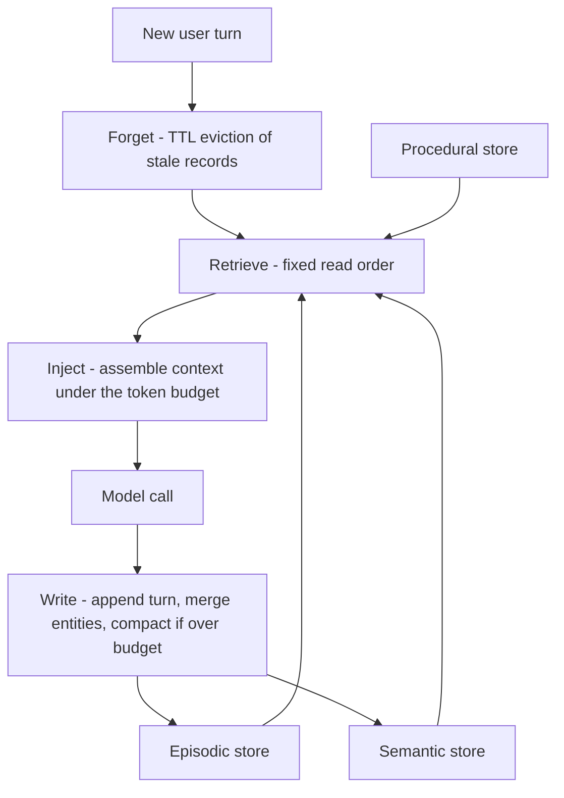

# Module 06d — Agent Memory

> **Depth tags** 🟢 app-level · 🟡 build-one-piece-by-hand · 🔴 from-scratch

Module 06 gave the agent exactly one memory — a **scratchpad** (Task 3) — and 06b
added **durable thread persistence** with LangGraph's checkpointer. Both are real,
but production agents (and interviews) distinguish a whole **taxonomy**: episodic
(conversation history), semantic (knowledge base), procedural (workflow patterns),
entity, and summary memory — plus the discipline of **managing** memory
(encode → store → retrieve → inject → forget) rather than just reading it.

The framing this module hangs on:

- **Memory-augmented**: memory _happens to_ the agent. History gets appended,
  a retriever dumps whatever it finds into the prompt, nothing is ever updated
  or forgotten. It works until the context bloats, the facts go stale, and the
  distractors drown the signal.
- **Memory-aware**: the agent (or its harness) _manages its cognitive state_.
  Reads run in a fixed order before the model call, writes run after it, every
  memory type has a lookup mechanism and a forgetting rule, and the whole thing
  respects a token budget.

You build the memory-aware version, one memory type at a time, and then compose
them into a `MemoryManager` whose context stays under budget while an unmanaged
baseline blows past it.

Everything runs **offline** via the same seam as module 06c:

```
ChatFn = (messages) => string        # Python: Callable[[list[dict]], str]
```

- With `--stub`, the harness injects a **deterministic fake model** — no network,
  no API key, exact assertions (the stub echoes what history it saw, returns
  fixed valid entity JSON, and emits fixed summaries).
- Without the flag, the same `ChatFn` is built from `get_provider().chat`
  (Python: `from llm_core import get_provider`) / `getProvider().chat`
  (TypeScript: `from '@learn-ai/llm-core'`) — never a hardcoded vendor.

State lives in module-local JSON files under `state/` (gitignored, cleaned at
the start of every run). Determinism throughout: a **fake integer clock** for
TTL, a whitespace token counter for budgets — no `Date.now()`, no real time.

> **Prerequisite:** finish module 06 (Tasks 1 & 3). You should be able to say
> "an agent is a loop" and have built the scratchpad once. 06b (checkpointer,
> `thread_id`) helps but isn't required — this module reimplements its own tiny
> persistence so the memory mechanics stay visible.

---

## Concepts

### 1. Memory-augmented vs memory-aware, and the five-type taxonomy

LLMs are stateless; every kind of "memory" is something you build around the
model call. The five types production systems actually name:

| Type           | Human analogy               | Lookup mechanism                         | When read                              | When written                            |
| -------------- | --------------------------- | ---------------------------------------- | -------------------------------------- | --------------------------------------- |
| **Episodic**   | "what happened"             | by thread + recency (last _n_ turns)     | every turn (programmatic)              | after every turn (programmatic)         |
| **Semantic**   | "what I know"               | by similarity (vector / lexical search)  | every turn, thresholded (programmatic) | on ingestion / upsert when facts change |
| **Procedural** | "how I do things"           | loaded wholesale (system prompt, skills) | every turn (programmatic)              | rarely — curated, not per-turn          |
| **Entity**     | "who/what I know about"     | by key: (name, type)                     | every turn (programmatic)              | after turns that mention entities       |
| **Summary**    | "the gist of what happened" | stands in for archived turns; expandable | every turn (programmatic)              | on compaction, when history over budget |

Module 06's scratchpad was a one-slot hybrid of all five; 06b's checkpointer is
episodic persistence only. This module builds each type as its own store with
its own read/write rule — that separation is what "memory-aware" means. (We
exercise four of the five: procedural memory is the system prompt / skill files
you already curate by hand; it appears in the taxonomy so you can name it, but
there's nothing per-turn to implement.)

### 2. The lifecycle: reads before the call, writes after

One memory-aware turn is a fixed pipeline around a single model call:

```
encode → store → retrieve → inject → forget

per turn:
    forget:    evict stale records (TTL)          # before anything else
    retrieve:  episodic → semantic → entities → summaries   (fixed read order)
    inject:    assemble the context, under a token budget
    (model call)
    encode+store:  write the user turn + reply, extract entities,
                   summarise old history if over budget
```

The same lifecycle as a picture — stores on the left, one turn flowing down:



The invariant: **memory READS run BEFORE the model call, memory WRITES run
AFTER it.** The model never mutates the store mid-call; the harness owns the
lifecycle.

The second boundary that matters: which operations are **programmatic** (the
harness always does them) vs **agent-triggered** (the model decides, via a tool
call):

| Operation                               | Who triggers it                                 | Why                                                          |
| --------------------------------------- | ----------------------------------------------- | ------------------------------------------------------------ |
| Load recent history (episodic)          | programmatic                                    | needed every turn; the model can't ask for what it can't see |
| Retrieve from the knowledge base        | programmatic                                    | cheap, thresholded — inject only what clears relevance       |
| Load known entities                     | programmatic                                    | small and always useful                                      |
| Expand a summary back to original turns | agent-triggered                                 | expensive; only when the agent actually needs the detail     |
| Web search / external lookup            | agent-triggered                                 | slow, costly, usually unnecessary                            |
| Compaction (summarise old turns)        | programmatic (budget-driven) or agent-triggered | someone must notice the budget                               |

Get the boundary wrong in one direction and you get **context bloat** (expanding
every summary and searching the web "just in case" — the model drowns); wrong in
the other direction and you get **missed context** (the model was never shown
the history it needed and can't know to ask for it).

### 3. Retrieval quality: noise, staleness, update-on-write

Reading a knowledge base is where memory-augmented systems quietly rot:

- **Noisy retrieval.** Top-k _always_ returns k results — even when the k-th is
  a semantically-adjacent-but-wrong-topic distractor ("the search service uses
  Elasticsearch" for a question about the checkout database). The fix is a
  **relevance threshold**: rank, cut to k, then drop anything scoring below
  `min_score`. An empty result is better than a plausible-looking wrong one.
- **Staleness / TTL.** Facts expire (promo codes, deploy freezes, on-call
  rotations). Give time-sensitive records a `created_at` and evict when
  `now - created_at > ttl`. Task 4 uses a **fake integer clock** so eviction is
  exact and testable.
- **Update-on-write (upsert).** When a fact changes, writing it as a _new_
  record leaves the stale version in the store — and retrieval will happily
  surface both, letting the old truth compete with the new. Key records by a
  stable id and **replace on write**; the same rule applies to entities
  (same name + type → update the fact, don't append a duplicate).

We rank with the offline **bag-of-words cosine** from 06c (count-vector dot
product over shared words, divided by the norms) so every score is deterministic
— the retrieval-quality lessons transfer unchanged to real embeddings (module 04).

### 4. Summary memory, just-in-time expansion, and the token budget

History grows linearly; the context window doesn't. **Summary memory** compresses
old turns into one record — but the discipline is **mark, don't delete**: the
originals stay in the store, tagged `archived_by = summary_id`. The summary
stands in for them in the assembled context; when the agent genuinely needs the
detail, **just-in-time expansion** (`expand_summary(summary_id)`) recovers the
original turns verbatim. Compression becomes reversible, so it stops being scary.

That makes the **token budget** enforceable: fixed-cost sections (semantic hits,
entities, summaries) are counted first, and the remaining budget is filled with
episodic turns newest-first — so the _oldest_ history is the first to fall back
to its summary. Module 16 (Context Engineering) treats budgeting as a topic in
its own right; here you implement the minimal version any agent needs.

---

## Tasks

Lanes: 🟢 use/compose it · 🟡 use it + hand-build a piece · 🔴 build the machinery.
Every task supports `--stub` (offline, deterministic) and a real path via the
shared provider. State files live under `modules/06d-agent-memory/state/`
(gitignored; each task cleans its own file on start).

### Task 1 🟢 — Episodic memory + the read/write lifecycle

**Goal:** Build the minimal memory-aware turn: a JSON-file store of per-thread
turns, read BEFORE the model call, written AFTER it — with thread isolation and
a `last_n` injection bound.

**Files:**

- `py/01_episodic.py`
- `ts/01-episodic.ts`

**Steps:**

1. Implement `read_episodic(store, thread_id, last_n)` / `readEpisodic(...)` —
   filter the flat store to one thread, keep the last `last_n` records in
   order, return them as `{role, content}` messages.
2. Implement `write_episodic(store, thread_id, role, content)` /
   `writeEpisodic(...)` — append one turn record.
3. Implement `build_context(system, episodic, user_msg)` / `buildContext(...)`
   — ordered assembly: system message, then episodic turns, then the new user
   message.
4. The provided `run_turn` is the lifecycle (load → read → build → call →
   write → save); the harness runs two threads (A and B) interleaved.

**Acceptance (`--stub`):**

- Thread A's context **never contains thread B's turns** (and vice versa).
- Turn order is preserved on read-back (user/assistant alternating,
  chronological).
- After 2 turns each, the store holds **4 A-entries + 4 B-entries** (user +
  assistant per turn).
- The `last_n` bound is respected (a read of 2 returns exactly the last 2).
- The context is ordered: system → episodic → new user message.

---

### Task 2 🟡 — Semantic memory with a relevance threshold (noisy retrieval)

**Goal:** Build an offline bag-of-words cosine knowledge base whose retrieval
survives a deliberate near-miss distractor — via a relevance threshold — and
whose writes are upserts (update, never duplicate).

**Files:**

- `py/02_semantic.py`
- `ts/02-semantic.ts`

**Steps:**

1. Implement `cosine(a, b)` over sparse count vectors (dot over shared words /
   product of norms; 0 if either norm is 0).
2. Implement `retrieve(store, query, k, min_score)` — rank every doc by cosine,
   cut to top-k, **then drop results below `min_score`** (the noisy-retrieval
   mitigation).
3. Implement `upsert(store, doc_id, text)` — same `doc_id` replaces the record,
   never duplicates.
4. The harness seeds a corpus with a near-miss distractor, runs retrieval at
   threshold 0 and at the tuned threshold, then changes a fact via upsert; the
   provided inject step grounds the (stub) model in what survived.

**Acceptance (`--stub`):**

- With `min_score=0` the distractor (`kb-search`) **leaks into the top-k**.
- With the tuned threshold (0.4) the distractor is **filtered while the true
  hit survives**.
- Upserting a changed doc leaves the **store size unchanged**, and retrieval
  returns the **new** text (the stale fact is gone).

---

### Task 3 🟡 — Entity memory + summary memory (just-in-time expansion)

**Goal:** Extract structured entities via the model (parse + validate JSON),
merge them update-on-write, compress old turns into a summary that **marks**
the originals instead of deleting them, and expand a summary back to the
verbatim originals on demand.

**Files:**

- `py/03_entity_summary.py`
- `ts/03-entity-summary.ts`

**Steps:**

1. Implement `extract_entities(chat_fn, text)` / `extractEntities(...)` —
   prompt the model for a JSON array of `{name, type, fact}`, parse it, and
   validate the shape (raise on anything malformed). The stub returns fixed
   valid JSON so assertions are exact.
2. Implement `merge_entities(store, new)` / `mergeEntities(...)` — same
   name+type updates the fact in place; new names append.
3. Implement `summarise_turns(chat_fn, turns)` / `summariseTurns(...)` —
   model-compress the turns into a summary record with a deterministic
   `summary_id` (`sum-<first>-<last>`), **marking** each original turn
   `archived_by = summary_id` (never deleting it).
4. Implement `expand_summary(store, summary_id)` / `expandSummary(...)` —
   just-in-time retrieval of the original turns behind a summary, in order.

**Acceptance (`--stub`):**

- Known entities are recalled across a **"restart"** (store saved to disk and
  reloaded fresh), carrying the merged (latest) fact: Dana is CEO, not CTO.
- Merging **updates instead of duplicating**: 2 entities total after 3
  extractions.
- After compaction the assembled context is **shorter** (char counts printed),
  yet `expand_summary` recovers the **4 original turns verbatim**.
- The store still holds all 6 turns — archived, never deleted.

---

### Task 4 🔴 — The MemoryManager: composed lifecycle + TTL/staleness

**Goal:** Compose Tasks 1–3 into one manager (this file is standalone — the
working pieces you already built are copied in as provided code): a fixed read
order under a hard token budget, a write path with conditional compaction, and
TTL eviction on a fake clock.

**Files:**

- `py/04_memory_manager.py`
- `ts/04-memory-manager.ts`

**Steps:**

1. Implement `MemoryManager.assemble_context(thread_id, query)` /
   `assembleContext(...)` — fixed read order: episodic → semantic
   (thresholded) → entities → summaries. Count the fixed sections first, then
   fill the remaining token budget with episodic turns **newest-first** (the
   oldest history falls back to its summary).
2. Implement `MemoryManager.finalize_turn(thread_id, user_msg, reply)` /
   `finalizeTurn(...)` — the write path: episodic writes, entity
   extract+merge, and conditional summarisation when the active history
   exceeds its budget.
3. Implement `evict_stale(store, now, ttl)` / `evictStale(...)` — remove
   semantic records with `now - created_at > ttl` (fake integer clock — no
   real time calls) and return the evicted ids.
4. The harness runs a scripted 6-turn conversation, printing managed vs
   no-management-baseline token counts per turn.

**Acceptance (`--stub`):**

- The managed context stays **≤ the 110-token budget on all 6 turns** (printed
  per turn) while the provided no-management baseline **grows monotonically
  past it**.
- The stale semantic record (`kb-promo`) is **evicted exactly at fake-clock
  tick 4** (TTL 3) and is no longer retrieved: `SAVE10` appears in turn 2's
  context but not in turn 5's.
- The **entity from turn 1 is still cited in turn 6's context** even though
  turn 1's verbatim text has been compacted away.

---

## Done when

- [ ] Task 1: `01_episodic` / `01-episodic --stub` shows isolated threads,
      preserved order, 4+4 store entries, and a respected `last_n` bound.
- [ ] Task 2: `02_semantic` / `02-semantic --stub` shows the distractor leaking
      at threshold 0, filtered at 0.4, and upsert replacing (not duplicating)
      the changed fact.
- [ ] Task 3: `03_entity_summary` / `03-entity-summary --stub` recalls merged
      entities across a restart, shrinks the context on compaction, and expands
      the summary back to the verbatim originals.
- [ ] Task 4: `04_memory_manager` / `04-memory-manager --stub` holds the
      context under budget on all 6 turns while the baseline overruns, evicts
      the stale record at tick 4, and still cites the turn-1 entity in turn 6.
- [ ] You can explain **memory-augmented vs memory-aware**, name the **five
      memory types** with their lookup mechanisms, and say which operations are
      programmatic vs agent-triggered (and why the boundary matters).

Each file prints its own **Acceptance** checklist at the end — every box should
read `[x]` and the file should say "All acceptance checks passed."

---

## Governance & data lifecycle

Agent memory is a durable store of user-derived data (episodic turns, semantic
facts, entities), so it is in scope for the data map and for erasure. TTL eviction
is a retention mechanism; a user's delete request must reach memory too, not only
the primary record. Fill in the Module 20b governance templates:

- [`DATA_INVENTORY.md`](../20b-governance-privacy/templates/DATA_INVENTORY.md) —
  list each memory store with its owner and purpose.
- [`RETENTION_SCHEDULE.md`](../20b-governance-privacy/templates/RETENTION_SCHEDULE.md)
  — map TTL / eviction to a retention period and a deletion path.

See **[module 20b](../20b-governance-privacy/README.md)** for rights (export/delete
reaching every store) and the full workflow.

## Going deeper

- **CoALA — Cognitive Architectures for Language Agents** (Sumers, Yao, Narasimhan,
  Griffiths) — the paper that framed working/episodic/semantic/procedural memory
  for LLM agents: <https://arxiv.org/abs/2309.02427>
- **MemGPT: Towards LLMs as Operating Systems** (Packer et al.) — paging between
  in-context "main memory" and external storage; the OS analogy behind
  compaction + just-in-time retrieval: <https://arxiv.org/abs/2310.08560>
- **LangGraph memory docs** — short-term (thread-scoped checkpointer) vs
  long-term (cross-thread store) memory, and where each belongs:
  <https://langchain-ai.github.io/langgraph/concepts/memory/>
- **DeepLearning.AI — LLMs as Operating Systems: Agent Memory** (short course
  with the MemGPT/Letta authors):
  <https://www.deeplearning.ai/short-courses/llms-as-operating-systems-agent-memory/>
- **Module 16 (Context Engineering)** — the token-budget discipline in full;
  **module 05 / 05b** — the retrieval-quality story with real embeddings.

---

## Environment

These tasks need a chat model **only** on the non-`--stub` path. For the offline
check (the acceptance criteria), always run with `--stub` — it uses the injected
fake model and requires no provider, key, or network. State is written to
module-local JSON files under `modules/06d-agent-memory/state/` (gitignored;
cleaned at the start of each run).

**Python:**

```bash
uv run python modules/06d-agent-memory/py/01_episodic.py --stub   # offline
uv run python modules/06d-agent-memory/py/01_episodic.py          # real: uses get_provider()
```

**TypeScript:** build the core once, then run with `tsx`:

```bash
pnpm build:core
pnpm tsx modules/06d-agent-memory/ts/01-episodic.ts --stub        # offline
pnpm tsx modules/06d-agent-memory/ts/01-episodic.ts               # real: uses getProvider()
```

The real path reads `LLM_PROVIDER` (default `ollama`) exactly like every other
module — no new env vars. The zero-cost path is Ollama (`ollama pull llama3.2`).

> **Note (TypeScript real path):** as in module 06c, `ChatFn` is kept
> **synchronous** so the memory mechanics stay readable, but `provider.chat()`
> is `async`. The `--stub` path is fully synchronous and is the offline check.
> To run the TS tasks against a real model, make the relevant call sites
> `async` and `await provider.chat(messages)` — the `makeRealChatFn` comment in
> each file points to the exact spot. (Python's `provider.chat` is synchronous,
> so the Python real path works as-is. Expect to harden Task 3's JSON parsing
> against a real model's chattier output.)

---

## 📚 Read more

- **MemGPT paper (Packer et al.)** — <https://arxiv.org/abs/2310.08560> — the OS analogy this module leans on: paging between in-context memory and external stores, compaction, just-in-time retrieval.
- **Letta (MemGPT) docs** — <https://docs.letta.com> — the production framework built on those ideas: memory blocks, self-editing memory, and agent state that outlives a context window.
- **LangGraph memory docs** — <https://langchain-ai.github.io/langgraph/concepts/memory/> — short-term (thread-scoped checkpointer) vs long-term (cross-thread store) memory, mapped to the taxonomy you built here.
- **Lilian Weng — LLM Powered Autonomous Agents** — <https://lilianweng.github.io/posts/2023-06-23-agent/> — the memory section of the classic agents survey: sensory/short-term/long-term framing and retrieval as recall.
- 🎥 **DeepLearning.AI — LLMs as Operating Systems: Agent Memory** — <https://www.deeplearning.ai/short-courses/llms-as-operating-systems-agent-memory/> — short video course with the MemGPT/Letta authors, the video companion to this module.
