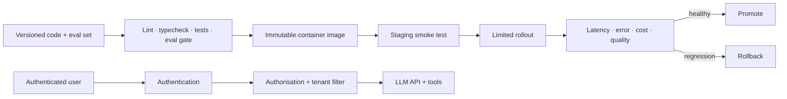

# Module 07b — Delivery & AI Service Operations

> **Depth tags** 🟢 app-level · 🟡 build-one-piece-by-hand

Module 07 makes an AI (Artificial Intelligence) feature observable and
serveable. This module closes the
last mile: turn that local service into a repeatable, authenticated, recoverable
deployment. It is intentionally provider-neutral; the service still uses
`get_provider()` / `getProvider()` for model calls.

> **Prerequisite:** Module 07. Module 11 helps for an ingestion-worker example;
> Module 20 helps for threat modelling. Do this before the capstone's public or
> shared-user deployment.

## What you will learn

- Package an API (Application Programming Interface) and its dependencies in a reproducible container without
  putting secrets in the image.
- Separate configuration, credentials, and user data; use least-privilege
  service identities and rotate credentials safely.
- Authenticate users, authorise each request, and enforce tenant boundaries
  before retrieval or tool execution.
- Operate an AI service: readiness/liveness checks, timeouts, rate limits,
  circuit breakers, durable background jobs, and structured logs.
- Release safely with CI, a smoke test, a staged rollout, monitoring, and a
  rollback decision.

## The delivery path

## Concepts

### Configuration is not a secret

Keep non-sensitive configuration such as a model name, region, and timeouts in
versioned configuration. Keep credentials in the deployment platform's secret
store or local `.env`, never in source control, logs, prompts, or a container
image. A deployment should be reproducible from an image digest plus a named
configuration revision—not from someone remembering terminal commands.

### Authentication is not authorisation

Authentication answers “who made this request?” Authorisation answers “may this
identity read this corpus or invoke this tool?” Apply the tenant/permission
filter before vector search, not after results are returned. Module 11's
permissions-aware retrieval is the retrieval-side implementation of this rule.

### AI services need ordinary reliability controls too

LLM calls are slow, remote, and fallible. Bound every dependency with a timeout,
limit concurrent work, distinguish retriable errors, and use a circuit breaker
to stop amplifying an outage. Put ingestion, large batch jobs, and long tool
work behind a durable queue; an HTTP request should not be the only record that
the work exists.

### Release quality is a product decision

Passing unit tests does not prove model quality. A release gate combines
deterministic tests, the versioned eval suite from module 21, and a small staging
smoke test. During a canary rollout, compare error rate, p95 latency, cost, and
quality signals to the previous revision. Decide the rollback thresholds before
the release.

## Tasks

### Task 1 — Containerise a minimal AI API 🟢

Create a Dockerfile and local Compose setup for the API you served in module 07
or 22. The image must run as a non-root user, accept all configuration through
environment variables, expose `GET /healthz` and `GET /readyz`, and never copy
`.env` into the image.

**Done when**

- A clean clone can start the API with one documented command.
- `/healthz` reports process health; `/readyz` fails while a required dependency
  is unavailable.
- `docker image inspect` and service logs contain no provider credentials.

### Task 2 — Identity, roles, and tenant-safe retrieval 🟡

Add a small identity model with at least `viewer` and `operator` roles plus a
`tenant_id`. Require authentication for `/ask` and privileged tools. Thread the
tenant identity into retrieval and tool execution; reject an attempt to read a
document owned by another tenant.

**Done when**

- An unauthenticated request returns 401; a valid identity without permission
  receives 403.
- A cross-tenant retrieval test returns no passages, even when a matching chunk
  exists in another tenant.
- Audit logs record the actor, tenant, action, decision, and request id—but not
  raw secrets or unnecessarily sensitive prompt content.

### Task 3 — Reliability envelope 🟡

Add per-request deadlines, provider timeouts, concurrency limits, rate limits,
and a circuit breaker around the model call. Send document ingestion or a slow
tool into a durable worker queue with an idempotency key.

**Done when**

- A simulated slow provider returns a bounded, useful failure response.
- Repeating a queued request with the same idempotency key produces one effect.
- A provider outage opens the circuit and recovers after the configured cool-off
  period; metrics make each state visible.

### Task 4 — CI, staged rollout, and rollback runbook 🟢

Create a CI (Continuous Integration) pipeline that formats, lints, type-checks, runs deterministic tests,
and runs an eval gate with a protected secret. Deploy first to staging, run a
smoke query, then release a small percentage of traffic. Write the exact rollback
command and thresholds in `RUNBOOK.md`.

**Done when**

- A deliberately failing test or eval blocks the build.
- A staging smoke test proves the deployed revision, model configuration, and
  basic authenticated request path work.
- The runbook names owners, dashboards, rollback triggers, and the recovery
  command; another person can follow it without improvising.

## Deployment checklist

- [ ] Image digest, configuration revision, and model version are recorded.
- [ ] Secrets are injected at runtime and excluded from source, images, traces,
      and eval artifacts.
- [ ] Authentication, authorisation, and tenant filtering happen before data or
      tools are accessed.
- [ ] Timeouts, rate limits, concurrency limits, and idempotency are tested.
- [ ] CI includes deterministic checks and a bounded-cost eval gate.
- [ ] Staging smoke test, rollback threshold, and owner are documented.

## Going deeper

- Replace the toy identity with an OpenID Connect provider and short-lived tokens.
- Add infrastructure-as-code for your target platform (Cloud Run, Fly.io,
  Render, ECS, Kubernetes, etc.). The learning objective is the invariant—not a
  particular cloud vendor.
- Use OpenTelemetry to join API, queue, tool, and LLM traces under one request
  id.
- Add a dead-letter queue and an incident review for failed ingestion jobs.
