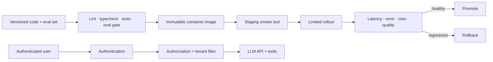

# Module 07b — Delivery & AI Service Operations

> **Depth tags** 🟢 app-level · 🟡 build-one-piece-by-hand

Module 07 makes an AI (Artificial Intelligence) feature observable and
serveable. This module closes the
last mile: turn that local service into a repeatable, authenticated, recoverable
deployment. It is intentionally provider-neutral; the service still uses
`get_provider()` / `getProvider()` for model calls.

> **Prerequisite:** Module 07. Module 11 helps for an ingestion-worker example;
> Module 20 helps for threat modelling. Do this before the capstone's public or
> shared-user deployment.

## What you will learn

- Package an API (Application Programming Interface) and its dependencies in a reproducible container without
  putting secrets in the image.
- Separate configuration, credentials, and user data; use least-privilege
  service identities and rotate credentials safely.
- Authenticate users, authorise each request, and enforce tenant boundaries
  before retrieval or tool execution.
- Operate an AI service: readiness/liveness checks, timeouts, rate limits,
  circuit breakers, durable background jobs, and structured logs.
- Release safely with CI, a smoke test, a staged rollout, monitoring, and a
  rollback decision.

## The delivery path



## Concepts

### Configuration is not a secret

Keep non-sensitive configuration such as a model name, region, and timeouts in
versioned configuration. Keep credentials in the deployment platform's secret
store or local `.env`, never in source control, logs, prompts, or a container
image. A deployment should be reproducible from an image digest plus a named
configuration revision—not from someone remembering terminal commands.

### Authentication is not authorisation

Authentication answers “who made this request?” Authorisation answers “may this
identity read this corpus or invoke this tool?” Apply the tenant/permission
filter before vector search, not after results are returned. Module 11's
permissions-aware retrieval is the retrieval-side implementation of this rule.

### AI services need ordinary reliability controls too

LLM calls are slow, remote, and fallible. Bound every dependency with a timeout,
limit concurrent work, distinguish retriable errors, and use a circuit breaker
to stop amplifying an outage. Put ingestion, large batch jobs, and long tool
work behind a durable queue; an HTTP request should not be the only record that
the work exists.

### Release quality is a product decision

Passing unit tests does not prove model quality. A release gate combines
deterministic tests, the versioned eval suite from module 21, and a small staging
smoke test. During a canary rollout, compare error rate, p95 latency, cost, and
quality signals to the previous revision. Decide the rollback thresholds before
the release.

## Tasks

### Task 1 — Containerise a minimal AI API 🟢

Create a Dockerfile and local Compose setup for the API you served in module 07
or 22. The image must run as a non-root user, accept all configuration through
environment variables, expose `GET /healthz` and `GET /readyz`, and never copy
`.env` into the image.

**Done when**

- A clean clone can start the API with one documented command.
- `/healthz` reports process health; `/readyz` fails while a required dependency
  is unavailable.
- `docker image inspect` and service logs contain no provider credentials.

### Task 2 — Identity, roles, and tenant-safe retrieval 🟡

Add a small identity model with at least `viewer` and `operator` roles plus a
`tenant_id`. Require authentication for `/ask` and privileged tools. Thread the
tenant identity into retrieval and tool execution; reject an attempt to read a
document owned by another tenant.

**Done when**

- An unauthenticated request returns 401; a valid identity without permission
  receives 403.
- A cross-tenant retrieval test returns no passages, even when a matching chunk
  exists in another tenant.
- Audit logs record the actor, tenant, action, decision, and request id—but not
  raw secrets or unnecessarily sensitive prompt content.

### Task 3 — Reliability envelope 🟡

Add per-request deadlines, provider timeouts, concurrency limits, rate limits,
and a circuit breaker around the model call. Send document ingestion or a slow
tool into a durable worker queue with an idempotency key.

**Done when**

- A simulated slow provider returns a bounded, useful failure response.
- Repeating a queued request with the same idempotency key produces one effect.
- A provider outage opens the circuit and recovers after the configured cool-off
  period; metrics make each state visible.

### Task 4 — CI, staged rollout, and rollback runbook 🟢

Create a CI (Continuous Integration) pipeline that formats, lints, type-checks, runs deterministic tests,
and runs an eval gate with a protected secret. Deploy first to staging, run a
smoke query, then release a small percentage of traffic. Write the exact rollback
command and thresholds in `RUNBOOK.md`.

**Done when**

- A deliberately failing test or eval blocks the build.
- A staging smoke test proves the deployed revision, model configuration, and
  basic authenticated request path work.
- The runbook names owners, dashboards, rollback triggers, and the recovery
  command; another person can follow it without improvising.

## Deployment checklist

- [ ] Image digest, configuration revision, and model version are recorded.
- [ ] Secrets are injected at runtime and excluded from source, images, traces,
      and eval artifacts.
- [ ] Authentication, authorisation, and tenant filtering happen before data or
      tools are accessed.
- [ ] Timeouts, rate limits, concurrency limits, and idempotency are tested.
- [ ] CI includes deterministic checks and a bounded-cost eval gate.
- [ ] Staging smoke test, rollback threshold, and owner are documented.

## Going deeper

- Replace the toy identity with an OpenID Connect provider and short-lived tokens.
- Add infrastructure-as-code for your target platform (Cloud Run, Fly.io,
  Render, ECS, Kubernetes, etc.). The learning objective is the invariant—not a
  particular cloud vendor.
- Use OpenTelemetry to join API, queue, tool, and LLM traces under one request
  id.
- Add a dead-letter queue and an incident review for failed ingestion jobs.

## Running the reference service

This module ships a small, production-shaped reference service in **both
languages** — Python/FastAPI under `py/` and TypeScript/Fastify under `ts/` —
that implements Tasks 1–3's invariants: configuration validated at
startup, structured JSON logs with correlation IDs, `GET /healthz` (liveness) and
`GET /readyz` (readiness that reflects the datastore), an authenticated,
tenant-scoped `POST /ask` wrapped in a reliability envelope (deadline, rate
limit, concurrency cap, retry, circuit breaker), an operator-only `POST /documents`
write, and durable background ingestion via `POST /jobs` + `GET /jobs/{id}` — all
backed by the provider-agnostic `llm_core` / `@learn-ai/llm-core` client (see
**Identity, RBAC & tenant isolation** and **Reliability & durable ingestion jobs**
below). Model calls never hardcode a vendor; tests inject a fake provider.

### One command (Docker Compose)

From a clean clone, copy the example environment file and start both services:

```bash
cp modules/07b-delivery-operations/.env.example modules/07b-delivery-operations/.env
docker compose -f modules/07b-delivery-operations/compose.yaml \
  --env-file modules/07b-delivery-operations/.env up --build
```

The Python service listens on `http://localhost:8000`, the TypeScript service on
`http://localhost:8001`. `.env` is gitignored and is never copied into the
images (the Dockerfiles run as a non-root user, copy explicit source paths, and
each ships a `.dockerignore` excluding `.env`). Check them:

```bash
curl localhost:8000/healthz            # {"status":"ok"}
curl localhost:8000/readyz             # {"status":"ready","checks":{"db":"ok"}}
curl -XPOST localhost:8000/ask -H 'content-type: application/json' \
  -d '{"question":"what does readyz check?"}'
```

`/readyz` returns `200` right after `up --build`: each image pre-creates its
datastore directory (`/app/data` for Python, `/repo/data` for TypeScript) and
`chown`s it to the non-root user, Compose mounts a named volume there, and pins
`DB_PATH` to that volume so the readiness probe can open the SQLite file. (The
Compose healthcheck polls `/readyz`, so the container is only reported healthy
once the datastore is reachable.)

### Running without Docker (tests / local dev)

```bash
# Python — `python -m m07b_service` is the redaction-safe entrypoint: a startup
# failure is logged sanitised and exits non-zero, never dumping a raw traceback.
# (An ASGI server can still import m07b_service.asgi:app for advanced setups.)
uv sync --extra production
cd modules/07b-delivery-operations/py
SERVICE_ENV=development PORT=8000 uv run python -m m07b_service
uv run pytest modules/07b-delivery-operations          # service tests (from repo root)

# TypeScript
pnpm build:core
SERVICE_ENV=development pnpm --filter @learn-ai/m07b-service start
pnpm --filter @learn-ai/m07b-service typecheck
pnpm test                                              # runs the service tests too
```

A missing or invalid required variable (for example an unset `SERVICE_ENV`, or a
non-numeric `PORT`) fails fast at startup with a clear, variable-named message
rather than a stack trace mid-request. A missing provider credential
(e.g. `OPENAI_API_KEY` when `LLM_PROVIDER=openai`) also fails at startup — not on
the first request — and provider errors/secrets never reach client responses or
logs.

## Storage & migrations

The service persists to **SQLite** with hand-rolled, numbered `.sql` migrations —
no ORM, no migration framework. One set of files under
`modules/07b-delivery-operations/migrations/` is consumed by BOTH language
runners (Python stdlib `sqlite3`; TypeScript Node built-in `node:sqlite`, which
is unflagged on Node ≥ 24 — the TS image/CI pin Node 24).

The initial migration (`0001_init`) creates the tenant-scoped schema: `tenants`,
`users` (role + `tenant_id`), `documents`, `chunks`, `ingest_jobs`,
`idempotency_keys`, and `audit_events`. Every tenant-scoped table carries a
`tenant_id` foreign key with indexes backing the tenant filter. `chunks` and
`ingest_jobs` use a **composite** foreign key `(tenant_id, document_id) →
documents(tenant_id, id)`, so a row can never reference a document owned by a
different tenant (a plain `document_id` FK would allow that, defeating tenant
isolation). `audit_events.tenant_id` is a **nullable** FK (`ON DELETE SET
NULL`) — NULL supports system events and the trail survives tenant deletion, but
a non-existent tenant id is rejected. The runner records applied versions in a
`schema_migrations` table.

**Apply / upgrade.** Migrations run automatically at startup (idempotent — only
pending ones apply). `/readyz` returns `200` only once the DB is fully migrated
**and writable**, and `503` otherwise. It fingerprints the schema — required
tables and key columns; **every** tenant foreign key (the direct
`*.tenant_id → tenants(id)` keys and the composite
`(tenant_id, document_id) → documents(tenant_id, id)` keys, including each FK's
`ON DELETE` action); the parent `documents(tenant_id, id)` UNIQUE key; and the
`tenant_id` nullability (NOT NULL on tenant-scoped tables, nullable on
`audit_events`) — requires `schema_migrations` to hold **exactly** the discovered
version set (no missing, no unknown/stale rows), and issues a rolled-back **write
probe**. So an unmigrated, read-only, structurally-incompatible, or
constraint-stripped DB reports `503`. The probe is non-blocking
(`busy_timeout = 0`): if a migration currently holds the write lock it returns
`503` fast rather than stalling the request. To apply manually:

```bash
# Python
uv run python -c "from m07b_service.migrations import apply_pending; \
  print(apply_pending('data/07b-service.sqlite'))"   # from .../py

# TypeScript
pnpm --filter @learn-ai/m07b-service exec tsx -e \
  "import('./src/migrations.js').then(m => console.log(m.applyPending('data/07b-service.sqlite')))"
```

**Rollback.** Each migration ships a paired `NNNN_name.down.sql`. Roll back the
most recent migration (drops its objects and removes its `schema_migrations`
row); re-running `apply_pending` rebuilds it:

```bash
# Python: rollback one step
uv run python -c "from m07b_service.migrations import rollback; \
  print(rollback('data/07b-service.sqlite'))"
```

For a local database you can also **rebuild from empty**: delete the SQLite file
and restart — startup re-applies every migration. Add a new migration by dropping
`NNNN_name.up.sql` + `NNNN_name.down.sql` into `migrations/` (next number); both
runners pick it up in order. Each migration file may contain multiple statements
(including a `CREATE TRIGGER … BEGIN … END;` body, or a `;` inside a string
literal) — the runners split SQLite-aware, not on a naive `;`.

**Concurrency.** Each runner takes a `BEGIN IMMEDIATE` write lock _before_
reading `schema_migrations`, so two runners against the same `DB_PATH`
serialise: one applies, the other blocks then finds nothing pending (no
read-decide-apply race). The lock is acquired with retry/backoff up to a
deadline (`MIGRATION_LOCK_TIMEOUT_S`, default 30 s, capped at 300 s) — a slow
first migration makes the second runner **retry** rather than crash on
`SQLITE_BUSY`; only exceeding the deadline raises a clear error (no restart
loop). The timeout is normalised at a single choke point (both the env var and
any explicit override): non-finite (`nan`/`inf`), non-positive, malformed, or
out-of-range values fall back to the 30 s default, so no deadline can be
infinite or overflow. A partial run rolls back entirely — no partial schema, no
orphan version row. Caveat: SQLite's locking is unreliable on some network
filesystems, so don't run concurrent runners against a DB on such a mount.

## Identity, RBAC & tenant isolation

Protected endpoints (`/ask`, and the operator-only `POST /documents`) require a
bearer token. The reference service uses a deliberately **TOY identity**: the
token _is_ the user id, resolved against the seeded `users` table to a
`Principal { user_id, tenant_id, role }`. This keeps the lesson focused on the
parts that are actually load-bearing — authorisation and the tenant filter — not
on token cryptography. A real deployment replaces this with OpenID Connect /
short-lived, hashed, opaque tokens (see **Going deeper**); the request shape does
not change. The token check lives in a small framework-agnostic module
(`auth.py` / `auth.ts`) so Python (FastAPI dependency) and TypeScript (Fastify
`preHandler`) share one shape.

The three guarantees, each enforced **before** any data is read or a tool runs:

- **Authentication (401 ≠ 403).** A missing or unknown token is rejected with
  `401`; a valid identity that lacks the required role is rejected with `403`.
  The two are distinct in both status code and message (`unauthorized` vs
  `forbidden`), so a caller can tell "log in" from "you can't do that".
- **RBAC.** Roles are ranked `viewer < operator < admin`. `/ask` needs any
  authenticated user; `POST /documents` (a privileged write) needs `operator`.
  The role check gates the **action** — a viewer's create request never writes a
  row, it is denied first.
- **Tenant isolation.** The caller's `tenant_id` is threaded into retrieval and
  the document write. Retrieval applies `WHERE tenant_id = ?` **inside** the SQL
  query (parameterised), so a caller can never receive another tenant's chunks —
  even a chunk that matches the query. A created document is always written to
  the caller's own tenant.

**Audit.** Every protected action appends a row to `audit_events` recording the
actor, tenant, action (`METHOD /path`), decision (`allow` / `deny`), and request
id — an allow after a successful `/ask` or document write, a deny on a `401`
(actor/tenant `NULL`) or a `403`. Audit rows deliberately store **no** prompt or
question content and **no** secrets: only who did what and whether it was
permitted.

## Reliability & durable ingestion jobs

An LLM call is slow, remote, and fallible, so `/ask` never calls the provider
directly — it goes through a **reliability envelope** (`reliability.py` /
`reliability.ts`) that composes, in order: a per-identity **rate limit** (`429`),
a **circuit breaker** that fast-fails while a provider outage is open (`503`), a
**concurrency cap** on in-flight calls (`503`), a per-request **deadline** that
bounds total time across retries (`504`), and a bounded **retry** for a transient
failure (`502` once exhausted). The breaker and rate window read an injectable
clock, so tests advance time deterministically instead of sleeping. Every failure
maps to a bounded HTTP status and the error handler returns only the canonical
reason phrase — a raw provider detail (which could carry a credential) never
reaches the client or the logs; only the failure **mode** is logged. Tuning is via
`PROVIDER_MAX_CONCURRENCY`, `RATE_LIMIT_PER_MINUTE`, `PROVIDER_MAX_RETRIES`,
`REQUEST_TIMEOUT_S`/`_MS`, `CIRCUIT_FAILURE_THRESHOLD`, and `CIRCUIT_COOLDOWN_S`/`_MS`
(see `.env.example`).

The slow, fallible work of **indexing** a document (chunk + embed) runs OUT of the
request path, in a **durable job queue** (`jobs.py` / `jobs.ts`) backed by the
`ingest_jobs` and `idempotency_keys` tables:

- **Enqueue** — `POST /jobs` (operator-only) `{"document_id": "<id-in-your-tenant>"}`
  returns `202 Accepted` with a `job_id`; the document must belong to the caller's
  tenant (else `404`). An `Idempotency-Key` header makes the enqueue **idempotent**:
  repeating the request enqueues the work **once** (the replay returns `200` with the
  same `job_id`), so a retried client produces one effect.
- **Inspect** — `GET /jobs/{job_id}` (any authenticated caller, tenant-scoped)
  returns the job's `status`, `retries`, and `max_retries`; another tenant's job id
  is a `404`, never a cross-tenant status leak.
- **Process** — a background `JobWorker` (started by the production launcher only,
  so request tests stay deterministic) atomically **claims** one `pending` job under
  `BEGIN IMMEDIATE` — two workers never run the same job — runs the handler, and
  settles it. A failed attempt is **re-queued** until `max_retries` is spent, then
  lands in the **dead-letter** state (`dead`) for inspection and manual `requeue`.
- **Effectively-once** — delivery is at-least-once (a crash after the side effect
  but before the status write replays the job), so the reference indexing handler is
  **idempotent** (`INSERT OR IGNORE` on the `UNIQUE(document_id, ordinal)` key); the
  indexed chunk becomes retrievable in-tenant via `/ask`.

```bash
# Enqueue indexing for one of your tenant's documents (idempotent per key):
curl -XPOST localhost:8000/jobs -H 'authorization: Bearer <operator-token>' \
  -H 'content-type: application/json' -H 'idempotency-key: req-123' \
  -d '{"document_id":"<doc-id>"}'                 # -> 202 {"job_id": "...", "status":"pending"}
curl localhost:8000/jobs/<job-id> -H 'authorization: Bearer <token>'   # -> {"status":"succeeded", ...}
```

The queue mechanics are exercised offline and deterministically: unit tests inject
a recording / failing handler to drive the idempotency, atomic-claim, retry,
dead-letter, and requeue paths (`test_07b_jobs.py` / `jobs.test.ts`), and HTTP
tests drive the endpoints and prove the one-effect guarantee end-to-end
(`test_07b_jobs_api.py` / `jobs_api.test.ts`).

## CI, staged rollout & rollback (Task 4)

Two pieces make a release **accountable** — a gate that runs on every change, and a
deploy path that ships it safely with a one-click rollback.

- **CI** — [`.github/workflows/ci.yml`](../../.github/workflows/ci.yml) is the active,
  **offline, secret-free** gate: build · typecheck · test (Python + TS) · format/lint
  (on the clean paths) · curriculum QA · the offline exercise smoke (under an OS-level
  no-egress boundary) · a control-char scan · and the **21b release eval gate**. No job
  references `secrets.*`, so a provider key is never available and any offline check
  that attempts a network call fails.
- **Deploy** — [`.github/workflows/deploy.yml`](../../.github/workflows/deploy.yml) is an
  **opt-in** staged-rollout template (`workflow_dispatch` **only**, so it never runs on a
  push/PR and the default CI path needs no cloud account or secret): pre-deploy eval gate
  → staging deploy + **authenticated smoke test** → **canary** with a metrics comparison →
  promote, with an **automatic rollback** job on a failed rollout. Cloud-specific commands
  are documented placeholders — replace them with your platform's (Cloud Run, Fly, ECS, …).
- **Runbook** — [`RUNBOOK.md`](RUNBOOK.md) is the operator's source of truth: owners &
  on-call, dashboards & alerts, the **canary thresholds** (error rate, p95 latency, 5xx,
  `/readyz`), **rollback triggers**, the exact **rollback command** (revision + the paired
  down-migration via `m07b_service.migrations.rollback`), recovery commands, and a
  blameless **incident-review** template.

A structural test (`scripts/curriculum/test_release_assets.py`) keeps these honest —
it asserts the deploy workflow stays manual-only, defines the staged-rollout jobs, and
that the RUNBOOK carries every required section — so the release evidence can't silently
rot. The Module 23 capstone's **M6 — Accountable release** milestone requires exactly
this: a recorded staging revision, a cross-tenant boundary test, migration-from-empty
evidence, and a rollback exercise.
