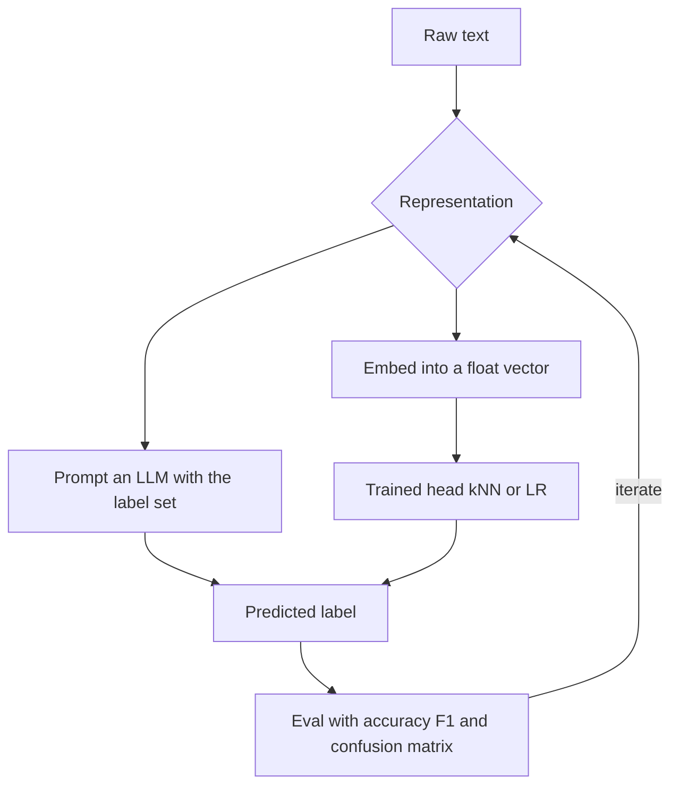

# Module 08 — Classification

> **Depth tags** 🟢 app-level · 🟡 build-one-piece-by-hand · 🔴 from-scratch

Classification is the bread-and-butter ML (Machine Learning) task: given a piece of text, assign it
one label from a fixed set. This module does it three ways so you feel the
real trade-offs between prompting an LLM (Large Language Model) and training a model.

Dataset: `data/texts.json` — 50 news snippets across six categories
(technology, science, business, sports, health, politics). Small enough to run
offline; large enough to measure meaningful accuracy differences.

---

## Concepts

### What is classification?

Classification maps an input to one of _C_ discrete labels. For text that means
"is this spam?", "what topic is this article?", or "is this review positive?"
The hard part is representation: how do you turn words into something a
mathematical model can learn from?



### Three approaches (and when to use each)

| Approach                  | How it works                                                                            | Needs labelled data?                     | Inference cost               |
| ------------------------- | --------------------------------------------------------------------------------------- | ---------------------------------------- | ---------------------------- |
| LLM zero/few-shot         | Prompt the model with the label set; let it "understand"                                | No (few-shot needs examples, not labels) | High — one LLM call per item |
| Embeddings + trained head | Embed text → float vector → train LR (Logistic Regression) or kNN (k-Nearest Neighbors) | Yes — ~20+ per class                     | Low — dot products only      |
| From scratch              | Embed text → train softmax LR with gradient descent                                     | Yes                                      | Low                          |

The key insight: **embeddings decouple "understanding text" from "making a decision"**.
The embedding model does the semantic heavy lifting at embedding time. At inference time
your classifier just needs to find a decision surface in that pre-built vector space —
which is cheap.

### Softmax and cross-entropy (Task 4 math)

Logistic regression for multiple classes works like this:

**Softmax** turns a vector of raw scores (logits) into a probability distribution:

```
softmax(z)_j = exp(z_j) / Σ_k exp(z_k)
```

Every output is in (0, 1) and they sum to 1 — a valid probability distribution.
Subtract the row-max before exp() to prevent numerical overflow (doesn't change the result).

**Cross-entropy loss** measures how wrong the probabilities are:

```
L = -1/N * Σ_i log( p[i, y[i]] )
```

`p[i, y[i]]` is the predicted probability for the TRUE class of sample i.
If it's 1.0 (perfect), log(1) = 0 — no loss. If it's 0.01 (very wrong), log(0.01) ≈ −4.6 — large penalty.

**The gradient** (the "beautiful" result — see Karpathy's micrograd for the derivation):

```
dL/dz = p - one_hot(y)
```

That's it. The gradient at each position is just (predicted probability) − (true probability).
This falls out naturally when you differentiate softmax + cross-entropy jointly.

From this:

```
dL/dW = Xᵀ @ dL/dz / N
dL/db = mean(dL/dz, axis=0)
```

**Why the harmonic mean for F1 (F1 score — harmonic mean of precision and recall)?**

Arithmetic mean of precision and recall can mislead: a classifier with precision=1.0
and recall=0.0 would score 0.5 on arithmetic average but is useless (it never predicts anything).
The harmonic mean punishes extremes:

```
F1 = 2 * P * R / (P + R)
```

P=1.0, R=0.0 → F1 = 0. That's the right answer.

### Class imbalance, calibration, and PR vs ROC (interview notes)

Three practical-ML questions that come up in nearly every interview and are easy
to get wrong:

**Class imbalance.** With a 99:1 split, "always predict the majority class" scores
99% accuracy — which is why accuracy is the wrong metric there (use per-class
precision/recall/F1, exactly what Task 3 builds). Fixes, in the order to try them:

1. **Do nothing to the data, fix the metric and the threshold** — score with F1 or
   PR-AUC and move the decision threshold instead of retraining.
2. **Class weights** — scale each class's loss term by `N / (K · N_class)` so rare
   classes contribute equally to the gradient (one line in the cross-entropy).
3. **Resampling** — oversample the minority (duplicate or synthesize, e.g. SMOTE
   interpolates between minority neighbours) or undersample the majority. Resample
   **only the training split** — resampling before the split leaks duplicated rows
   into the test set.

**Calibration.** A classifier is _calibrated_ when its scores are probabilities:
among samples given `p = 0.8`, ~80% are actually positive. Modern neural nets are
typically **overconfident**; check with a reliability diagram (bin by predicted
probability, plot bin accuracy vs bin confidence) and fix post-hoc with **Platt
scaling** (fit a logistic regression on held-out scores) or **temperature
scaling** (divide logits by a single learned `T > 1` before softmax — the same
`T` from module 01's sampler). Calibration matters whenever the probability
gates a decision — routing low-confidence outputs to human review (module 21
Task 4) only works if "0.6 confident" means 0.6.

**PR curve vs ROC curve.** ROC (module 01b) plots TPR vs FPR; the
precision–recall curve plots precision vs recall. Under heavy imbalance ROC-AUC
can look great while the classifier is useless, because FPR divides by the huge
negative count and barely moves; precision divides by the model's _positive
predictions_, so it collapses when false positives swamp the rare positives.
Rule: balanced classes or symmetric costs → ROC; rare positive class where false
alarms hurt (fraud, injection detection in module 20) → PR curve and PR-AUC.

---

## Tasks

### Task 1 🟢 — LLM zero-shot / few-shot classification

**Goal:** Use a chat LLM as a classifier with no training data.

**Files:**

- `py/01_llm_classifier.py`
- `ts/01-llm-classifier.ts`

**Steps:**

1. Implement `parse_label()` / `parseLabel()` — extract a label from the model's
   raw text response. Be robust: lowercase everything, check if any valid label
   appears as a substring.

2. Implement `zero_shot_prompt()` / `buildZeroShotPrompt()` — a prompt that:
   - Describes the task ("classify into one of: ...")
   - Lists the valid labels exactly
   - Asks for ONLY the label as output (no explanation)

3. Implement `classify_zero_shot()` / `classifyZeroShot()` — call `provider.chat()`
   with `temperature=0` for deterministic output, parse the result.

4. Implement `few_shot_prompt()` / `buildFewShotPrompt()` — same structure but
   prepend labelled examples before the query. Format:

   ```
   Text: <example>
   Label: <label>
   ...
   Text: <query>
   Label:
   ```

5. Implement `classify_few_shot()` / `classifyFewShot()` — same call pattern.

**Acceptance:**

- Zero-shot achieves ≥ 60% accuracy on the first 10 samples.
- Few-shot achieves ≥ 70% accuracy on the first 10 samples.
- `parse_label("The answer is TECHNOLOGY", labels)` returns `"technology"`.

**Why few-shot helps:** The model already knows these labels, but your examples
anchor its output format. Ambiguous items ("the senator tweeted about climate")
benefit from seeing how you want edge cases handled.

---

### Task 2 🟡 — Embeddings + classic ML

**Goal:** Embed the texts, split into train/test, train a classifier on vectors.

**Files:**

- `py/02_embedding_classifier.py` (sklearn LogisticRegression + hand-rolled kNN)
- `ts/02-embedding-classifier.ts` (hand-rolled kNN only)

**Python extra:** `uv sync --extra ml`

**Steps:**

1. Implement `embed_texts()` / `provider.embed()` — embed all 50 texts in batches
   of 32 (providers may have batch limits). Return shape (50, D).

2. Implement `cosine_similarity()` / `cosineSimilarity()`:

   ```
   cosine(a, b) = dot(a, b) / (||a|| * ||b||)
   ```

3. Implement `KNNClassifier.fit()` — store the training vectors and labels.

4. Implement `KNNClassifier.predict_one()` / `predictOne()`:
   - Score every training vector against the query with cosine similarity.
   - Take the k highest-scoring vectors.
   - Return the majority label among those k neighbours.

5. Implement `accuracy()` — fraction correct.

6. (Python only) Compare your hand-rolled kNN to `sklearn.KNeighborsClassifier`
   with `metric="cosine"`. They should be very close.

**Acceptance:**

- Test accuracy ≥ 60% for kNN (k=5).
- Hand-rolled kNN and sklearn kNN agree on ≥ 80% of predictions.
- Train/test split is 80/20 stratified (same random seed = 42).

**Why kNN works here:** Embedding space preserves semantic similarity. "Sports"
articles cluster together; "health" articles form another cluster. kNN just asks
"what cluster am I closest to?"

---

### Task 3 🟡 — Evaluation

**Goal:** Compute precision, recall, F1, confusion matrix; compare classifiers.

**Files:**

- `py/03_evaluation.py`
- `ts/03-evaluation.ts`

**Steps:**

1. Implement `accuracy()` — fraction correct.

2. Implement `precision_recall_f1()` / `precisionRecallF1()` for a single label:
   - TP = correctly predicted as this label
   - FP = incorrectly predicted as this label
   - FN = missed instances of this label
   - Precision = TP / (TP + FP), Recall = TP / (TP + FN), F1 = 2PR/(P+R)
   - Return 0.0 if any denominator is 0.

3. Implement `macro_f1()` / `macroF1()` — average per-class F1.

4. Implement `confusion_matrix()` — N×N array where `[i][j]` is the count of
   samples with true label i and predicted label j.

5. Implement `run_embedding_classifier()` / (inline in TS) — reproduce the
   80/20 split from Task 2 and return `(y_test, predictions)`.

6. Implement `llm_classify()` / `llmClassify()` — a few-shot LLM call on each
   test sample (reuse your Task 1 prompt).

7. Print a comparison table: embedding classifier vs LLM, side by side.

**Acceptance:**

- Metrics are implemented by hand (Python may additionally use `sklearn.metrics` to check).
- Both classifiers run on the EXACT SAME test set (same 80/20 stratified split, seed=42).
- A per-class table and confusion matrix print for each classifier.
- Macro F1 is reported for both.

**Why a confusion matrix?** Raw accuracy hides failure modes. A confusion matrix
shows you WHICH classes get confused — e.g. "health" often confused with "science"
— which tells you whether the embedding space separates them or whether you need more data.

---

### Task 4 🔴 — Classifier from scratch

**Goal:** Implement multinomial logistic regression with gradient descent using
only numpy (Python) / plain arrays (TypeScript).

**Files:**

- `py/04_logistic_scratch.py`
- `ts/04-logistic-scratch.ts`

**Steps:**

The data loading, train/test split, and training loop are provided. You implement:

1. `softmax(z)` — row-wise numerically stable softmax:

   ```python
   z_stable = z - z.max(axis=1, keepdims=True)
   exp_z = np.exp(z_stable)
   return exp_z / exp_z.sum(axis=1, keepdims=True)
   ```

2. `cross_entropy_loss(probs, y)` — clip probs at 1e-12, gather `probs[i, y[i]]`,
   return `-mean(log(correct_probs))`.

3. `forward(X)` — `Z = X @ W + b`, then `softmax(Z)`.

4. `gradient_step(X, y)` — the core of the task:
   ```
   probs = forward(X)
   loss  = cross_entropy_loss(probs, y)
   dZ    = probs - one_hot(y)       # the elegant gradient
   dW    = X.T @ dZ / N
   db    = mean(dZ, axis=0)
   W    -= lr * dW
   b    -= lr * db
   return loss
   ```

**Acceptance:**

- Loss decreases monotonically over the first 50 epochs.
- Test accuracy after 300 epochs is ≥ 50% (embedding features make this achievable).
- `softmax([[1, 2, 3]])` sums to approximately 1.0 per row.
- No sklearn or external ML library used in the model or gradient code.

**The "beautiful" gradient:** The gradient of softmax cross-entropy with respect
to the pre-softmax logits is simply `p - one_hot(y)`. Where the model is
confident and wrong, the gradient is large; where it's confident and right,
it approaches zero. This elegant result is why softmax + cross-entropy are the
universal standard for classification.

---

## Done when

- [ ] `01_llm_classifier` / `01-llm-classifier` classifies the sample texts and
      prints zero-shot vs few-shot accuracy.
- [ ] `02_embedding_classifier` / `02-embedding-classifier` embeds all 50 texts,
      trains kNN, prints test accuracy ≥ 60%.
- [ ] `03_evaluation` / `03-evaluation` prints precision/recall/F1 per class and
      a comparison table of LLM vs embedding classifier on the SAME test set.
- [ ] `04_logistic_scratch` / `04-logistic-scratch` trains a logistic regression
      from scratch and shows decreasing loss + final test accuracy.

---

## When to use which approach

| Situation                                               | Recommended approach                                  |
| ------------------------------------------------------- | ----------------------------------------------------- |
| No labelled data, flexible or changing labels           | LLM zero-shot                                         |
| A handful of examples per class (< 10)                  | LLM few-shot                                          |
| 20–100+ labelled examples per class, fixed label set    | Embeddings + trained head (LR or kNN)                 |
| Need sub-millisecond latency or very high throughput    | Embeddings + trained head                             |
| Labels are costly to collect but you have a chat model  | LLM few-shot as a labelling oracle, then train a head |
| You want to understand what the model is actually doing | From scratch (Task 4)                                 |
| Multi-billion parameter model, many task variations     | Fine-tune (beyond this module)                        |

**The rule of thumb:** LLM zero/few-shot is the right starting point — no data
required and often surprisingly accurate. If you have labelled data and need
cheap inference, train an embedding head. The from-scratch task isn't for
production; it's for intuition.

---

## Going deeper

- **Karpathy micrograd** — derivation of the softmax + cross-entropy gradient in
  50 lines of Python: <https://github.com/karpathy/micrograd>
- **scikit-learn text classification guide** — <https://scikit-learn.org/stable/tutorial/text_analytics/working_with_text_data.html>
- **"Embeddings as features"** — HuggingFace blog on using embedding vectors as
  input to classical ML: <https://huggingface.co/blog/getting-started-with-embeddings>
- **HuggingFace text-classification** — if you want to fine-tune a full transformer:
  <https://huggingface.co/docs/transformers/tasks/sequence_classification>
- **SetFit** — few-shot fine-tuning with contrastive learning; only needs 8 examples
  per class: <https://github.com/huggingface/setfit>

---

## Environment variables

No new env vars beyond what module 00 set up.

Providers that support embeddings: `ollama` (default), `openai`, `nvidia`.
Anthropic's provider raises on `embed()` — use a different provider.

```bash
LLM_PROVIDER=ollama
OLLAMA_EMBED_MODEL=nomic-embed-text    # default
```

## Python extras

```bash
uv sync --extra ml    # installs scikit-learn (Tasks 2 and 3)
```

---

## 📚 Read more

- [scikit-learn user guide](https://scikit-learn.org/stable/user_guide.html) — the reference for LogisticRegression, kNN, metrics, calibration, and cross-validation.
- [CS231n — Linear classification notes](https://cs231n.github.io/linear-classify/) — the cleanest written derivation of softmax + cross-entropy (the Task 4 math).
- [StatQuest (YouTube)](https://www.youtube.com/@statquest) — short, intuition-first videos on logistic regression, ROC/PR curves, and F1.
- [3Blue1Brown — Neural networks](https://www.3blue1brown.com/topics/neural-networks) — visual gradient-descent intuition that makes the Task 4 update rule click.
