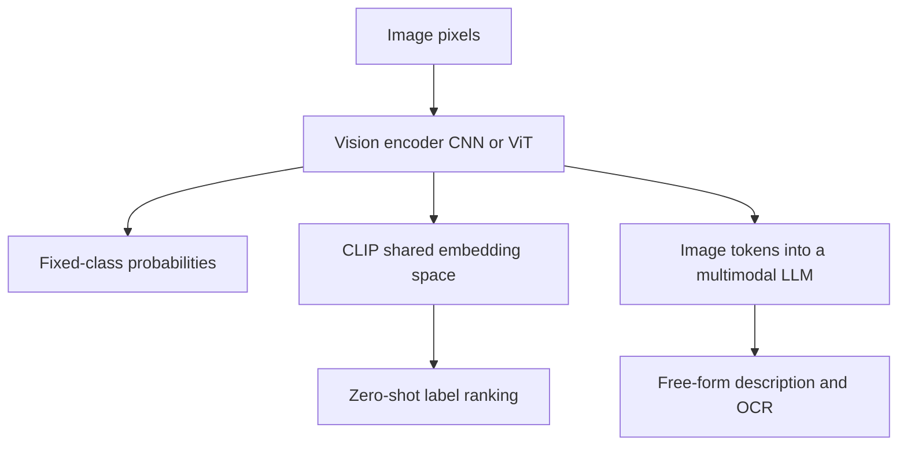

# Module 09 — Computer Vision

> **Depth tags** 🟢 app-level · 🟡 build-one-piece-by-hand · 🔴 from-scratch

Vision models turn pixels into understanding. This module walks you from raw
numbers in a JPEG to a rich, flexible description from a multimodal LLM (Large Language Model) — and
then peels back the layers to show what's happening inside a CNN (Convolutional Neural Network).

You'll classify images with a pretrained model, rank free-form labels with CLIP (Contrastive Language-Image Pre-training),
ask a multimodal LLM to describe and extract text from a photo, and implement
the convolution operation that sits at the heart of every CNN.

---

## Concepts

### Pixels → features

A colour image is a 3-D array of numbers: `height × width × 3` (red, green,
blue channels), each pixel an integer 0–255. That's the raw input every vision
model receives. The model's job is to find structure — edges, shapes, textures,
objects — in those numbers.

Early vision systems hand-crafted this structure (Sobel edges, HOG (Histogram of Oriented Gradients) features).
Deep learning _learns_ the features from data. Task 4 in this module implements
a hand-crafted edge detector so you feel exactly what a "feature" is before the
learning happens.

The three inference paths this module walks through:



### Convolutional Neural Networks (CNNs)

A CNN stacks many **convolutional layers**. Each layer slides a small matrix
(the **kernel** or **filter**) across the feature map from the previous layer,
computing a dot product at each position. Early layers learn low-level features
(edges, corners); later layers combine those into high-level patterns (eyes,
wheels, dog faces).

```
input pixels  →  [conv + relu] ×N  →  global pooling  →  fully-connected  →  label
              (feature maps grow deeper, shrink spatially)
```

AlexNet (2012) showed that a deep CNN trained on ImageNet could recognise 1000
object categories better than any hand-crafted system. That result launched the
modern AI era.

### Vision Transformers (ViT)

ViT (Dosovitskiy et al., 2020) applies the Transformer architecture — designed
for sequences of tokens — to images by chopping the image into fixed-size
**patches** (e.g. 16×16 pixels), flattening each patch into a vector, and
treating the sequence of patch vectors exactly like word tokens in a language
model. Self-attention then lets every patch attend to every other patch, giving
global context that CNNs can only approximate through deep stacking.

ViT models trained at scale (CLIP, DINOv2, SigLIP) now dominate both
classification benchmarks and serve as the vision encoder backbone inside
multimodal LLMs.

### CLIP — a shared image/text embedding space

CLIP (Radford et al., OpenAI 2021) trains a vision encoder and a text encoder
**jointly** with a contrastive objective: pull together the embeddings of a
(caption, image) pair, push apart everything else. After training on 400 million
internet (image, alt-text) pairs the two encoders live in the **same embedding
space**: a photo of a cat and the sentence "a photo of a cat" produce vectors
close together; "a photo of a dog" is further away.

This makes **zero-shot classification** possible: at inference time, embed the
image and embed each candidate label text, then rank labels by cosine similarity.
No per-class training data needed.

```
image encoder ──▶ image embedding ──┐
                                    ├──▶ cosine similarity → ranked labels
text encoder  ──▶ text  embedding ──┘
```

### Multimodal LLMs

Modern LLMs (GPT-4o, Claude 3+, Gemini) extend the transformer to accept images
alongside text. The common architecture: a pretrained vision encoder (often a
ViT-L or ViT-H) converts an image into a sequence of "image tokens", which are
concatenated with text tokens and fed to the language model. The result is
flexible understanding: description, Q&A, OCR (Optical Character Recognition), classification — all via natural
language.

### Going beyond the abstraction

`llm_core` / `@learn-ai/llm-core` is **text-only**. Its `ChatMessage.content`
is a plain string; there is no image field. Sending an image to Claude or GPT
requires the raw vendor SDKs (Software Development Kits) (`anthropic`, `openai`) because the multimodal
message format — a list of content blocks with image data — is not part of the
shared interface. Task 3 uses the SDKs directly for exactly this reason. That
is not a shortcoming of `llm_core`; it is a deliberate reminder that every
abstraction has a boundary, and knowing where that boundary lies is a core
engineering skill.

---

## Setup

### Minimal (all hosted APIs — no local model download)

You need at least one of:

| What              | Env var             | Where to get it                                                                 |
| ----------------- | ------------------- | ------------------------------------------------------------------------------- |
| HuggingFace token | `HF_TOKEN`          | [huggingface.co/settings/tokens](https://huggingface.co/settings/tokens) (free) |
| OpenAI API key    | `OPENAI_API_KEY`    | [platform.openai.com/api-keys](https://platform.openai.com/api-keys)            |
| Anthropic API key | `ANTHROPIC_API_KEY` | [console.anthropic.com](https://console.anthropic.com)                          |

Add your keys to `.env` (copy from `.env.example` at the repo root).

Tasks 1 and 2 use the **HuggingFace Inference API (Application Programming Interface)** (free tier, `HF_TOKEN`).  
Task 3 uses **OpenAI or Anthropic** for the multimodal LLM path (`OPENAI_API_KEY` or `ANTHROPIC_API_KEY`).  
Task 4 (convolution from scratch) needs only **numpy** (already in the base install) and **Pillow** (in the `vision` extra).

### Optional — local model execution (Python)

Downloads model weights to your machine (hundreds of MB to several GB); slow
on Mac MPS but works without internet once downloaded.

```bash
uv sync --extra vision   # installs torch, torchvision, transformers, pillow, huggingface-hub
```

Then in each exercise, uncomment the `classify_local()` / `clip_classify_local()`
function and call it instead of the hosted version.

### TypeScript — transformers.js

`@huggingface/transformers` runs ONNX-quantised models directly in Node. It
downloads the model on first use (~90 MB for ViT-base, ~300 MB for CLIP) and
caches it locally. No Python, no GPU required.

```bash
pnpm install   # from repo root — picks up the new @huggingface/transformers dep
```

---

## Running the exercises

**Python** (from the repo root):

```bash
uv run python modules/09-computer-vision/py/task1_classify.py
uv run python modules/09-computer-vision/py/task2_clip.py
LLM_PROVIDER=openai uv run python modules/09-computer-vision/py/task3_vision_llm.py
uv run python modules/09-computer-vision/py/task4_convolution.py
```

**TypeScript** (from the repo root):

```bash
pnpm tsx modules/09-computer-vision/ts/task1_classify.ts
pnpm tsx modules/09-computer-vision/ts/task2_clip.ts
LLM_PROVIDER=openai pnpm tsx modules/09-computer-vision/ts/task3_vision_llm.ts
pnpm tsx modules/09-computer-vision/ts/task4_convolution.ts
```

A sample image (`assets/cat.jpg`) is downloaded automatically on first run if
it is not already present.

---

## Tasks

### Task 1 — Image classification with a pretrained model 🟢

**Goal:** send an image to a pretrained ViT model and get back a ranked list of
ImageNet class labels.

**Steps**

1. Read `task1_classify.py` / `task1_classify.ts` top to bottom.
2. **Python**: complete the `TODO` inside `classify_hosted()` — call
   `client.image_classification()` from `huggingface_hub.InferenceClient`.
3. **TypeScript**: complete the `TODO` inside `classifyLocal()` — import
   `pipeline` from `@huggingface/transformers` and run the
   `"image-classification"` pipeline on the sample image.
4. Run the exercise. Verify the top label matches what's in the image.
5. Optional: uncomment and complete the local Python path (`classify_local()`)
   to see the same model running on your machine.

**Acceptance**

- Prints a ranked list of (label, score) pairs.
- The correct class appears in the top 3.

---

### Task 2 — Zero-shot classification with CLIP 🟢

**Goal:** given an image and a set of free-form candidate labels, rank them by
CLIP similarity. Change the label list and watch the ranking change — no
retraining.

**Background**  
Because CLIP's image and text encoders share an embedding space, you can compare
the image's embedding to any text string at runtime. The label list is not fixed
to a training vocabulary — you invent it on the fly.

**Steps**

1. Read `task2_clip.py` / `task2_clip.ts`.
2. **Python**: complete the `TODO` inside `clip_classify_hosted()` — call
   `client.zero_shot_image_classification()`.
3. **TypeScript**: complete the `TODO` inside `clipLocal()` — use the
   `"zero-shot-image-classification"` pipeline with `candidate_labels`.
4. Run. Verify the correct label ranks highest.
5. Experiment: add quirky candidates like `"a photo of the moon"` or
   `"a motivational poster"`. Notice how CLIP still makes sensible rankings
   even for labels it was never explicitly trained to classify.

**Acceptance**

- Prints each label with its cosine-similarity score.
- The label that best describes the image ranks first.

---

### Task 3 — Vision via a multimodal LLM 🟡

**Goal:** send an image + a text prompt to GPT-4o-mini or Claude and receive a
natural-language description plus a one-word label. Compare the output to tasks
1 and 2.

**Background**  
This exercise deliberately steps outside the `llm_core` abstraction to use the
raw vendor SDKs. Inspect the `messages` array you build: you'll see an
`image_url` block (OpenAI) or a `source` block with base64 data (Anthropic).
This is the real multimodal request shape — understanding it lets you add image
inputs to any project without relying on a wrapper.

**Steps**

1. Read `task3_vision_llm.py` / `task3_vision_llm.ts`. Note the import: no
   `get_provider()` / `getProvider()` here — we import the vendor SDK directly.
2. **Python — OpenAI path**: complete the `TODO` in `describe_with_openai()` —
   build the content array with a `text` part and an `image_url` part, then
   call `client.chat.completions.create()`.
3. **Python — Anthropic path**: complete the `TODO` in `describe_with_anthropic()`
   — build the content array with an `image` source block and a `text` block,
   then call `client.messages.create()`.
4. Do the same in the TypeScript file.
5. Run both providers if you have keys for both. Compare their descriptions.
6. Modify `DESCRIBE_PROMPT` to ask for something specific: "List all text
   visible in the image" (OCR-style), or "Is this indoor or outdoor?"

**Acceptance**

- Prints a 2-3 sentence description of the image.
- Prints a single-word label on a `Label:` line.
- Works with at least one of OpenAI or Anthropic.

---

### Task 4 — Convolution from scratch 🔴

**Goal:** implement a 2-D convolution function using explicit loops (no numpy
`convolve`, no PyTorch), apply it to a real image with edge-detection and blur
kernels, and visualise the feature maps.

**Background**  
This task forbids the obvious library (no `scipy.signal.convolve2d`, no
`torch.nn.functional.conv2d`) because the point is to see the inner loop.
Once you've written `sum += patch * kernel` yourself, you'll never wonder
again what a conv layer actually computes.

**Steps**

1. Read `task4_convolution.py` / `task4_convolution.ts`. Study the kernel
   matrices: can you predict which direction each one highlights?
2. **Python**: fill in the double for-loop inside `conv2d()` — see the `TODO`
   comment for the exact code to uncomment.
3. **TypeScript**: same — fill in the four-level nested loop inside `conv2d()`.
4. Run. The sanity check (identity kernel) must pass first. Then the main
   function applies the Sobel and blur kernels to the sample image and writes
   output files to `assets/`.
5. Open the output images. Horizontal-edge output should look like a pencil
   sketch of horizontal lines; vertical-edge should show vertical lines;
   blur should look like a smeared version of the original.
6. Reflect: in a trained CNN, what happens to these kernels? (They're
   initialised randomly and updated by backpropagation until they detect
   whatever features reduce the loss.)

**Acceptance**

- `_sanity_check()` / `sanityCheck()` passes without assertion error.
- Output feature-map images are written to `assets/` and visually make sense.

---

## Done when

- [ ] You classified an image with a pretrained model (task 1) and saw ranked labels.
- [ ] You ranked free-form text labels with CLIP (task 2) and changed the label list.
- [ ] You sent an image to a multimodal LLM (task 3) and read its description.
- [ ] You implemented 2-D convolution from scratch (task 4) and passed the sanity check.
- [ ] You can explain, in a sentence, the difference between a task-1 classifier,
      CLIP zero-shot, and a multimodal LLM — when would you choose each?

---

## Going deeper

### Object detection, segmentation, OCR

- **YOLO** (You Only Look Once) — real-time object detection: bounding boxes +
  labels in a single forward pass.
  [ultralytics.com](https://docs.ultralytics.com)
- **DETR (Detection Transformer)** — detection with Transformers (Facebook AI, 2020); treats detection
  as a set-prediction problem with no anchor boxes.
  [HuggingFace DETR](https://huggingface.co/facebook/detr-resnet-50)
- **SAM** (Segment Anything Model, Meta 2023) — given a point or box, segments
  the object at that location; works on arbitrary images with no class labels.
  [segment-anything.com](https://segment-anything.com)
- **OCR**: traditional path is Tesseract; modern path is a multimodal LLM (task 3
  showed how — just change the prompt). For structured extraction from documents,
  see Microsoft's TrOCR or Google Document AI.

### ViT vs CNN: when to use each

|                                | CNN                             | ViT                                    |
| ------------------------------ | ------------------------------- | -------------------------------------- |
| Inductive bias                 | Translation equivariance (good) | None — learns it from data             |
| Data efficiency                | Better with small datasets      | Needs large datasets or pretraining    |
| Global context                 | Expensive (deep stacking)       | Cheap (attention is global by default) |
| Throughput                     | Fast (optimised CUDA kernels)   | Slightly slower for small images       |
| SOTA (State of the Art) (2024) | Still competitive (ConvNeXt)    | ViT-based models dominate              |

### Papers and resources

- [CS231n Convolutional Neural Networks for Visual Recognition](https://cs231n.github.io) — the canonical lecture notes; the convolution visualisations in lecture 5 are outstanding.
- [An Image is Worth 16x16 Words (ViT paper)](https://arxiv.org/abs/2010.11929) — the original Vision Transformer.
- [The Illustrated Transformer](https://jalammar.github.io/illustrated-transformer/) — self-attention intuition that applies to ViT.
- [Learning Transferable Visual Models From Natural Language Supervision (CLIP)](https://arxiv.org/abs/2103.00020) — the original CLIP paper.
- [HuggingFace Vision Course](https://huggingface.co/learn/computer-vision-course/) — hands-on; covers classification, detection, generation.
- [NVIDIA NIM (NVIDIA Inference Microservices) vision models](https://build.nvidia.com/explore/vision) — hosted vision endpoints (CLIP, OCR, object detection) if you want an OpenAI-compatible API for vision tasks.

---

## 📚 Read more

- [CS231n notes](https://cs231n.github.io) — the canonical course notes on convolution, pooling, and CNN architectures; the backbone of Task 4.
- [CLIP paper — Radford et al. 2021](https://arxiv.org/abs/2103.00020) — the contrastive image/text training behind Task 2's zero-shot classifier.
- [Anthropic docs](https://docs.anthropic.com) — the vision/multimodal message format you build by hand in Task 3.
- [3Blue1Brown — Neural networks](https://www.3blue1brown.com/topics/neural-networks) — visual intuition for what stacked layers learn from pixels.
