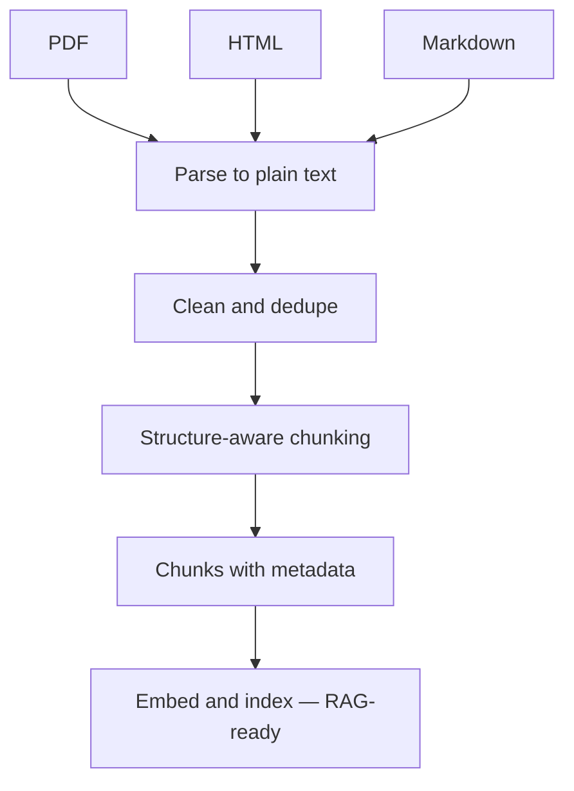

# Module 11 — Document Ingestion

> **Depth tags** 🟢 app-level · 🟡 build-one-piece-by-hand

Document ingestion is the data front-end for every RAG (Retrieval-Augmented Generation) pipeline. This module
teaches you the engineering that makes or breaks retrieval quality: parsing
real document formats, cleaning noise, chunking by structure (not arbitrary
character counts), and keeping an index fresh incrementally.

**Prereq:** Complete module 05 (RAG) first. That module assumes clean,
pre-formatted text; this module shows you how to get there from the messy
real world.

---

## Concepts

### Why ingestion is 80% of a RAG project

A RAG demo works beautifully on a tidy text file. A production system works on
PDFs (Portable Document Format) scanned from paper, HTML (HyperText Markup Language) pages full of nav menus and cookie banners, Word
documents with embedded images, and Markdown wikis with inconsistent heading
levels. Every format adds noise, and noise degrades retrieval. An answer can
only be as good as the chunks that are retrieved, and chunks can only be as good
as the text that was extracted.

The split: ~20% of production RAG engineering is tuning the retrieval and
generation; ~80% is building robust ingestion that handles edge cases.



### Parsing formats

| Format          | Key challenge                                                                                               | Library                                             |
| --------------- | ----------------------------------------------------------------------------------------------------------- | --------------------------------------------------- |
| **PDF**         | Multi-column layout, headers/footers on every page, scanned PDFs (need OCR — Optical Character Recognition) | pypdf / pdfplumber (Python); pdf-parse (TypeScript) |
| **HTML**        | Navigation, ads, cookie banners, `<script>` noise swamps body text                                          | beautifulsoup4 (Python); cheerio (TypeScript)       |
| **Markdown**    | Clean text but heading syntax (`#`, `**`, `` ` ``) confuses embeddings                                      | stdlib regex                                        |
| **DOCX / EPUB** | Proprietary binary formats; python-docx / ebooklib needed                                                   | out of scope here                                   |

Rule of thumb: parse to plain text first, then clean, then chunk. Keep
parsing and cleaning in separate stages so each is testable.

### Cleaning

Raw text from parsers contains:

- **Boilerplate**: navigation links, cookie notices, footers, page numbers.
- **Whitespace noise**: multiple consecutive blank lines, mixed indentation.
- **Formatting artifacts**: Markdown `##`, `**bold**`, HTML `&amp;` entities.
- **Near-duplicates**: the same paragraph quoted in multiple places.

Cleaning heuristics to know:

- **Line-length filter**: single short lines that look like nav items
  ("HOME", "Contact Us") can be dropped.
- **Boilerplate keywords**: "Cookie Policy", "Terms of Service", etc.
- **Shingle-based deduplication**: compute Jaccard similarity between paragraph
  fingerprints; if similarity > 0.8, drop the duplicate.

### Structure-aware chunking

Naive fixed-size chunking from module 04 treats the document as a flat stream
of words. This can split a heading from its body, or a question from its answer.

**Section-aware chunking** instead:

1. Detects heading boundaries (Markdown `#`, `##`, `###`; HTML `<h1>` – `<h3>`).
2. Keeps each section as one logical unit.
3. Only sub-chunks if the section exceeds the embedding model's token limit.
4. Prepends the heading to every sub-chunk so the section title is always in
   context — critical for retrieval.

```
Document
├── # Introduction       → Chunk 0  (heading + intro prose)
├── ## Why RAG?          → Chunk 1  (heading + body)
│   └── (long body)      → Chunk 1a, 1b  (sub-chunked; each starts with "## Why RAG?")
└── ## The Pipeline      → Chunk 2
```

### Metadata on every chunk

Every chunk should carry:

| Key                | Why                                                                                      |
| ------------------ | ---------------------------------------------------------------------------------------- |
| `source`           | File path or URL (Uniform Resource Locator) — for attribution and freshness tracking     |
| `section`          | Heading text — for filtering and display                                                 |
| `page`             | PDF page number — for PDF citations                                                      |
| `ingested_at`      | ISO (International Organization for Standardization) timestamp — for staleness detection |
| `estimated_tokens` | For context-window budget planning                                                       |

### Multimodal pages: when the text layer isn't enough

Everything above assumes the PDF has a **digital text layer** you can extract.
Much real content doesn't: scanned pages, tables drawn as ruled lines, charts,
screenshots, and diagrams. `pypdf` returns `""` (or garbage) for those, and the
numbers in a table image never reach your index.

The fix is **multimodal retrieval**: treat each page as an _image_.

1. **Render** each page to a PNG (via `pymupdf`).
2. **Caption** it with a vision LLM — transcribe the tables, read the figures —
   producing a text description of the page.
3. **Embed** the caption (text embeddings, `llm_core.embed()`) and index it.
4. At query time, retrieve pages by caption similarity, then **answer over the
   page image itself** — hand the matched PNG back to the vision model so
   generation reasons over pixels, not a lossy transcription.

_Retrieve by text, answer over the image._ Two costs: a vision call per page at
index time, and a vision-capable provider at query time.

> **Abstraction leak (same as module 09 Task 3):** `llm_core`'s `chat()` is
> **text-only**. Sending an image needs the raw vendor SDK (`openai` /
> `anthropic`). Embeddings still go through `provider.embed()`. Note Anthropic
> has vision but **no embeddings** — pair it with `EMBED_PROVIDER=openai`.

### Incremental indexing

Re-embedding every document on every run is slow and costly. Incremental
indexing uses a content hash per document:

```
hash(current text)  ==  hash(stored in manifest)
      ↓ yes                      ↓ no
   skip (no API call)      re-embed + update manifest
```

The manifest is a small JSON (JavaScript Object Notation) file mapping `source → {hash, timestamp, model}`.
On each run: hash each file, compare to manifest, embed only the diff.

At production scale this becomes an upsert pattern in a vector DB (Database) (e.g.
Qdrant's `upsert` with `id = hash(chunk_text)` — existing vectors are left
alone; new/changed ones replace the old).

### Web scraping ethics

If you extend task 1 to fetch HTML from the web:

- Always check `robots.txt` before scraping: `https://example.com/robots.txt`.
- Respect `Crawl-delay` directives.
- Identify your bot with a descriptive `User-Agent`.
- Cache aggressively — re-fetching the same page repeatedly is bad citizenship.
- Terms of service sometimes prohibit scraping outright.

---

## Tasks

### Task 1 🟢 — Parse documents

**Goal:** Extract text from PDF, HTML, and Markdown files into a normalized
`Document` record.

**Files:**

- `py/01_parse_documents.py`
- `ts/01-parse-documents.ts`

**Steps:**

1. Implement `parse_markdown()` / `parseMarkdown()` — read file, extract title
   from first H1, return Document.
2. Implement `parse_html_bs4()` / `parseHtml()` — fetch/read HTML, strip nav/
   header/footer/script/style, extract body text with BeautifulSoup / cheerio.
3. Implement `parse_html_fallback()` / `parseHtmlFallback()` — stdlib-only
   fallback using regex for when BS4/cheerio is unavailable.
4. Implement `parse_pdf()` / `parsePdf()` — pypdf / pdf-parse; extract text
   page by page; join with page-break sentinel.
5. Implement `parse_document()` / `parseDocument()` — dispatch on extension.
6. Run the harness against `sample_docs/intro_to_rag.md` and
   `sample_docs/vector_databases.html`.

**Acceptance:**

- Both sample files parse without error.
- HTML output contains body text but not nav/footer text.
- Markdown output contains the raw Markdown (cleaning is task 2).
- `metadata.title` is populated for both files.

---

### Task 2 🟡 — Clean & normalize

**Goal:** Strip boilerplate, collapse whitespace, and remove near-duplicate
paragraphs from parsed text.

**Files:**

- `py/02_clean_normalize.py`
- `ts/02-clean-normalize.ts`

**Steps:**

1. Implement `strip_markdown_syntax()` / `stripMarkdownSyntax()` — remove `#`,
   `**`, `` ` ``, fenced code blocks, table pipes, link syntax.
2. Implement `collapse_whitespace()` / `collapseWhitespace()` — normalise line
   endings, collapse runs of spaces, limit blank lines to 2.
3. Implement `remove_boilerplate_lines()` / `removeBoilerplateLines()` — drop
   all-caps nav items, horizontal rules, cookie/privacy footer lines.
4. Implement `fingerprint()` — n-gram shingle set for a text block.
5. Implement `dedupe_blocks()` / `dedupeBlocks()` — drop near-duplicate
   paragraphs using Jaccard similarity of shingle sets.
6. Implement `clean()` — chain all of the above in the right order.

**Acceptance:**

- Markdown output has no `#`, `**`, or `` ` `` characters.
- HTML output has no nav/footer text (from task 1) and no duplicate paragraphs.
- Cleaning reduces total character count vs. raw text (typically 10–30%).
- Two copies of the same paragraph → only one survives dedupe.

---

### Task 3 🟡 — Structure-aware chunking

**Goal:** Chunk documents by section/heading rather than by fixed character
count, and carry section metadata into every chunk.

**Files:**

- `py/03_structure_chunking.py`
- `ts/03-structure-chunking.ts`

**Steps:**

1. Implement `naive_fixed_size_chunks()` / `naiveFixedSizeChunks()` —
   word-based fixed-size with overlap (from module 04, reproduced here for
   side-by-side comparison).
2. Implement `section_chunks()` / `sectionChunks()` — detect ATX (a Markdown heading style using `#` prefixes) heading
   boundaries, emit one chunk per section (sub-chunk if too large, always
   prepend the heading).
3. Run the harness on `sample_docs/intro_to_rag.md` and print both chunk lists.

**Acceptance:**

- Section-aware chunks each start with (or contain) a Markdown heading.
- `chunk.metadata.section` is populated for every section chunk.
- A section longer than `max_tokens` is split into sub-chunks, each containing
  the section heading at the top.
- Section-aware produces fewer, more meaningful chunks than naive for the
  sample document.

---

### Task 4 🟢 — Incremental indexing

**Goal:** Hash documents, skip unchanged ones on re-run, track a manifest, and
prune stale entries.

**Files:**

- `py/04_incremental_indexing.py`
- `ts/04-incremental-indexing.ts`

**Steps:**

1. Implement `content_hash()` / `contentHash()` — SHA-256 (Secure Hash Algorithm 256-bit), first 16 hex chars.
2. Implement `load_manifest()` / `loadManifest()` — JSON file → dict.
3. Implement `save_manifest()` / `saveManifest()` — dict → JSON file.
4. Implement `ingest_documents()` / `ingestDocuments()` — per-doc: hash, compare
   to manifest, skip if unchanged, embed chunks if new/changed, update manifest.
5. Implement `remove_stale_entries()` / `removeStaleEntries()` — drop manifest
   entries for files that no longer exist.
6. Run the harness twice; confirm second run skips both files.

**Acceptance:**

- First run: new=2, changed=0, skipped=0 (or whichever files exist).
- Second run (same files, no edits): new=0, changed=0, skipped=2.
- Manifest JSON is written to `modules/11-document-ingestion/.index_manifest.json`.
- `remove_stale_entries` returns a list when called with a shorter path list.

---

### Task 5 🟡 — Permissions-aware retrieval

**Goal:** Attach per-document access metadata (owner, group, visibility) during
ingestion and enforce it at retrieval time so a query for a given user only
returns chunks they are allowed to see. Reinforce page/section-level citations
by carrying `source`, `section`, and `page` in chunk metadata.

**Files:**

- `py/05_permissions_aware.py`
- `ts/05-permissions-aware.ts`

**Steps:**

1. Implement `tag_access()` / `tagAccess()` — create a `PermissionedChunk`
   with the chunk text, embedding vector, ACL (owner/groups/visibility), and
   citation fields (`source`, `section`, `page`).
2. Implement `user_can_access()` / `userCanAccess()` — return True/false based
   on visibility rules: `public` → always; `private` → owner only;
   `group` → owner or group member.
3. Implement `cosine_similarity()` / `cosineSimilarity()` — dot product over
   norms, guard against zero-length vectors.
4. Implement `retrieve_for_user()` / `retrieveForUser()` — supports two modes:
   - **Pre-filter** (`pre_filter=True`): restrict the candidate set to accessible
     chunks BEFORE scoring. Preferred in production (faster, avoids scoring
     documents the user can never see).
   - **Post-filter** (`pre_filter=False`): score all chunks, then keep only
     accessible results. Shown here for comparison — results must match pre-filter.
5. Run the harness for users `alice`, `bob`, `carol`, `guest` and verify that
   each user sees only permitted chunks and that citations include
   `source`, `section`, and (where relevant) `page`.

**Acceptance:**

- `guest` (member of `["all"]`) sees only `public` and `all`-group documents.
- `bob` (member of `["finance", "exec", "all"]`) sees finance/exec docs but not
  the ops or `private` board document.
- Pre-filter and post-filter return identical chunk IDs in the same order.
- Every `RetrievalResult` prints a citation string with `source` and `section`.
- The harness prints the access summary table without errors.

---

### Task 6 🟡 — Multimodal PDF retrieval

**Goal:** Index and retrieve PDF pages by _image_, not just extracted text, so
tables and figures become searchable and answerable.

**Files:**

- `py/06_multimodal_pdf.py`
- `ts/06-multimodal-pdf.ts`

**Steps:**

1. Implement `build_multimodal_index()` / `buildMultimodalIndex()` — caption
   each page image with `vision_ask(path, CAPTION_PROMPT)`, then embed all
   captions in one `embed()` call; return one entry per page.
2. Implement `retrieve_pages()` / `retrievePages()` — embed the query, score
   captions by cosine, return top-k pages.
3. Implement `answer_over_page()` / `answerOverPage()` — build an answer prompt
   and call `vision_ask()` on the retrieved page **image** (answer over pixels).
4. Run the harness. Python renders the sample pages (via `pymupdf`) on first
   run; **TypeScript consumes those PNGs**, so run the Python file once before
   the TS one.

The vision call (`vision_ask`) is provided — it's the same raw-SDK pattern from
module 09 Task 3. Your job is the retrieval flow around it.

**Acceptance:**

- The index has one entry per rendered page, each with a non-empty caption.
- The query "What was Q3 2024 revenue?" retrieves the **table page** (`page_2`)
  at rank 1.
- `answer_over_page` returns the Q3 figure (55.3) read from the page image —
  a number `pypdf`'s text layer would have missed on a scanned table.

---

## Done when

- [ ] `parse_document()` handles `.md` and `.html` without error.
- [ ] Cleaned HTML has no nav/footer text; cleaned Markdown has no `#`/`**` chars.
- [ ] Section-aware chunks carry `metadata.section` and respect heading boundaries.
- [ ] Second incremental-indexing run shows 0 new / 0 changed / N skipped.
- [ ] `retrieve_for_user()` enforces ACLs (Access Control Lists): guest cannot see private/group docs.
- [ ] Pre-filter and post-filter return the same results.
- [ ] Every retrieval result includes a citation with source + section (+ page for PDFs).
- [ ] Multimodal retrieval indexes page images, retrieves the table page for a
      revenue query, and answers the figure from the page image.
- [ ] Both py and ts harnesses print output without crashing.

---

## Governance & data lifecycle

Ingestion is where a document's data first lands and is copied — parsed text,
chunks, embeddings, and any cache — and each copy is a store with an owner, a
retention rule, and a deletion path. Each ingested source also has a **licence**.
Before ingesting a real corpus, fill in the Module 20b governance templates at these
points:

- [`DATA_INVENTORY.md`](../20b-governance-privacy/templates/DATA_INVENTORY.md) —
  record the parsed-text store, the vector store, and any cache.
- [`RETENTION_SCHEDULE.md`](../20b-governance-privacy/templates/RETENTION_SCHEDULE.md)
  — a deletion request must reach the embeddings and cache, not only the source.
- [`LICENCE_AND_USE_DECISIONS.md`](../20b-governance-privacy/templates/LICENCE_AND_USE_DECISIONS.md)
  — every ingested source needs an allowed-use decision, or is excluded.

See **[module 20b](../20b-governance-privacy/README.md)** for the full workflow.

## Going deeper

- **PDF OCR:** pypdf extracts digital text only. For scanned PDFs, try
  [pytesseract](https://github.com/madmaze/pytesseract) or the
  [Azure Document Intelligence](https://azure.microsoft.com/en-us/products/ai-services/ai-document-intelligence)
  API (Application Programming Interface). What changes when the source is image-based?
- **Vision embeddings (ColPali):** Task 6 captions-then-embeds (text vectors).
  A stronger approach embeds the page image _directly_ with a late-interaction
  vision model like [ColPali](https://arxiv.org/abs/2407.01449), skipping the
  caption step. No text extraction at all — retrieval is image-patch to
  query-token. Compare recall against your caption pipeline.
- **DOCX / EPUB:** Add `python-docx` or `ebooklib` support to task 1's
  dispatcher. The cleaning and chunking stages should work unchanged.
- **Heading hierarchy:** Extend `section_chunks()` to respect heading level —
  keep H1 > H2 > H3 nesting in metadata so you can filter by top-level section.
- **Sentence-based chunking:** Instead of word-count, split on sentence
  boundaries (use `nltk.sent_tokenize` or a simple period-space heuristic)
  and group N sentences per chunk. Compare retrieval quality with module 05's
  eval harness.
- **Full RAG integration:** Feed the chunks from tasks 3 and 4 into the RAG
  pipeline from module 05. Replace the inline CORPUS_DOCS with real documents
  and measure whether retrieval quality improves.
- **Deduplication at scale:** The shingle Jaccard approach is O(n²) in the
  number of paragraphs. For large corpora, look at
  [MinHash LSH (Locality-Sensitive Hashing)](https://en.wikipedia.org/wiki/MinHash) (available in
  `datasketch`), which finds near-duplicates in O(n).
- **Web crawling:** Extend task 1 to accept a URL, fetch it, follow links one
  level deep, and build a small corpus. Remember to check `robots.txt`.

---

## Environment variables

No new env vars beyond module 00.

## Python dependencies

PDF and HTML parsers are not in stdlib. Document them to users:

```bash
# PDF parsing (pick one):
uv add pypdf         # or: uv add pdfplumber

# HTML parsing (preferred):
uv add beautifulsoup4 httpx

# HTML parsing fallback: stdlib urllib + re (no install needed)

# Task 6 — multimodal PDF (render pages to images):
uv sync --extra ingest    # now includes pymupdf
uv add openai             # OR: uv add anthropic — for the vision call
```

Most parsers are bundled under `uv sync --extra ingest` (`pypdf`,
`beautifulsoup4`, `lxml`, and now `pymupdf` for Task 6). Task 6's vision call
also needs the `openai` or `anthropic` SDK.

## TypeScript dependencies

Added to `ts/package.json`:

- `pdf-parse` — PDF text extraction
- `cheerio` — jQuery-like HTML parser for Node.js

Install: `pnpm install` from `modules/11-document-ingestion/ts/` or `pnpm -r install` from the repo root.

## Sample files

`sample_docs/` contains two files for offline use:

- `intro_to_rag.md` — Markdown article about RAG (covers headings, tables, lists)
- `vector_databases.html` — HTML page with nav/header/footer boilerplate to strip

These files are self-contained so every task runs without network access.

---

## 📚 Read more

- [pypdf docs](https://pypdf.readthedocs.io) — the reference for the PDF extraction you do in Task 1, including its limits on scanned pages.
- [Beautiful Soup docs](https://www.crummy.com/software/BeautifulSoup/bs4/doc/) — the canonical guide to navigating and stripping HTML trees.
- [Unstructured docs](https://docs.unstructured.io) — a production-grade ingestion library: one API for PDF, HTML, DOCX, EPUB, and more.
- [Tesseract OCR](https://github.com/tesseract-ocr/tesseract) — the standard open-source OCR engine for when your PDFs are scans, not digital text.
