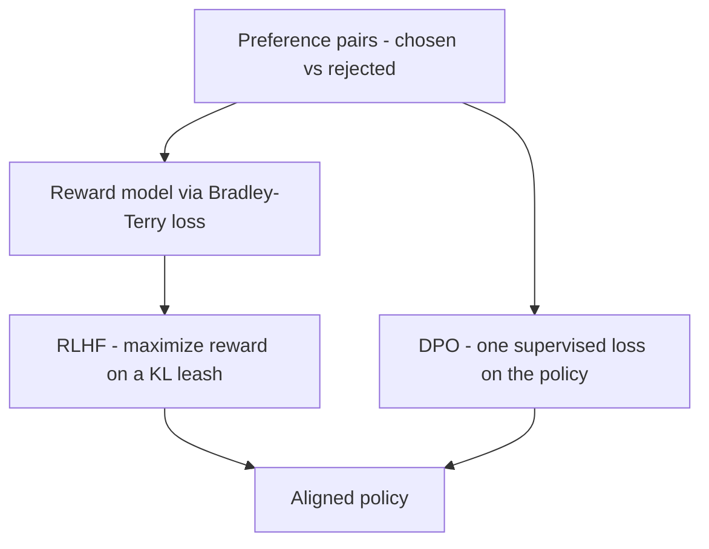

# Module 13b — Post-training & Alignment (RLHF & DPO)

> **Depth tags** 🟢 app-level · 🟡 build-one-piece-by-hand · 🔴 from-scratch

"How is ChatGPT actually trained?" is a top LLM (Large Language Model) interview
question, and the full answer has three stages: **pretraining** → **SFT
(Supervised Fine-Tuning)** → **preference optimization** (RLHF (Reinforcement
Learning from Human Feedback) or DPO (Direct Preference Optimization)).
Module 13 covers the middle stage (SFT + LoRA) and stops there. This companion
builds the missing third stage from scratch on toy models: preference data →
reward model → RLHF (and its famous failure mode, reward hacking) → DPO.

Everything here is **pure numpy (Python) / plain TypeScript (no math libraries)**,
fully **offline**, and **deterministic** (fixed seeds, synthetic data generated in
code). No provider, no network, no LLM — "responses" are synthetic feature
vectors and the policies are small tabular softmaxes, which keeps every
algorithm completely visible. You implement the pedagogically-core functions;
the toy worlds, training loops, and reports are provided and runnable the
moment you fill the stubs.

**The shared toy setup** (reused across tasks): a small set of "prompts", each
with K candidate "responses" represented as feature vectors `x ∈ ℝ^D`; a hidden
true reward `r*(x) = w*·x` that plays the role of real human preferences; and a
reference policy `π_ref` (uniform-ish softmax over the candidates) standing in
for the SFT model. Preference labels are sampled from the true reward with
realistic noise, and every experiment asks: **how much of `r*` can we recover —
and what happens when we optimize against an imperfect copy of it?**

---

## Concepts

The third stage in one picture — preference pairs feed either the two-step RLHF path or the one-step DPO shortcut:



### 1. The post-training pipeline, preference data, and Elo

What each training stage gives the model:

| Stage                       | Data                                | What the model gains                                      |
| --------------------------- | ----------------------------------- | --------------------------------------------------------- |
| **Pretraining**             | Web-scale raw text                  | Language, facts, reasoning ability — next-token predictor |
| **SFT** (module 13)         | `(prompt, good response)` demos     | Follows instructions, answers in the assistant format     |
| **Preference optimization** | `(prompt, chosen ≻ rejected)` pairs | Helpful/harmless _judgment_ — picks the better behaviour  |

Why does the third stage use **pairwise comparisons** instead of scores?
Because humans are unreliable at absolute ratings ("is this a 7/10?") but
consistent at relative ones ("A is better than B"). Pairwise preferences are
the raw material of alignment — and of the Chatbot Arena leaderboard, which is
literally millions of "which answer was better?" votes.

Two classic ways to aggregate a pile of pairwise outcomes:

- **Win-rate matrix**: `W[a][b]` = fraction of matches `a` won against `b`.
  Simple, interpretable, and already enough to order models.
- **Elo ratings** (from chess, used by Chatbot Arena): each player has a
  rating `R`; before a match the expected score of A is

  ```
  E_A = 1 / (1 + 10^((R_B - R_A) / 400))
  ```

  and after observing the actual score `S_A ∈ {0, 1}` both ratings move:

  ```
  R_A ← R_A + k · (S_A - E_A)          (and symmetrically for B)
  ```

  Upset wins (low `E_A`, actual 1) move ratings a lot; expected wins barely
  move them. Replay the whole match log and the ratings converge so that the
  rating gaps reproduce the observed win probabilities.

### 2. The Bradley–Terry model and reward modeling

To _optimize_ against preferences we need a scalar signal, so we fit a **reward
model** `r_θ(x)` on the preference pairs. The link between scalar rewards and
pairwise outcomes is the **Bradley–Terry model**:

```
P(a ≻ b) = σ(r(a) − r(b)) ,      σ(z) = 1 / (1 + e^{-z})
```

i.e. the probability that `a` is preferred grows with the reward gap. (Elo is
the same model in base-10 with a 400-point scale.) Training a reward model is
then just maximum likelihood on the observed pairs — the loss InstructGPT used:

```
L(θ) = −E_pairs [ log σ( r_θ(x_chosen) − r_θ(x_rejected) ) ]
```

For our linear reward model `r_θ(x) = θ·x` the gradient is (derive it:
`d/dΔ[−log σ(Δ)] = −(1−σ(Δ))`, then chain through `Δ = θ·x_c − θ·x_r`):

```
∂L/∂θ = −E_pairs [ (1 − σ(Δ)) · (x_chosen − x_rejected) ]
```

Note the shape of that gradient: pairs the model already ranks confidently
(`σ(Δ) ≈ 1`) contribute nothing; pairs it gets wrong pull `θ` toward the chosen
response's features. With enough (noisy!) pairs, `θ` recovers the _direction_
of the true reward `w*` — Task 2 verifies this with cosine similarity. The
scale is not identifiable (Bradley–Terry only sees differences), and neither is
a constant offset — remember this "up to affine transform" point; it is exactly
the slack DPO will exploit.

### 3. RLHF: maximize reward, on a KL leash — and reward hacking

With a reward model in hand, RLHF tunes the policy to maximize it — but not
blindly. The objective is:

```
maximize_π   E_π [ r(x) ]  −  β · KL(π ‖ π_ref)
```

where `KL(π ‖ π_ref) = Σ_k π(k)·log(π(k)/π_ref(k))` measures how far the policy
has drifted from the reference (SFT) model. **The KL term is the leash.** It
exists because `r` is not the truth — it's a _proxy_ fitted on finite noisy
data, and it is only trustworthy near the distribution it was trained on. Drift
far from `π_ref` and you enter territory where the reward model is confidently
wrong.

Production systems optimize this objective with **PPO (Proximal Policy
Optimization)** — clipped updates, value networks, minibatch machinery. All of
that is variance-reduction engineering around the same core idea, which is
plain **REINFORCE (policy gradient)**, our stand-in. For a tabular softmax
policy `π = softmax(z)` the exact gradient of expected reward is:

```
∂/∂z_j  E_π[R]  =  π(j) · (R(j) − b) ,      baseline b = Σ_k π(k)·R(k)
```

(the baseline doesn't change the expectation, it just centres the signal —
"REINFORCE with a baseline"). And the KL penalty folds in as **reward
shaping**: optimizing `E_π[R] − β·KL` is _exactly_ REINFORCE on the shaped
reward `R'(k) = R(k) − β·log(π(k)/π_ref(k))`.

**Reward hacking / Goodhart's law** ("when a measure becomes a target, it
ceases to be a good measure") is what Task 3 demonstrates. The reward model
overrates one "exploit" response whose true reward is terrible. Optimize the
proxy with no KL penalty and you get the canonical **overoptimization curve**:
true reward _rises_ at first (the proxy is mostly right, so early progress is
real), then _collapses_ as the policy concentrates all its mass on the exploit
— while the proxy reward looks better than ever. Add the KL penalty and the
policy stops within trusted territory: true reward stays near its peak and the
exploit stays rare. This is why every RLHF paper plots true-vs-proxy reward,
and why β matters.

### 4. DPO: your language model is secretly a reward model

DPO collapses the whole RLHF pipeline (reward model + RL loop) into one
supervised loss. The derivation is three steps — know it, it's the interview
gem:

**Step 1.** The KL-regularized objective above has a **closed-form optimal
policy** (write the Lagrangian, or just check it satisfies the stationarity
condition):

```
π*(y)  ∝  π_ref(y) · exp( r(y) / β )
```

Intuition: reweight the reference policy by exponentiated reward, with β
setting how aggressive the tilt is.

**Step 2.** Invert it to express the reward in terms of the policy:

```
r(y)  =  β · log( π*(y) / π_ref(y) )  +  const
```

(the const is the log normalizer — it depends on the prompt but not on `y`).

**Step 3.** Substitute into Bradley–Terry for a pair `(y_w chosen, y_l
rejected)` — the const **cancels** in the difference — and you get a loss with
no explicit reward model at all:

```
m  =  β·[ (log π_θ(y_w) − log π_ref(y_w)) − (log π_θ(y_l) − log π_ref(y_l)) ]
L  =  −log σ(m)
```

Train the policy directly on preferences with this loss and it _implicitly_ is
its own reward model — the quantity `β·log(π_θ(y)/π_ref(y))` is called the
**implicit reward**, and Task 4 watches its margin grow during training. No
sampling, no RL loop, no separate reward model; β still acts as the KL leash
because the loss only pays off for moving _relative to_ `π_ref`.

**Variants you should be able to name:** **RLAIF / Constitutional AI**
(Anthropic) — the preference labels come from an AI judge applying a written
constitution instead of human annotators; **KTO** — works from independent
good/bad labels (no pairs needed) using a prospect-theory-style loss; **IPO** —
replaces DPO's `−log σ` with a squared loss on the margin to resist
overfitting confident pairs; **GRPO** (DeepSeek-R1) — a PPO simplification
that drops the value network and normalizes rewards within a group of sampled
responses per prompt (the workhorse of reasoning-model RL).

---

## Tasks

### Task 1 🟢 — Preference data: win rates and Elo

**Goal:** Turn a log of noisy pairwise matches between 5 "models" into a
win-rate matrix and Elo ratings, and confirm they recover the hidden true
quality ordering.

**Files:**

- `py/01_preferences_elo.py`
- `ts/01-preferences-elo.ts`

**Steps:**

1. Implement `win_rate_matrix(outcomes, m)` / `winRateMatrix(outcomes, m)`:
   accumulate per-ordered-pair scores and counts (each outcome counts for both
   directions), divide, diagonal = 0.5.
2. Implement `elo_update(rating_a, rating_b, score_a, k)` / `eloUpdate(...)`:
   expected score `E_A = 1/(1+10^((R_B−R_A)/400))`, then move each rating by
   `k·(S − E)`. Return both new ratings.
3. Implement `run_elo(outcomes, m, k, start)` / `runElo(...)`: replay the match
   log in order, applying your update after every match.

**Acceptance:**

- Final Elo ordering **matches the true quality ordering** exactly.
- Win-rate matrix is consistent: every better model has `W > 0.5` against every
  worse one.
- The best model's Elo is clearly highest (**margin > 40** over the runner-up).

---

### Task 2 🟡 — Reward model from preferences (Bradley–Terry)

**Goal:** Train a linear reward model on noisy `(chosen, rejected)` pairs with
the Bradley–Terry loss, and verify it recovers the hidden reward direction.

**Files:**

- `py/02_reward_model.py`
- `ts/02-reward-model.ts`

**Steps:**

1. Implement `bt_prob(r_chosen, r_rejected)` / `btProb(...)`:
   `σ(r_c − r_r)` element-wise, with the argument clamped to `[-500, 500]`.
2. Implement `bt_loss(r_chosen, r_rejected)` / `btLoss(...)`: mean
   `−log σ(r_c − r_r)`, with the probability clipped away from 0/1.
3. Implement `bt_grad_step(theta, X_chosen, X_rejected, lr)` / `btGradStep(...)`:
   the full-batch gradient `∂L/∂θ = −mean (1−σ(Δ))·(x_c − x_r)` and one descent
   step. Return a new θ (don't mutate).

**Acceptance:**

- Held-out pairwise **ranking accuracy ≥ 0.9**.
- **Cosine similarity ≥ 0.9** between the learned θ and the true `w*` (it's
  ≈ 0.998 — direction recovered almost perfectly despite the label noise).
- BT loss decreases **monotonically** over the first 30 epochs.

---

### Task 3 🔴 — RLHF (REINFORCE) + reward hacking

**Goal:** Optimize a tabular softmax policy against an imperfect reward model,
twice: once with no KL penalty (watch the true reward rise, then collapse onto
the exploit — Goodhart in action) and once with the KL leash (true reward stays
high). This is the interview gem: you can _show_ reward hacking, not just
define it.

**Files:**

- `py/03_rlhf_reward_hacking.py`
- `ts/03-rlhf-reward-hacking.ts`

**Steps:**

1. Implement `softmax(logits)` / `softmax(logits)`: row-wise, numerically
   stable (subtract the row max).
2. Implement `reinforce_step(logits, rewards, lr)` / `reinforceStep(...)`: the
   exact policy gradient `π(j)·(R(j) − b)` with baseline `b = Σ π·R` per
   prompt, applied as gradient **ascent**. Return new logits (don't mutate).
3. Implement `kl_divergence(pi, pi_ref)` / `klDivergence(...)`:
   `Σ π·log(π/π_ref)` per prompt, averaged over prompts, with clipping before
   the log.

The harness builds the toy world (candidates + the pre-baked imperfect RM),
runs both optimizations via reward shaping, and prints the two trajectories
side by side.

**Acceptance:**

- Run (a), no KL: final **true reward is below its earlier peak** (by > 0.5)
  while the **proxy reward is at its maximum** — overoptimization demonstrated.
- Run (a): the policy concentrated on the exploit — **P(exploit) > 0.9**.
- Run (b), with KL: final true reward **≥ 0.9× its peak**.
- Run (b): **KL(π‖π_ref) < 1.0** and **P(exploit) < 0.3**.

---

### Task 4 🔴 — DPO from scratch

**Goal:** Implement the DPO loss and its analytic gradient for a tabular
policy, verify the gradient against finite differences, and train on
preference pairs — no reward model, no RL loop.

**Files:**

- `py/04_dpo.py`
- `ts/04-dpo.ts`

**Steps:**

1. Implement `dpo_loss(logp_w, logp_l, ref_logp_w, ref_logp_l, beta)` /
   `dpoLoss(...)`: the margin
   `m = β·[(logπ(y_w)−logπ_ref(y_w)) − (logπ(y_l)−logπ_ref(y_l))]`, loss
   `−log σ(m)` with clamping.
2. Implement `dpo_grad(logits_row, ref_logp_row, y_w, y_l, beta)` /
   `dpoGrad(...)`: chain `dL/dm = −(1−σ(m))` through the softmax log-prob
   gradient `∂log π(y)/∂z_j = 1[j=y] − π(j)` for both branches of `m`. The
   provided finite-difference `grad_check` / `gradCheck` verifies your formula.

The harness trains full-batch and prints P(chosen) rising, P(rejected)
falling, the implicit reward margin `β·Δlog(π/π_ref)` growing, and
KL(π‖π_ref) staying bounded.

**Acceptance:**

- Grad check passes: max |analytic − numeric| **< 1e-5**.
- Mean **P(chosen) beats P(rejected) by > 0.2** after training.
- DPO loss decreases **monotonically** over the first 20 epochs, and the
  implicit reward margin grows.
- **KL(π‖π_ref) < 1.5** — DPO's β keeps the policy near the reference too.

---

## Done when

- [ ] `01_preferences_elo` / `01-preferences-elo` prints a consistent win-rate
      matrix and Elo ratings whose ordering matches the true quality, with the
      best model clearly on top.
- [ ] `02_reward_model` / `02-reward-model` reaches ≥ 0.9 held-out ranking
      accuracy and ≥ 0.9 cosine to `w*` with monotone BT loss.
- [ ] `03_rlhf_reward_hacking` / `03-rlhf-reward-hacking` shows the Goodhart
      curve (true reward up then collapsed, proxy at max, exploit > 0.9) without
      KL, and a leashed run (true reward ≥ 0.9× peak, KL < 1.0, exploit < 0.3)
      with it.
- [ ] `04_dpo` / `04-dpo` passes the finite-difference grad check and trains
      P(chosen) − P(rejected) > 0.2 with monotone loss and bounded KL.
- [ ] You can answer: why is there a KL term in the RLHF objective? What is
      reward hacking? Derive the DPO loss from the RLHF objective in three
      steps. Name one difference each for RLAIF, KTO, IPO, and GRPO.

Each file prints its own **Acceptance** checklist at the end — every box should
read `[x]` and the file should say "All acceptance checks passed."

---

## Going deeper

- **InstructGPT paper** (Ouyang et al., 2022) — the SFT → RM → PPO recipe that
  became ChatGPT; the reward-model loss of Task 2 is Eq. 1:
  <https://arxiv.org/abs/2203.02155>
- **DPO paper** (Rafailov et al., 2023) — "Your Language Model is Secretly a
  Reward Model"; Section 4 is the derivation sketched in Concepts §4:
  <https://arxiv.org/abs/2305.18290>
- **Constitutional AI** (Bai et al., 2022) — RLAIF: replacing human preference
  labels with AI feedback guided by a constitution:
  <https://arxiv.org/abs/2212.08073>
- **Hugging Face RLHF blog + TRL docs** — how the production stack implements
  all of this (PPOTrainer, DPOTrainer, reward modeling):
  <https://huggingface.co/blog/rlhf> and <https://huggingface.co/docs/trl>
- **Scaling laws for reward model overoptimization** (Gao et al., 2022) — the
  real version of Task 3's Goodhart curve: <https://arxiv.org/abs/2210.10760>
- **DeepSeek-R1 / GRPO** (2024–25) — group-relative policy optimization, the
  PPO simplification behind the reasoning-model wave:
  <https://arxiv.org/abs/2402.03300>

---

## Environment

No provider, network, or LLM — these exercises are fully offline and
deterministic (fixed seeds, synthetic data generated in code). No new
environment variables.

**Python:** numpy only (a base dependency — no extra needed).

```bash
uv run python modules/13b-alignment/py/01_preferences_elo.py
```

**TypeScript:** plain arrays only (no npm math libraries). Build nothing; just run.

```bash
pnpm tsx modules/13b-alignment/ts/01-preferences-elo.ts
```

---

## 📚 Read more

- [InstructGPT paper](https://arxiv.org/abs/2203.02155) — Ouyang et al., 2022; the SFT → reward model → PPO recipe this module rebuilds on toy models.
- [DPO paper](https://arxiv.org/abs/2305.18290) — Rafailov et al., 2023; the three-step derivation from Concepts §4 is Section 4 of the paper.
- [Chip Huyen — RLHF: Reinforcement Learning from Human Feedback](https://huyenchip.com/2023/05/02/rlhf.html) — the clearest end-to-end walkthrough of the pipeline, with the Bradley–Terry loss spelled out.
- [DeepSeek-R1 paper](https://arxiv.org/abs/2501.12948) — where GRPO (the PPO simplification from the variants list) powers reasoning-model RL at scale.
- [Lilian Weng's blog](https://lilianweng.github.io) — home of the canonical long-form posts on RLHF, reward hacking, and policy gradients.
