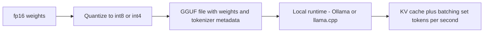

# Module 14 — Local Inference Optimization

> **Depth tags** 🟢 app-level · 🟡 build-one-piece-by-hand · 🔴 from-scratch

Running a model is only half the story. Running it EFFICIENTLY — maximising
tokens per second, minimising time-to-first-token, fitting it in memory — is
what separates a toy demo from a usable system. This module teaches the core
techniques: quantization, KV (Key-Value) caching, batching, and the tradeoffs between
different serving engines.

The default path uses Ollama (already set up from module 00) and hosted APIs (Application Programming Interfaces), so
nothing large downloads unless you explicitly opt in. Optional paths for
llama.cpp and vLLM are documented for each task.

---

## Concepts

The local-inference pipeline in one picture — shrink the weights, package them, then let the runtime's caching and batching set the speed:



### Quantization

Neural network weights are stored as floating-point numbers. The default is
fp32 (32-bit, 4 bytes per weight). Quantization reduces precision to save
memory and speed up computation:

| Format         | Bits/weight | Relative size | Quality loss |
| -------------- | ----------- | ------------- | ------------ |
| fp32           | 32          | 1×            | baseline     |
| fp16 / bf16    | 16          | 0.5×          | negligible   |
| int8           | 8           | 0.25×         | small        |
| int4 (GGUF Q4) | ~4.5        | ~0.14×        | moderate     |
| int2           | 2           | 0.0625×       | significant  |

The key insight: for inference (not training), we can tolerate slightly lower
precision because we're not accumulating gradients. A Q4 model often performs
within 5% of the fp16 model at 1/4 the memory footprint.

**GGUF** is the file format used by llama.cpp. It packages the quantized weights
plus metadata (tokenizer vocabulary, architecture config) into a single portable
file. Ollama uses GGUF under the hood.

### KV cache

During autoregressive generation, the model processes all prior tokens to
predict the next one. Naively this would mean recomputing the key (K) and
value (V) matrices for every past token at every new step — O(n²) work for a
sequence of length n.

The KV cache stores K and V for all past tokens so only the NEW token's K and V
need to be computed at each step. This reduces the cost of each new token from
O(n) to O(1) in the attention layer.

Why context length is quadratic without caching:

```
Without KV cache:  step t costs O(t) attention ops → total O(n²)
With KV cache:     step t costs O(1) new K/V + O(t) attention read → total O(n)
```

The price: KV cache memory grows with sequence length. For a 7B model with
4096-token context, the KV cache can be several GB. This is why long-context
inference is expensive even though the model weights are fixed.

### Throughput vs latency

- **Latency**: time to first token (TTFT) + time per output token (TPOT)
- **Throughput**: tokens per second across ALL concurrent requests

These are in tension:

- A single request gets the lowest latency when it monopolises the GPU.
- Throughput is maximised by **batching**: processing multiple requests at once,
  amortising the fixed cost of loading weights.

Concurrency model: sending N requests at the same time vs sequentially shows
the batching benefit — total time grows much slower than N×single.

### Serving engines

| Engine                | Best for                 | Key feature                           |
| --------------------- | ------------------------ | ------------------------------------- |
| **Ollama**            | Single-user local dev    | One command, cross-platform, GGUF     |
| **llama.cpp**         | Embedded / edge          | Minimal deps, CPU inference           |
| **vLLM**              | High-throughput server   | PagedAttention, OpenAI-compatible API |
| **TGI** (HuggingFace) | HF model hub integration | Streaming, Rust, quantization         |

Rule of thumb: Ollama for local experiments, vLLM for serving at scale.

### Inside a serving engine: continuous batching, PagedAttention, speculative decoding (interview notes)

Three techniques explain most of the gap between "naive transformers loop" and
vLLM-class throughput. LLM-infra interviews expect all three:

**Continuous batching (a.k.a. in-flight batching).** Static batching waits to
assemble a batch, runs it, and returns everything when the _longest_ sequence
finishes — short requests idle behind long ones. Continuous batching schedules at
the **iteration level**: after every decode step, finished sequences leave the
batch and queued requests join immediately. The GPU stays full, TTFT drops, and
throughput rises several-fold on mixed-length traffic. This is the single biggest
win in vLLM/TGI; Task 3's concurrency experiment is the client-visible shadow of it.

**PagedAttention.** The KV cache (Task 5) is the memory hog, and naive engines
allocate each request one contiguous slab sized for its _maximum_ possible length
— most of it wasted internal fragmentation. vLLM applies virtual memory's trick:
the cache is split into fixed-size **blocks (pages)**, a per-request block table
maps logical to physical blocks, blocks are allocated on demand and freed on
completion. Waste falls from ~60–80% to <4%, so far more sequences fit → bigger
effective batches → the throughput continuous batching needs. Bonus: shared
prefixes (same system prompt) can point at the same physical blocks —
copy-on-write prompt caching.

**Speculative decoding.** Decode is memory-bandwidth-bound: each step moves all
the weights to produce _one_ token. Let a small **draft model** propose k tokens
cheaply, then have the target model verify all k **in one parallel forward pass**
— accept the longest prefix the target agrees with (plus one corrected token). A
rejection-sampling rule makes the output distribution **exactly** the target
model's — it's lossless, unlike quantization. Typical 2–3× decode speedup when
the draft's acceptance rate is high; degenerates gracefully when it isn't.
Variants to name-drop: Medusa (extra decoding heads instead of a draft model)
and n-gram/prompt-lookup drafting.

One-liner summary for interviews: continuous batching keeps the GPU busy,
PagedAttention makes the batches big, speculative decoding cuts per-token
latency — and all three compose.

---

## Tasks

### Task 1 🟢 — Run local models and measure tokens/sec

**Goal:** Call models via Ollama, measure tokens per second, and document
the llama.cpp/GGUF + vLLM paths.

**Files:**

- `py/01_run_local.py`
- `ts/01-run-local.ts`

**Steps:**

1. Implement `measure_throughput()` / `measureThroughput()` — call `provider.chat()`
   and measure wall-clock time. Compute tokens/sec from `result.usage.output_tokens`
   divided by elapsed seconds.

2. Implement `run_benchmark()` / `runBenchmark()` — run the same prompt 3 times,
   report min/max/mean tokens/sec.

3. Implement `print_engine_guide()` / `printEngineGuide()` — print a formatted
   table comparing Ollama / llama.cpp / vLLM / TGI use cases.

**Acceptance:**

- The script runs with Ollama and prints tokens/sec.
- The engine guide table prints correctly.
- No errors if Ollama is not running (handle gracefully with try/except).

---

### Task 2 🟡 — Quantization: size vs speed vs quality

**Goal:** Run the same prompt across two quantization levels in Ollama, measure
size/speed/quality differences, and print a comparison table.

**Files:**

- `py/02_quantization.py`
- `ts/02-quantization.ts`

**Steps:**

1. Implement `get_model_info()` / `getModelInfo()` — query the Ollama `/api/show`
   endpoint for a model and extract parameter count and quantization format from
   the response JSON.

2. Implement `run_timed_prompt()` / `runTimedPrompt()` — call a specific model
   via the Ollama API (using an `OpenAICompatibleProvider` with `chat_model`
   overridden, or a raw `openai` SDK call) and return `(text, tokens, elapsed_s)`.

3. Implement `score_quality()` / `scoreQuality()` — ask a judge LLM (Large Language Model) to score the
   two outputs for coherence and factual plausibility (1–5 scale each).

4. Implement `print_comparison_table()` / `printComparisonTable()` — format a
   table with columns: model | quant | size | tokens/sec | quality.

**Models to compare:** `llama3.2` and `llama3.2:1b` (different sizes, not just quant
levels — adjust if you have Q4/Q8 variants of the same model via `ollama pull`).

**Acceptance:**

- The table prints with at least 2 rows (2 different models/quant levels).
- Tokens/sec is measured, not estimated.
- Quality scores are LLM-judge-derived (or clearly marked as manual).

---

### Task 3 🟡 — Throughput vs latency: batching and concurrency

**Goal:** Measure single-request latency and time-to-first-token (TTFT), then
fire N concurrent requests and measure aggregate throughput.

**Files:**

- `py/03_throughput_latency.py`
- `ts/03-throughput-latency.ts`

**Steps:**

1. Implement `measure_ttft()` / `measureTtft()` — use streaming to capture the
   time between sending the request and receiving the FIRST token chunk.
   Use `provider.chat_stream()` / `provider.chatStream()`.

2. Implement `measure_single_request()` / `measureSingleRequest()` — measure
   total latency (TTFT + generation time) and tokens/sec for one request.

3. Implement `measure_concurrent()` / `measureConcurrent()` — fire `n` requests
   concurrently (Python: `asyncio.gather` with `asyncio.to_thread`; TypeScript:
   `Promise.all`). Return total elapsed and aggregate tokens/sec.

4. Implement `print_latency_table()` / `printLatencyTable()` — compare:
   - 1 sequential request
   - N concurrent requests (N = 2, 4, 8)

**Acceptance:**

- TTFT is measured via streaming (not estimated).
- Concurrent requests run in parallel (wall-clock time < N × single-request time).
- A table prints showing latency vs concurrency.

---

### Task 4 🟢 — Serving engines: pick by use case

**Goal:** Understand the tradeoffs between Ollama, llama.cpp, vLLM, and TGI.
Write a `recommend_engine()` function that returns the best engine for a given
use case description.

**Files:**

- `py/04_serving_engines.py`
- `ts/04-serving-engines.ts`

**Steps:**

1. Implement `recommend_engine()` / `recommendEngine()` — given a use-case
   string, return a recommendation dict with keys: `engine`, `reason`, `setup`.
   Use simple keyword matching (no ML needed — this is a rules table).

2. Implement `run_against_engines()` / `runAgainstEngines()` — call the SAME
   prompt against all available engines (Ollama always, others if configured),
   print responses side by side.

3. Implement `print_engine_table()` / `printEngineTable()` — a formatted markdown
   table summarising all four engines.

**Acceptance:**

- `recommend_engine("I need to serve 1000 users concurrently")` returns vLLM.
- `recommend_engine("I want to run a model on my laptop with no setup")` returns Ollama.
- The engine table prints correctly.

---

### Task 5 🔴 — KV cache intuition: cached vs uncached autoregressive loop

**Goal:** Implement a toy autoregressive generation loop (no real model, using a
mock "attention" step) that demonstrates WHY caching K/V matrices avoids
redundant recomputation. Measure the speedup.

**Files:**

- `py/05_kv_cache.py`
- `ts/05-kv-cache.ts`

**The harness is runnable. You implement the TODO sections.**

The toy model:

- Uses a fixed "embedding" (a random vector per token id).
- At each step, "attention" over all past tokens is simulated by computing
  dot products of the new token's query with all past keys.
- Two modes: uncached (recompute ALL keys each step) and cached (store past K,
  only compute new K).

**Steps:**

1. Implement `embed()` / `embed()` — return a random embedding for a token id
   (consistent within one run — use a dict cache keyed on token id).

2. Implement `compute_key()` / `computeKey()` — project an embedding through a
   fixed key projection matrix W_k. Returns the key vector.

3. Implement `attention_uncached()` / `attentionUncached()` — given the full
   token sequence so far, recompute ALL key vectors from scratch, then dot with
   the query. Count total key computations.

4. Implement `attention_cached()` / `attentionCached()` — given the KV cache
   (list of past key vectors), extend with the new token's key, then dot with
   the query. Count only 1 new key computation.

5. Implement `measure_speedup()` / `measureSpeedup()` — generate a 100-token
   sequence twice (uncached and cached), measure wall-clock time, print the
   speedup and total key computations avoided.

**Acceptance:**

- Uncached total key computations = 1 + 2 + 3 + ... + N = N\*(N+1)/2.
- Cached total key computations = N (one per step).
- Cached time is measurably faster for N >= 50 (even with the toy computation).
- Results print in a clear table.

---

### Task 6 🟢 — Routing, fallbacks & load testing

**Goal:** Build a model router that sends easy queries to a cheap/fast model
and hard queries to a stronger one, implement a provider fallback chain that
retries on failure or timeout, and run a small load test to measure throughput,
p50/p95 latency, and error rate.

**Files:**

- `py/06_routing_fallbacks.py`
- `ts/06-routing-fallbacks.ts`

**Steps:**

1. Implement `classify_difficulty()` / `classifyDifficulty()` — heuristic
   keyword-based classifier; rules: hard if contains HARD_KEYWORDS, word count
   > 20, or multiple `?`; easy otherwise.
2. Implement `route()` / `route()` — return a `RoutingDecision` with the chosen
   model (`EASY_MODEL` or `HARD_MODEL`) and a human-readable reason.
3. Implement `with_fallback()` / `withFallback()` — iterate through a list of
   providers, trying each in order with a timeout. Return the first success;
   raise / throw if all fail.
4. Implement `load_test()` / `loadTest()` — fire `n` requests with `concurrency`
   concurrent workers; collect per-request latencies; return a `LoadTestResult`
   with throughput (req/s), p50/p95 latency, and error rate.
5. Run the harness: routing table for 10 sample queries, fallback demo, then
   two load-test runs (concurrency=1 vs concurrency=3).

**Acceptance:**

- `classify_difficulty()` classifies at least 3 of the 4 hard examples in the
  harness as "hard" and at least 4 of the 6 easy examples as "easy".
- `route()` returns `HARD_MODEL` for hard queries and `EASY_MODEL` for easy ones.
- `with_fallback()` succeeds when the first provider works (prints which was used).
- `load_test()` returns a result where `success_count + error_count == n`.
- p50 and p95 latencies are printed; p95 >= p50.

---

## Done when

- [ ] `01_run_local` / `01-run-local` runs against Ollama and prints tokens/sec.
- [ ] `02_quantization` / `02-quantization` prints a quant comparison table with
      measured speed numbers.
- [ ] `03_throughput_latency` / `03-throughput-latency` shows TTFT and concurrent
      throughput higher than sequential.
- [ ] `04_serving_engines` / `04-serving-engines` returns correct recommendations
      and prints the engine table.
- [ ] `05_kv_cache` / `05-kv-cache` passes the computation count check and shows
      a measurable cached speedup.
- [ ] `06_routing_fallbacks` / `06-routing-fallbacks` prints a routing table,
      demonstrates fallback, and shows p50/p95 latency from the load test.
- [ ] You can answer: why does context length affect memory quadratically without KV caching?
- [ ] You can answer: when should you route to a smaller model instead of always
      using the strongest one?

---

## Going deeper

- [llama.cpp](https://github.com/ggerganov/llama.cpp) — the reference CPU-optimised
  LLM inference engine. The GGUF format spec is here.
- [vLLM docs](https://docs.vllm.ai) — PagedAttention and continuous batching
  explained. Dramatically better throughput for multi-user serving.
- [Ollama](https://ollama.com) — the easiest local model runner; uses llama.cpp
  under the hood.
- ["Efficient LLM Inference" survey](https://arxiv.org/abs/2404.14294) — quantization,
  speculative decoding, distillation, all in one paper.
- [FlashAttention](https://arxiv.org/abs/2205.14135) — IO-aware attention that
  avoids materializing the full attention matrix; complementary to KV caching.
- [AWQ quantization](https://arxiv.org/abs/2306.00978) — activation-aware weight
  quantization; better quality at 4-bit than naive rounding.

---

## Environment variables

```bash
# All tasks default to Ollama — no extra keys needed.
LLM_PROVIDER=ollama
OLLAMA_CHAT_MODEL=llama3.2           # default; change to llama3.2:1b for Task 2

# Task 3 concurrent benchmark (optional):
OLLAMA_BASE_URL=http://localhost:11434/v1   # default
```

## Optional extras

```bash
# For llama-cpp-python (local CPU inference without Ollama):
uv sync --extra llama-cpp
# Installs: llama-cpp-python (~200 MB wheel, or builds from source).
# On Mac with Apple Silicon, set: CMAKE_ARGS="-DLLAMA_METAL=on"
# before installing to enable Metal GPU acceleration.

# For vLLM (high-throughput GPU serving — Linux/CUDA only):
# vLLM is NOT available on Mac. Use it on a Linux server with an NVIDIA GPU.
# pip install vllm   (outside uv, system python)
```

---

## 📚 Read more

- [llama.cpp](https://github.com/ggml-org/llama.cpp) — the reference CPU/edge inference engine; the repo also hosts the GGUF format and quantization docs.
- [Ollama docs](https://docs.ollama.com) — the official docs for the runner used throughout this module, including the `/api/show` endpoint from Task 2.
- [vLLM docs](https://docs.vllm.ai) — official docs for the high-throughput serving engine; continuous batching and PagedAttention explained by the people who built them.
- [PagedAttention paper](https://arxiv.org/abs/2309.06180) — Kwon et al., 2023; the virtual-memory trick for the KV cache from the interview-notes section.
- [Karpathy — Neural Networks: Zero to Hero](https://karpathy.ai/zero-to-hero.html) 🎥 — building GPT from scratch makes the KV-cache math in Task 5 obvious.
