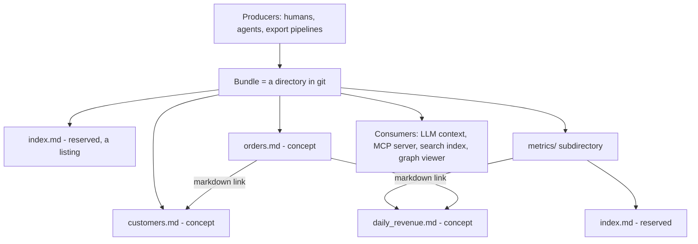

# Module 16b — Knowledge Bundles & the Open Knowledge Format (OKF)

> **Depth tags** 🟢 app-level · 🟡 build-one-piece-by-hand · 🔴 from-scratch

Module 16 treats the context window as a scarce budget and teaches you to spend it
well: count tokens, cache prefixes, compact history, offload tool output. Every one
of those techniques operates on text you are handed. This module is about the step
before: **giving your knowledge a shape that makes budgeting possible in the first
place.**

The **Open Knowledge Format (OKF)** is a vendor-neutral format for representing
knowledge as plain markdown files with YAML frontmatter, published by Google Cloud
alongside its Knowledge Catalog work (spec v0.2:
[`GoogleCloudPlatform/knowledge-catalog`](https://github.com/GoogleCloudPlatform/knowledge-catalog/blob/main/okf/SPEC.md)).
It is deliberately unexciting: a bundle is a directory, a concept is a file, an id
is a path, and a relationship is a markdown link. That plainness is the feature —
there is no SDK between you and the content, so `cat`, `git diff`, Obsidian, a
static file server, and an LLM are all first-class clients.

Why it belongs next to context engineering: the format splits every concept into
**queryable frontmatter** (cheap: type, tags, status, provenance, freshness) and a
**prose body** (expensive: schemas, caveats, examples). That split is what lets you
load a 6-line index instead of a 780-token bundle, gate on trust before you spend a
token on retrieval, and follow one link instead of stuffing the whole corpus into
the prompt.

By the end you will have parsed and validated a bundle without a YAML library,
generated its index and answered questions inside a hard token budget, filtered
concepts on provenance/lifecycle/staleness, walked its link graph to reach a fact no
search could find, produced a conformant bundle with a model, and served the whole
thing to an agent over MCP.

> **Prerequisite:** module 16 (Tasks 1 and 3 — token budgeting and compaction). You
> should already be comfortable with "context is a budget". Module 05's retrieval
> vocabulary helps; module 17 (MCP) helps for Task 6 but is not required.

---

## Concepts

A bundle, and the two things you can do with it:



### 1. A concept is a file; its id is its path

Every `.md` file in a bundle is a **concept**, except two **reserved filenames** —
`index.md` (a directory listing) and `log.md` (a chronological history). A concept's
**id** is its bundle-relative path with `.md` removed:

| file                       | concept id              |
| -------------------------- | ----------------------- |
| `orders.md`                | `orders`                |
| `metrics/daily_revenue.md` | `metrics/daily_revenue` |
| `index.md`                 | — (reserved)            |

Identity being the path has a consequence worth sitting with: **renaming a file
renames the concept**, and every link to it becomes dangling. Git tracks the rename;
your loader has to notice the breakage. Task 4 makes it report instead of crash.

`type` is the **only always-required** frontmatter key. The spec is explicit that a
concept carrying just `type` is fully conformant — `title`, `description`,
`resource`, and `tags` are recommended, everything else is optional. Minimally
opinionated, freely extensible.

### 2. The OKF-lite frontmatter subset (what you parse in Task 1)

Real bundles are YAML and deserve a real parser (`pyyaml`, `js-yaml`). This module's
🔴 lane forbids one, so the shipped bundle sticks to a documented subset that is
small enough to hand-parse and large enough to hold everything the spec's
trust/provenance fields need:

```yaml
type: table # scalar (always a string — no type coercion)
tags: [sales, core] # flow list of strings
generated: # nested map, two-space indent
  by: reference_agent/llama3.2
  at: 2026-06-01T09:00:00Z
sources: # list of maps: `- ` opens an item,
  - resource: warehouse/ddl/orders.sql #   further keys at the same indent
    title: Orders DDL #   belong to that item
```

Two indent levels, no comments, no block scalars, no quoting rules. One trap worth
naming: **values contain colons** (`bigquery://…`, ISO timestamps), so split each
line on its **first** `:` only.

### 3. Progressive disclosure: the index is the cheap surface

The generated `index.md` is one line per concept — title, link, description, tags.
In the shipped bundle that is **80 tokens for the whole bundle**, against **780
tokens** if you dump every body. So the consumption pattern writes itself:

1. Load the index (cheap, always).
2. Rank concepts using **only their index lines** — because in a real bundle the
   bodies are precisely what you have not paid for yet.
3. Spend the remaining budget on the bodies that ranked highest.

This is the same discipline as module 16's token budgeting, except the format did
the hard part: the summary already exists as data, so you are not summarising at
runtime.

Two failure modes to keep in view. **Dumping everything** costs 10× and buries the
answer mid-context ("lost in the middle" — module 16 Task 4). **Greedy filling**
has a subtler bug: when the best concept does not fit, a cheap irrelevant one can
win the leftover space. Task 2's "going deeper" makes you reproduce it.

### 4. Trust is a queryable field, not a vibe

Relevance is not sufficient. A retrieval layer that only asks "does this match?"
will happily cite a deprecated table or a snapshot that expired last quarter. OKF v0.2
puts the signals in frontmatter so the filter is a few lines of code:

| field         | shape                           | what it answers                      |
| ------------- | ------------------------------- | ------------------------------------ |
| `status`      | `draft \| stable \| deprecated` | where in its lifecycle this is       |
| `stale_after` | `YYYY-MM-DD`                    | when the content stops being true    |
| `generated`   | `{ by, at }`                    | who wrote it (agent, human, process) |
| `verified`    | `[{ by, at }, …]`               | who signed it off, and when          |
| `sources`     | `[{ resource, title }, …]`      | what it was derived from             |

Three distinctions the shipped bundle is built to teach:

- **Freshness is a property of the knowledge, not of the file.** `promo_codes.md`
  has a recent mtime and has not changed in months. It is still stale on
  2026-07-01, because `stale_after` says the snapshot only ever described one
  quarter. No filesystem metadata can tell you that.
- **`deprecated` outranks fresh and verified.** `legacy_orders_v1` is signed off and
  has no expiry — and is the wrong answer to every question. A filter that only
  checks dates hands it over.
- **`draft` ≠ untrusted, `verified` ≠ correct.** `revenue_dashboard` is a fresh,
  non-deprecated draft that no human has reviewed. Whether that disqualifies it
  depends on the question, which is why Task 3's filter takes a flag rather than
  hard-coding a policy.

And the operational rule: **every drop carries a reason naming the field that fired**.
A filter that silently returns fewer results is indistinguishable from a broken one.

The actor convention for `generated.by` / `verified[].by`: `<producer>/<version>` for
agents (`reference_agent/gemini-2.5-pro`), `human:<id>` for people, `process:<id>` for
automation.

### 5. The bundle is graph-shaped, not just tree-shaped

The directory hierarchy is one view. The **links between concepts are the real
structure**: a link from A to B asserts a relationship, and the _kind_ of
relationship (joins-with, derived-from, supersedes) lives in the surrounding prose,
not in the link. Two link-target forms resolve to a concept id:

| form            | target in the markdown | resolved from                       | id            |
| --------------- | ---------------------- | ----------------------------------- | ------------- |
| bundle-relative | `/orders.md`           | the bundle root                     | `orders`      |
| relative        | `./promo_codes.md`     | the linking concept's own directory | `promo_codes` |

Prefer bundle-relative: it is the only form that survives a file being moved into a
subdirectory.

Why this matters for retrieval: index-line search has a blind spot no amount of
ranker tuning fixes. If a concept's title, description, and tags share no words with
the question, it is unreachable — even when the answer is in its body. The shipped
bundle plants exactly that case (Task 4), and **one hop along the links** finds it.
That is GraphRAG's core move (module [05b](../05b-advanced-rag/README.md)) with the
graph already written down for you instead of extracted by an LLM.

When expanding, treat a link as **undirected**: `orders` never links to
`promo_codes`, but `promo_codes` links to `orders`, and that is exactly as much of a
relationship from the other side.

### 6. Producing OKF, and serving it

**Producing.** Anyone can write OKF — a human, an export pipeline from Dataplex or
Collibra, or an agent walking a database. The division of labour that keeps generated
knowledge trustworthy: the **model writes prose** (title, description, tags), the
**code writes structure and provenance** (`type`, `resource`, `generated.by`,
`generated.at`). Never let a model invent the provenance of its own output. And
because serialising frontmatter is the exact inverse of parsing it, the honest test
is a **round trip**: parse what you rendered and compare it to what you meant.

**Serving.** Because a bundle is files, an MCP server over it is three tools —
`list_concepts` (cheap), `read_concept` (expensive), `search_concepts` (line-level
hits). That is the same shape Google's reference implementation exposes over a
markdown knowledge base (`list_contents` / `read_file` / `search_content`). Served,
progressive disclosure becomes the **client's** decision: the agent lists, decides,
and reads only what it needs. Compare module 16's tool-output offloading — a cheap
reference now, the full text only on demand.

---

## Tasks

Lanes: 🟢 use/compose it · 🟡 use it + hand-build a piece · 🔴 build the machinery.

Tasks 2–6 **build on Task 1** (they load your parser by path, so do Task 1 first).
Everything except the real-provider path of Task 5 and the live server of Task 6
runs **offline and deterministically** against the checked-in bundle in
[`bundle/`](bundle/index.md).

### Task 1 🔴 — Parse and validate a bundle (no YAML library)

**Goal:** turn a directory of markdown into a list of validated concepts, using your
own OKF-lite frontmatter parser.

**Files:** [`py/01_parse_bundle.py`](py/01_parse_bundle.py) ·
[`ts/01-parse-bundle.ts`](ts/01-parse-bundle.ts)

**Steps:**

1. Implement `parse_frontmatter` / `parseFrontmatter` — split the `---` fences, parse
   the four OKF-lite shapes (scalar, flow list, nested map, list of maps), return
   `(meta, body)`. Raise/throw on a missing or unterminated fence.
2. Implement `concept_id` / `conceptId` — bundle-relative posix path, minus `.md`.
3. Implement `load_bundle` / `loadBundle` — walk `*.md` recursively, **skip
   `index.md` and `log.md` at every level**, parse each survivor.
4. Implement `validate` — required `type`, unique ids, one actionable message each.

**Acceptance:**

- Exactly 6 concepts load, ids sorted: `customers`, `legacy_orders_v1`,
  `metrics/daily_revenue`, `orders`, `promo_codes`, `revenue_dashboard`.
- Both reserved `index.md` files (root and `metrics/`) are skipped.
- `orders` parses all four shapes: `tags` is a 2-item list, `generated.by` is
  `reference_agent/llama3.2`, `sources` is 2 maps with `resource` + `title`,
  `verified[0].by` is `human:learner`.
- The body starts at `# Orders` and contains no frontmatter.
- The three broken fixtures are rejected cleanly (fence errors raise; the typeless
  document is reported by `validate`).

---

### Task 2 🟡 — Progressive disclosure under a token budget

**Goal:** generate the index, then answer three questions inside a 250-token budget
by disclosing only the bodies you need.

**Files:** [`py/02_progressive_disclosure.py`](py/02_progressive_disclosure.py) ·
[`ts/02-progressive-disclosure.ts`](ts/02-progressive-disclosure.ts)

**Steps:**

1. Implement `index_line` / `indexLine` — title, bundle-relative link, description,
   tags. This is the whole cheap surface, so it has to be enough to decide on.
2. Implement `build_index` / `buildIndex` — id-sorted, deterministic.
3. Implement `rank_by_index` / `rankByIndex` — score concepts against the question
   using **only their index lines** (provided bag-of-words cosine).
4. Implement `disclose` — index always in and charged; positive scores only; add
   bodies best-first while they fit; never exceed the budget.

**Acceptance:**

- The index is 80 tokens against 780 for the whole bundle (under a fifth).
- All three disclosed contexts fit in 250 tokens, and each contains the one concept
  that answers its question (`orders`, `promo_codes`, `metrics/daily_revenue`).
- The index is present and first in every assembled context.
- Index lines carry frontmatter only — the needle fact from a body never leaks in.

**Going deeper:** drop `BUDGET` to 200 and re-run. The best concept (139 tokens) no
longer fits beside the index, and a cheaper, worse-matching one takes the space.
Decide whether your `disclose` should skip-and-continue or stop at the first miss,
and write down why.

---

### Task 3 🟡 — Trust: provenance, status, and staleness

**Goal:** gate the same bundle on lifecycle, freshness, and verification, and cite
what survives.

**Files:** [`py/03_trust_gating.py`](py/03_trust_gating.py) ·
[`ts/03-trust-gating.ts`](ts/03-trust-gating.ts)

**Steps:**

1. Implement `is_stale` / `isStale` — compare `stale_after` to a passed-in `now` as
   dates. No expiry declared means never stale. (Never read the clock — the checks
   pin two different "nows".)
2. Implement `trust_filter` / `trustFilter` — rules in order: `deprecated`, then
   stale, then (optionally) unverified. Every drop gets a reason naming the field.
3. Implement `provenance` — a one-line citation: id, type, status, who generated it,
   who verified it (or that nobody did).

**Acceptance:**

- At `2026-07-01` with verification required, the trusted set is exactly
  `customers`, `metrics/daily_revenue`, `orders`.
- The other three drop for the right reason: `legacy_orders_v1` on `status`,
  `promo_codes` on `stale_after`, `revenue_dashboard` on `verified`.
- Relaxing the flag re-admits the unverified draft, and only that.
- At `2026-05-01` — same files, earlier "now" — the promo snapshot is fresh again and
  only the deprecated concept drops.
- The citation for `orders` names both `reference_agent/llama3.2` and `human:learner`.

---

### Task 4 🔴 — The link graph and 1-hop expansion

**Goal:** build the adjacency by hand and reach a fact that index search cannot find.

**Files:** [`py/04_link_graph.py`](py/04_link_graph.py) ·
[`ts/04-link-graph.ts`](ts/04-link-graph.ts)

**Steps:**

1. Implement `extract_links` / `extractLinks` — markdown links only, both accepted
   forms resolved to ids, external/anchor/non-`.md` targets skipped.
2. Implement `build_graph` / `buildGraph` — out-edge adjacency (every concept keyed,
   even with no links) plus the list of **dangling** links.
3. Implement `neighbours` — out-links ∪ in-links.
4. Implement `expand` — breadth-first to `hops`, never re-expanding a concept.

**Acceptance:**

- The adjacency matches the bundle exactly, including
  `revenue_dashboard -> [metrics/daily_revenue, promo_codes]` (which exercises the
  relative `./` form) and `metrics/daily_revenue -> [orders, promo_codes]` (the
  bundle-relative `/` form from inside a subdirectory).
- The one dangling link (`revenue_dashboard -> warehouse/missing`) is reported, not
  crashed on.
- Index search for _"Why did order volume jump on 2026-05-17?"_ seeds
  `[orders, legacy_orders_v1]` and the needle (`412,900`) is **absent** from that
  context; after one hop it is **present**.
- The expanded set is exactly the seeds' neighbourhood (5 of 6 concepts —
  `revenue_dashboard` stays out), and `promo_codes` is reached purely via an in-link.
- A 2-hop walk from `revenue_dashboard` reaches exactly one more concept than 1 hop.

**Going deeper:** compose Tasks 3 and 4 — gate for trust first, then expand. Note
that `legacy_orders_v1`, one of the two seeds, is deprecated: the order in which you
compose relevance, trust, and expansion changes the answer.

---

### Task 5 🟢 — Produce a bundle with a model

**Goal:** emit conformant OKF from raw table dumps, and make your generator check its
own output.

**Files:** [`py/05_produce_bundle.py`](py/05_produce_bundle.py) ·
[`ts/05-produce-bundle.ts`](ts/05-produce-bundle.ts)

Runs offline with `--stub` (a deterministic fake model); without the flag it goes
through `get_provider()` / `getProvider()` like every other module.

**Steps:**

1. Implement `describe_concept` / `describeConcept` — prompt the model for **prose
   only** (`title`, `description`, `tags`) as one JSON object; parse and reject
   anything malformed.
2. Implement `render_frontmatter` / `renderFrontmatter` — the inverse of Task 1 for
   the three value shapes, key order preserved.
3. Implement `conformance_check` / `conformanceCheck` — must parse, must have `type`,
   must carry `generated.by` + `generated.at`, must have a non-empty body. Returns
   messages, never raises.

**Acceptance (`--stub`):**

- Three concepts plus a generated `index.md` are written to `out/` (`out-ts/` for
  TypeScript), both gitignored.
- Every document **round-trips**: parsing what you rendered returns the metadata you
  meant, exactly.
- Every document passes its own conformance check, and the written directory re-loads
  as a valid 3-concept bundle.
- `generated.by` / `generated.at` come from the code (fixed constants), not the model.
- The model's prose reached the frontmatter.
- A document missing `type` and one missing `generated` are both caught.

---

### Task 6 🟢 — Serve the bundle over MCP

**Goal:** expose the bundle to any agent as three tools, and get them right offline
first.

**Files:** [`py/06_okf_mcp_server.py`](py/06_okf_mcp_server.py) ·
[`ts/06-okf-mcp-server.ts`](ts/06-okf-mcp-server.ts)

**Steps:**

1. Implement `list_concepts` / `listConcepts` — ids only, optional prefix. Cheap.
2. Implement `read_concept` / `readConcept` — the file **verbatim**, fences included.
   Unknown id → an error naming it; an id escaping the bundle root → refused.
3. Implement `search_concepts` / `searchConcepts` — case-insensitive line hits
   `{id, line, text}`, 1-based line numbers within the **body**, capped by `max_hits`.
4. Wire the three into an MCP server over stdio (`build_server` + `serve` in Python,
   `serve` in TypeScript). Write tool descriptions that say which call is cheap and
   which is expensive — they are the only documentation the model gets.
5. Point a client at it. For Claude Code, add to `.mcp.json` in the repo root:

   ```json
   {
     "mcpServers": {
       "okf-bundle": {
         "command": "uv",
         "args": [
           "run",
           "python",
           "modules/16b-knowledge-bundles/py/06_okf_mcp_server.py"
         ]
       }
     }
   }
   ```

**Acceptance (`--selftest`, offline):**

- `list_concepts()` returns all 6 ids sorted; `list_concepts("metrics/")` returns
  just the nested one.
- `read_concept("orders")` returns the document verbatim (starts with `---`, contains
  `type: table` and `# Orders`).
- An unknown id errors with the id in the message; `../../../etc/passwd` is refused.
- `search("412,900")` returns exactly one hit: `metrics/daily_revenue`, body line 7.
- `search("settlement")` returns 4 hits across 2 concepts; `max_hits` caps the set; a
  miss returns an empty list.
- Then: a real MCP client lists the three tools and calls them.

---

## Done when

- [ ] Task 1: 6 concepts load with the expected ids, all four frontmatter shapes
      parse, reserved files are skipped, and the three broken fixtures are rejected.
- [ ] Task 2: index 80 tokens vs 780 for the bundle; all three questions answered
      inside 250 tokens with the right concept disclosed.
- [ ] Task 3: the trusted set at `2026-07-01` is the expected three, each drop names
      its deciding field, and moving "now" earlier changes the outcome.
- [ ] Task 4: the adjacency and the dangling link match exactly; the needle is absent
      from the seed context and present after one hop.
- [ ] Task 5: three concepts plus an index written, every document round-trips and
      self-checks, provenance stamped by code, and both broken documents caught.
- [ ] Task 6: the offline self-test passes, and a real MCP client can list and call
      the three tools.
- [ ] You can explain why `type` is the only required key, why freshness lives in
      frontmatter rather than the filesystem, and why one hop over links beats a
      better ranker for the Task 4 question.

Each file prints its own **Acceptance** checklist at the end — every box should read
`[x]` and the file should say "All acceptance checks passed."

---

## Environment

No new dependencies for Tasks 1–5: the frontmatter parser is hand-written (that is
the 🔴 constraint) and token counts use a whitespace approximation so runs are
deterministic offline. Task 6 needs the MCP SDK.

**Python:**

```bash
uv run python modules/16b-knowledge-bundles/py/01_parse_bundle.py
uv run python modules/16b-knowledge-bundles/py/05_produce_bundle.py --stub   # offline
uv run python modules/16b-knowledge-bundles/py/05_produce_bundle.py          # real provider
uv run python modules/16b-knowledge-bundles/py/06_okf_mcp_server.py --selftest
uv sync --extra mcp   # then run 06 without --selftest to start the server
```

**TypeScript:** build the core once, then run with `tsx`:

```bash
pnpm build:core
pnpm tsx modules/16b-knowledge-bundles/ts/01-parse-bundle.ts
pnpm tsx modules/16b-knowledge-bundles/ts/05-produce-bundle.ts --stub
pnpm tsx modules/16b-knowledge-bundles/ts/06-okf-mcp-server.ts --selftest
```

Tasks 2–6 load Task 1 by path (Python) or import it (TypeScript), so **implement
Task 1 first** — otherwise you will see its `NotImplementedError` / TODO error.

Generated output goes to `out/` (Python) and `out-ts/` (TypeScript) inside this
module; both are gitignored and rewritten on every run.

> **Note (TypeScript real path):** as in modules 06c/06d, `ChatFn` is kept
> **synchronous** so the generator stays readable, while `provider.chat()` is
> `async`. The `--stub` path is fully synchronous and is the offline check; to run
> Task 5 against a real model, make `describeConcept` `async` and
> `await provider.chat(messages)`. Python's `provider.chat` is synchronous, so its
> real path works as-is — expect to harden the JSON parsing against a chattier model.

---

## Governance & data lifecycle

A bundle is a durable, human-readable store of knowledge derived from real systems,
so it carries the same obligations as any other data store — plus one of its own:
`generated` / `verified` make **authorship auditable**, which is exactly the evidence
an accountability review asks for. If a bundle describes personal data, the concept
files are in scope for the data map, and `stale_after` is a retention signal, not
just a quality one. Fill in the module 20b templates:

- [`DATA_INVENTORY.md`](../20b-governance-privacy/templates/DATA_INVENTORY.md) — list
  the bundle with its owner and purpose.
- [`RETENTION_SCHEDULE.md`](../20b-governance-privacy/templates/RETENTION_SCHEDULE.md)
  — map `stale_after` to a review or deletion path.

See **[module 20b](../20b-governance-privacy/README.md)** for the full workflow.

---

## Going deeper

- **OKF v0.2 specification** —
  <https://github.com/GoogleCloudPlatform/knowledge-catalog/blob/main/okf/SPEC.md> —
  the full key list (including attested-computation concepts), the reserved-filename
  rules, and the actor convention.
- **The `okf/` reference bundles** —
  <https://github.com/GoogleCloudPlatform/knowledge-catalog/tree/main/okf/bundles> —
  four real generated bundles (GA4, Stack Overflow, Bitcoin, Acme Retail) with an
  HTML graph viewer. Read one before you design your own.
- **Module [16](../16-context-engineering/README.md)** — the token-budget discipline
  in full; Task 6's tool-output offloading is the same "reference now, retrieve on
  demand" move this module applies to knowledge.
- **Module [05b](../05b-advanced-rag/README.md)** — GraphRAG, where the graph is
  extracted by an LLM instead of being written down; compare the cost.
- **Module [11](../11-document-ingestion/README.md)** — the messy front end: what it
  takes to get real documents into a shape worth publishing as a bundle.
- **Module [17](../17-mcp/README.md)** — MCP transports, clients, and tool discovery
  in depth.
- **Module [06d](../06d-agent-memory/README.md)** — semantic memory with relevance
  thresholds and TTL; a bundle is the durable, reviewable version of the same store.

---

## 📚 Read more

- **Open Knowledge Format spec (v0.2)** — <https://github.com/GoogleCloudPlatform/knowledge-catalog/blob/main/okf/SPEC.md> — required vs recommended keys, provenance/trust families, bundle layout, link semantics.
- **Knowledge Catalog repo** — <https://github.com/GoogleCloudPlatform/knowledge-catalog> — the reference producer agent, the graph visualizer, and the `metadata as code` toolbox (a YAML-based sibling format worth contrasting with OKF).
- **Anthropic — Effective context engineering for AI agents** — <https://www.anthropic.com/engineering/effective-context-engineering-for-ai-agents> — progressive disclosure and just-in-time retrieval as first principles, which is why the index/body split matters.
- **Anthropic — Contextual Retrieval** — <https://www.anthropic.com/news/contextual-retrieval> — what a chunk needs around it to be retrievable; frontmatter is a hand-written version of the same idea.
- **Model Context Protocol docs** — <https://modelcontextprotocol.io> — the tool/resource model behind Task 6.
- **Frictionless Data & the Open Definition (Open Knowledge Foundation)** — <https://frictionlessdata.io> — the older "data package" tradition of describing data with plain declarative files; useful contrast with OKF's markdown-plus-prose bet.
