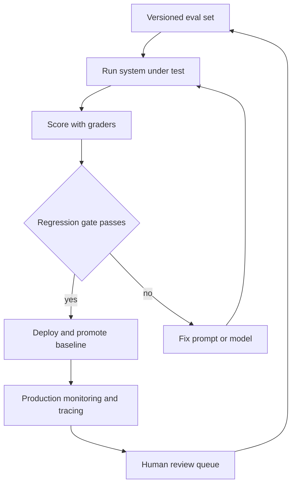

# Module 21 — LLMOps & Eval

> **Depth tags** 🟢 app-level · 🟡 build-one-piece-by-hand

Module 07 gave you the first eval harness and an observability logger. This
module zooms out to the **full eval lifecycle** that a production team runs:
versioned datasets, multi-variant experiments, a regression gate that blocks
bad deploys in CI (Continuous Integration), a human review queue, and a rolling production monitor.

Each piece is independent: do them in order or jump to the part you need.

---

## Concepts

The lifecycle in one picture: a versioned dataset feeds eval runs, scores gate
deploys, and production traces plus human labels flow back into the dataset.



### The eval lifecycle

```
New prompt/model idea
        │
        ▼
1. Run it against the versioned eval set  (task 1)
        │
        ▼
2. Compare it to the current baseline     (task 2 — experiments)
        │
        ├── better?  → promote to baseline, merge into eval set
        │
        └── worse?   → reject; CI gate catches it if it slips (task 3)
                               │
                               ▼
                 3. Low-confidence cases → human review queue (task 4)
                               │
                               ▼
                 4. Human labels feed back into eval set (task 4 --merge)
                               │
                               ▼
                 5. Production logs monitored for drift (task 5)
```

### Why version the eval set?

An eval set you can change at will is not an eval set — it's a scratchpad. Pin
it in git. Use a version field (`"version": "1.0.0"`). When you add new cases
(e.g., from the human review queue), bump the patch. Any run file records which
eval version it was scored against, so you can always reproduce results.

### Grader spectrum

| Grader       | Speed   | Cost         | When to use                    |
| ------------ | ------- | ------------ | ------------------------------ |
| Exact match  | instant | free         | Structured outputs, codes, IDs |
| Contains     | instant | free         | Key terms that must appear     |
| LLM-as-judge | seconds | ~$0.001/case | Open-ended generation, nuance  |

Use all three layers: exact for what you can, LLM (Large Language Model) for the rest. The LLM judge
score also gives you a confidence signal for the human review queue (task 4).

### Regression gates in CI

A gate is just a script that exits non-zero when a metric drops below a
threshold. GitHub Actions treats a non-zero exit as a build failure — nothing
else is needed. The same script runs identically as a Husky pre-push hook so
engineers catch regressions before pushing.

**Key threshold to set:** faithfulness (LLM-judge score on held-out RAG (Retrieval-Augmented Generation) cases).
A drop in faithfulness usually means a prompt change made the model ignore
context and start hallucinating.

### Human review + feedback loops

LLM judges are good but not perfect. For low-confidence outputs (judge score
below ~0.75), queue them for a human. Once a human labels an output as correct,
it becomes a new golden example in the eval set. This is the flywheel: more
production traffic → more labels → better eval set → better measurements.

### Production monitoring

Monitoring is different from eval: eval measures _quality_; monitoring measures
_health_. Track:

- **Latency** (p50, p95) — p95 spikes mean tail-latency problems.
- **Error rate** — sudden jumps mean provider outages or context-overflow bugs.
- **Cost** — unexpectedly expensive calls mean prompt bloat or model mis-config.
- **Token usage** — creeping input token counts signal context accumulation bugs.

The JSONL (JSON Lines) log format from module 07 task 2 feeds directly into task 5's monitor.

### Drift: why a model that passed eval degrades anyway (interview notes)

"Model performance dropped in production but you changed nothing — what
happened?" is a standard MLOps interview probe. The vocabulary:

- **Data drift (covariate shift)** — the input distribution `P(x)` moves: new
  topics, new user segments, a new document format in the RAG corpus. The model
  is unchanged but increasingly answers out-of-distribution questions.
- **Concept drift** — the input→output relationship `P(y|x)` moves: the correct
  answer changed (pricing, policies, APIs) while the corpus or model stayed
  frozen. Stale RAG corpora are concept drift you built yourself.
- **Upstream/model drift (LLM-specific)** — a hosted provider silently updates
  the model behind an alias like `-latest`, or a prompt/tool change shifts
  behaviour. Same eval set, different model → different outputs.

Detection is distribution comparison between a reference window (what the eval
set represents) and a live window:

- **Numeric signals** (latency, token counts, confidence/judge scores): compare
  histograms — PSI (Population Stability Index) or a KS test; PSI > 0.2 is the
  conventional "investigate" threshold.
- **Text inputs**: embed both windows (module 04) and compare — centroid cosine
  distance or the share of live queries whose nearest reference neighbour is
  below a similarity floor. Rising distance = users asking things your eval set
  never covered.
- **Outputs**: track judge-score and refusal-rate trends over time (task 5's
  report is the natural home); a step change without a deploy is upstream drift.

Response playbook: data drift → sample the new inputs into the eval set (task 4's
feedback loop) and re-tune retrieval; concept drift → refresh the corpus /
re-label; upstream drift → pin model versions and re-run the regression gate
(task 3) on every pin bump.

---

## Setup

```bash
# Python (no extra deps beyond the base install):
uv sync

# TypeScript:
pnpm install
```

**New env vars:** none beyond what module 07 uses (`LLM_PROVIDER`, provider keys).

**Files produced at runtime** (gitignore-safe):

| File                                             | Created by    |
| ------------------------------------------------ | ------------- |
| `modules/21-llmops-eval/results/run_*.json`      | Tasks 1 & 2   |
| `modules/21-llmops-eval/data/review_queue.jsonl` | Task 4        |
| `modules/21-llmops-eval/data/demo-calls.jsonl`   | Task 5 --demo |

---

## Tasks

### Task 1 — Versioned eval set + graders 🟢

**Goal:** Load a versioned eval dataset, run a RAG-style system under test,
score each case with three grader types, and write a results file.

**Steps (Python):**

1. Open `py/01_versioned_eval.py`.
2. Implement `load_eval_set` (TODO 1) — parse `data/eval_set_v1.json`.
3. Implement `run_system` (TODO 2) — call the LLM with a context-stuffed prompt.
4. Implement the three graders: `grade_exact`, `grade_contains`, `grade_llm_judge` (TODOs 3a–3e).
5. Implement `run_eval` (TODO 4) and `write_results` (TODO 5).
6. Run: `uv run python modules/21-llmops-eval/py/01_versioned_eval.py`

**Steps (TypeScript):**

1. Open `ts/01-versioned-eval.ts`. Follow the same TODO structure.
2. Run: `pnpm tsx modules/21-llmops-eval/ts/01-versioned-eval.ts`

**Acceptance:**

- All 5 eval cases run and produce scores from at least two grader types.
- A `results/run_<timestamp>.json` file is created.
- Changing the system prompt in `run_system` changes the scores.

---

### Task 2 — Experiments 🟡

**Goal:** Run the same eval across prompt variants, store runs with metadata,
compare two runs, and pick a winner with numbers.

**Steps (Python):**

1. Open `py/02_experiments.py`.
2. Implement `load_eval_set` (TODO 1).
3. Implement `run_one` (TODO 2) — format prompt template + call provider.
4. Implement `quick_score` (TODO 3) — fast contains-based grader.
5. Implement `run_experiment` (TODO 4) — loop over cases, build ExperimentRun.
6. Implement `save_run` (TODO 5) and `compare_runs` (TODO 6).
7. Run with different prompt versions, then compare:
   ```bash
   uv run python modules/21-llmops-eval/py/02_experiments.py --prompt-version v1
   uv run python modules/21-llmops-eval/py/02_experiments.py --prompt-version v2
   uv run python modules/21-llmops-eval/py/02_experiments.py \
       --compare results/run_<v1>.json results/run_<v2>.json
   ```

**Steps (TypeScript):**

1. Open `ts/02-experiments.ts`. Follow the same TODO structure.
2. Run: `pnpm tsx modules/21-llmops-eval/ts/02-experiments.ts --prompt-version v1`

**Acceptance:**

- Two runs with different `--prompt-version` produce different avg_scores.
- `--compare` prints a table and names a winner.
- Each run file records model, prompt version, and timestamp.

---

### Task 3 — Regression gate in CI 🟡

**Goal:** A script that fails with exit code 1 if a key metric drops below a
threshold, suitable for CI and pre-push hooks.

**Steps (Python):**

1. Open `py/03_regression_gate.py`.
2. Implement `load_results` (TODO 1), `extract_metric` (TODO 2).
3. Implement `run_fresh_eval` (TODO 3) — a quick eval with faithfulness scoring.
4. Implement `check_gate` (TODO 4) — prints pass/fail and returns bool.
5. Test the gate:
   ```bash
   # Should pass:
   uv run python modules/21-llmops-eval/py/03_regression_gate.py \
       --results results/<run>.json --metric avg_score --threshold 0.1
   # Should fail:
   uv run python modules/21-llmops-eval/py/03_regression_gate.py \
       --results results/<run>.json --metric avg_score --threshold 0.99
   echo "Exit code: $?"
   ```

**Steps (TypeScript):**

1. Open `ts/03-regression-gate.ts`. Follow the same TODO structure.
2. Run: `pnpm tsx modules/21-llmops-eval/ts/03-regression-gate.ts --run-fresh --threshold 0.1`

**GitHub Actions:** Review `eval-gate.yml` in this module directory. Copy it
to `.github/workflows/` and add your provider API (Application Programming Interface) key as a GitHub Actions
secret to activate the gate in CI.

**Husky pre-push hook:** Add to `.husky/pre-push`:

```bash
uv run python modules/21-llmops-eval/py/03_regression_gate.py \
    --run-fresh --metric avg_score --threshold 0.60
```

**Acceptance:**

- Exit code 0 when threshold is easily met; exit code 1 when threshold is
  impossibly high.
- `--run-fresh` runs an eval and checks faithfulness without requiring a
  pre-built results file.

---

### Task 4 — Human review + feedback loop 🟡

**Goal:** Route low-confidence outputs to a review queue, label them
interactively, and fold approved labels back into the eval set.

**Steps (Python):**

1. Open `py/04_human_review.py`.
2. Implement `judge_output` (TODO 1) — LLM-as-judge returning (score, reason).
3. Implement `run_and_queue` (TODO 2) — collect items below CONFIDENCE_THRESHOLD.
4. Implement `write_queue` (TODO 3) — append to JSONL.
5. Implement `label_queue_interactive` (TODO 4) — CLI (Command-Line Interface) labelling loop.
6. Implement `merge_labels_into_eval_set` (TODO 5) — promote approved outputs.
7. Run the demo: `uv run python modules/21-llmops-eval/py/04_human_review.py --demo`

**Steps (TypeScript):**

1. Open `ts/04-human-review.ts`. Follow the same TODO structure.
2. Run: `pnpm tsx modules/21-llmops-eval/ts/04-human-review.ts --demo`

**Acceptance:**

- `data/review_queue.jsonl` is created with at least one entry.
- After labelling, `--merge` bumps the eval set version and adds new cases.
- Re-running task 1 picks up the new cases.

---

### Task 5 — Production monitoring 🟢

**Goal:** Parse JSONL logs from module 07, compute p50/p95 latency, error rate,
and cost, check alert thresholds, and print a report.

**Steps (Python):**

1. Open `py/05_production_monitoring.py`.
2. Implement `parse_log` (TODO 1) — read JSONL; map to LogEntry.
3. Implement `percentile` (TODO 2) — linear interpolation.
4. Implement `build_report` (TODO 3) and `check_alerts` (TODO 4).
5. Implement `print_report` (TODO 5) and `generate_demo_log` (TODO 6).
6. Run:

   ```bash
   # With module 07 log:
   uv run python modules/21-llmops-eval/py/05_production_monitoring.py \
       --log-file modules/07-advanced-production/llm-calls.jsonl

   # Demo mode (no module 07 needed):
   uv run python modules/21-llmops-eval/py/05_production_monitoring.py --demo
   ```

**Steps (TypeScript):**

1. Open `ts/05-production-monitoring.ts`. Follow the same TODO structure.
2. Run: `pnpm tsx modules/21-llmops-eval/ts/05-production-monitoring.ts --demo`

**Acceptance:**

- Report prints latency (p50/p95), error rate, token totals, and cost.
- Any metric exceeding a threshold shows an `[ALERT]` line.
- `--watch` mode re-reads the log every N seconds without crashing.

---

## Done when

- [ ] Task 1: eval set loaded; all 5 cases scored; results file written.
- [ ] Task 2: two prompt-version runs compared; a winner is declared with numbers.
- [ ] Task 3: `--threshold 0.99` exits non-zero; `--threshold 0.01` exits zero.
- [ ] Task 4: review queue written; label → merge bumps eval set version.
- [ ] Task 5: demo log parsed; report printed with latency stats and alerts.

---

## Going deeper

- **Langfuse**: open-source eval + observability platform with a UI (User Interface) for human
  review, datasets, and score dashboards. Everything in this module maps directly
  to Langfuse concepts (datasets = eval sets, traces = log entries, scores =
  grader results, human annotations = task 4 labels).
- **Semantic versioning for evals**: treat your eval set like a library.
  Breaking changes (removing cases, changing rubrics) warrant a major bump.
  New cases are patches. Downstream consumers pin to `v1.x` to avoid surprises.
- **Multi-judge consensus**: run two different LLMs as judge and flag cases
  where they disagree (score delta > 2) as "uncertain" → human queue.
- **Online evals**: evaluate every production call in real time using a fast
  judge model, feeding alerts when quality drops below baseline. Adds latency
  (~1 s extra) but gives you a live quality signal.
- **Prompt regression testing with `git bisect`**: tag eval results in git
  alongside the prompt files that produced them; `git bisect` can find the
  commit that broke faithfulness.

---

## 📚 Read more

- [Hamel Husain — Your AI product needs evals](https://hamel.dev/blog/posts/evals/) — the widely cited practitioner's guide to eval systems that actually improve a product, not just decorate a dashboard.
- [OpenAI evals guide](https://platform.openai.com/docs/guides/evals) — official patterns for designing graders and running evals against hosted models.
- [Langfuse docs](https://langfuse.com/docs) — open-source tracing, datasets, scores, and human annotation; every concept in this module has a direct Langfuse counterpart.
- [Chip Huyen's blog](https://huyenchip.com/blog/) — essays on ML/LLM system design, monitoring, and the data-drift thinking behind task 5.
