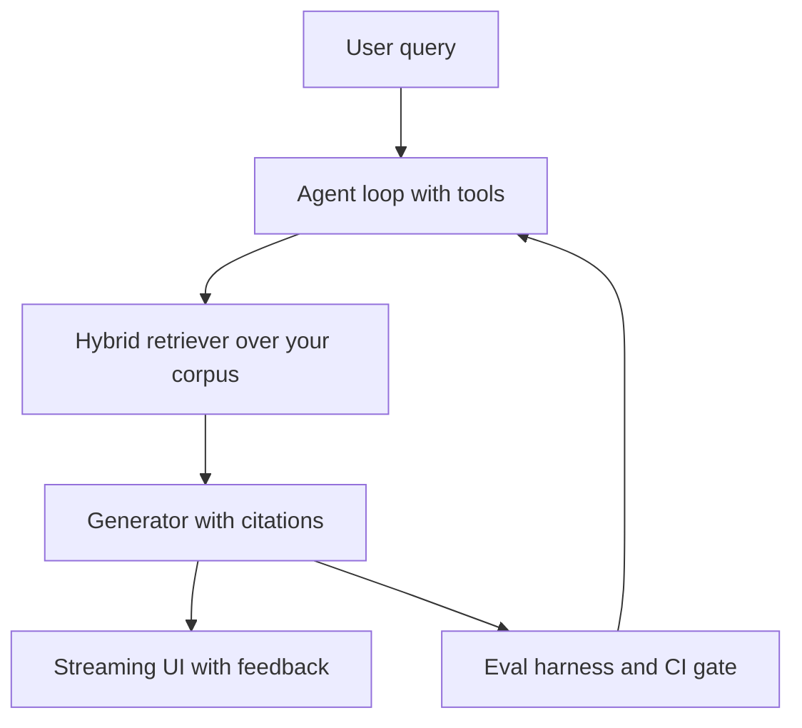

# Module 23 — Capstone

You have the building blocks. Now you assemble them.

The capstone is an open-ended build. There is no scaffold to fill in, no TODOs
to complete — only a brief, a milestone plan, and an honest rubric. The goal is
to ship something you would actually want to use, and to trace every design
decision back to what you learned.

Study `projects/news-agent` first. It is a complete, end-to-end example that
combines modules 02, 04, 05, and 06 into a running application. Read every file
before you write a line of your own.

Whichever track you pick, the shape is the same: an agent loop over a retrieval
pipeline, wrapped in evals and a served interface.



---

## Choose your track

Pick one of the three options below. If you have a different idea that covers at
least four of the six rubric dimensions, describe it in a one-paragraph pitch and
proceed.

---

### Option A (recommended) — Documentation / Q&A assistant

Build a system that lets a user ask questions over a corpus of their choice
(documentation, research papers, a book, a codebase) and get grounded,
cited answers from an agent that can also call tools.

**Required capabilities**

| Capability                                                                                      | Modules it draws on |
| ----------------------------------------------------------------------------------------------- | ------------------- |
| Ingest a corpus: parse formats, clean, chunk, embed, index                                      | 04, 11              |
| Retrieve and rerank relevant passages (hybrid + cross-encoder)                                  | 04, 05              |
| Generate answers with inline citations                                                          | 05                  |
| Agent loop: the LLM (Large Language Model) can request more context, call a tool, or answer     | 06, 17              |
| At least one tool (e.g. search, calculator, date lookup, SQL (Structured Query Language) query) | 02, 06, 12          |
| Eval harness: automated tests of retrieval and faithfulness, eval gate                          | 07, 21              |
| A served interface with streaming + citations UI                                                | 07, 22              |
| Security: prompt-injection guards, approval gate for side-effecting tools                       | 20                  |
| Cost and latency tracking per request                                                           | 07, 21              |
| Delivery: deployment, identity, tenant isolation, and rollback runbook                          | 07b                 |
| Governance: data map, retention decision, model/data card, and user recourse                    | 20b                 |
| Release evidence: held-out gold passages and deterministic agent-safety tests                   | 21b                 |

**Architecture**

```
                      User query
                          │
                          ▼
              ┌───────────────────────┐
              │      Agent loop       │
              │  (ReAct or native     │
              │   tool calling / MCP) │
              └──────────┬────────────┘
                         │ retrieve(query, k=8)
                         ▼
              ┌───────────────────────┐
              │    Retriever          │
              │  dense (embeddings)   │
              │  + BM25 hybrid        │
              │  + cross-encoder      │
              │    rerank             │
              └──────────┬────────────┘
                         │ top-k passages + metadata
                         ▼
              ┌───────────────────────┐
              │    Generator          │
              │  system prompt +      │
              │  passages + question  │
              │  → answer + citations │
              └──────────┬────────────┘
                         │
              ┌──────────┴────────────┐
              │    Eval harness       │
              │  LLM-as-judge:        │
              │  faithfulness,        │
              │  answer relevance,    │
              │  citation coverage    │
              └───────────────────────┘

  Ingest path (offline):
  corpus files → parser (11) → cleaner (11) → chunker (04/11)
              → embed() → vector store (Chroma or Qdrant)
```

**Milestone plan**

| Milestone                                                                                 | What you deliver                                                                                                                                                                                                                                                            | Done when                                                                                                                       |
| ----------------------------------------------------------------------------------------- | --------------------------------------------------------------------------------------------------------------------------------------------------------------------------------------------------------------------------------------------------------------------------- | ------------------------------------------------------------------------------------------------------------------------------- |
| M1 — Ingest                                                                               | Parse real document formats (PDF, HTML, Markdown via module 11), clean, chunk by structure, embed, and index into Chroma or Qdrant. Query via CLI.                                                                                                                          | Top-3 passages for 5 hand-crafted questions are all on-topic.                                                                   |
| M2 — Hybrid retrieve + rerank                                                             | Add BM25 (Best Matching 25) alongside dense retrieval, fuse with RRF (Reciprocal Rank Fusion), and optionally add a cross-encoder reranker. Compare before/after.                                                                                                           | Hybrid beats dense-only MRR@5 (Mean Reciprocal Rank) on your 5 questions.                                                       |
| M3 — Generator with citations                                                             | Wrap retriever + LLM into a single Q&A function. The answer includes inline `[Source N]` references mapped to passage URLs or page numbers.                                                                                                                                 | 5/5 answers include at least one valid citation; none contradict the passages.                                                  |
| M4 — Agent + tools                                                                        | Promote the generator into an agent loop. Add at least one tool (web search, calculator, SQL query, or domain-specific lookup). The agent can multi-hop: retrieve → observe → retrieve again if needed. Optionally wire tools via MCP (Model Context Protocol) (module 17). | Agent correctly answers a 2-hop question that requires two retrieval steps.                                                     |
| M5 — Eval harness + served API (Application Programming Interface) + UX (User Experience) | Write an automated eval set (≥ 20 QA pairs). Score faithfulness and answer relevance using LLM-as-judge; add an eval gate (module 21). Serve the agent with streaming + citations UI (User Interface) (module 22). Add injection guards (module 20).                        | Eval script prints pass rate ≥ 70 %; API returns `{answer, citations, latency_ms}`; streaming UI renders tokens live.           |
| M6 — Accountable release                                                                  | Containerise and deploy through staging; apply auth/tenant filtering, retention decisions, gold-evidence evals, and deterministic agent-safety tests (modules 07b, 20b, 21b).                                                                                               | Release runbook, data map, model/data card, and rollback threshold are reviewed; held-out evidence and agent-policy suite pass. |

**Stretch goals**

- Implement incremental indexing with content-hash manifest (module 11) so only changed docs are re-embedded.
- Add context-window budget management and prompt caching (module 16).
- Add a reasoning model path for hard multi-hop questions (module 15).
- Wire tools through an MCP server you build (module 17).
- Add speaker diarisation if your corpus includes audio/video transcripts (module 19).
- Run the eval across two providers and compare faithfulness scores.
- Add red-team tests (module 20) to the CI (Continuous Integration) eval gate.
- Add deployment staging, rollback, and tenant-boundary checks (module 07b).
- Add a data map, retention decision, and model/data card (module 20b).
- Add held-out retrieval evidence and deterministic agent-trajectory tests
  (module 21b).
- Build a lightweight streaming chat UI (module 22 pattern).

---

### Option B — Research / news agent

Build an agent that, given a research question, autonomously plans a retrieval
strategy, fetches content from multiple sources, synthesises a report, and
evaluates the quality of its own output.

**Required capabilities:** planning, web/RSS (Really Simple Syndication) retrieval (real or mocked), multi-step
agent loop (module 06), modern agent APIs or MCP (module 17), synthesis with source
attribution (module 05), document ingestion if processing large fetched content
(module 11), an eval harness with regression gate (modules 07, 21), and a
scheduler or CLI trigger.

**Architecture sketch**

```
  User prompt ("Research X")
        │
        ▼
  Planner agent ──► subtask list (JSON)
        │
        ├─► Worker A: fetch + summarise source 1
        ├─► Worker B: fetch + summarise source 2
        └─► Worker C: ...          (run in parallel)
              │
              ▼
  Synthesiser agent ──► final report + citations
              │
              ▼
  Eval agent (LLM-as-judge) ──► factuality / coverage scores
              │
              ▼
  Regression gate (module 21) ──► CI check
```

Note: `projects/news-agent` is a working implementation of a simpler version of
this pattern. Study it, then extend or rebuild it with evaluation, security, and
improved UX.

**Stretch goals:** Telegram delivery, scheduled runs, a comparison mode that
runs the same question against two providers and diffs the reports, security
hardening (module 20) for untrusted web content.

---

### Option C — Multimodal assistant

Build an assistant that combines vision (module 09), audio (module 19 optional),
document ingestion (module 11), embeddings (module 04), and a conversational
agent (module 06) to answer questions about a mixed-modality corpus.

**Required capabilities:** document parsing and image captioning via multimodal
LLM (modules 09, 11), embedding captions/text for retrieval (module 04), a RAG (Retrieval-Augmented Generation)
pipeline over mixed modalities (module 05), an agent loop with tools (module 06),
security hardening (module 20), and an eval harness (modules 07, 21).

**Architecture sketch**

```
  Image + doc corpus
        │
        ▼ parse (module 11) + caption (module 09 multimodal LLM)
  Text captions + metadata
        │
        ▼ embed → vector store
  Query ──► retrieve captions ──► fetch image(s) ──► LLM answer + citations
```

**Stretch goals:** CLIP (Contrastive Language-Image Pre-training)-based zero-shot image search (module 09), audio
transcription of video content (module 19), approval gate for actions (modules
18/20), streaming + citations UI (module 22).

---

## Self-evaluation rubric

Score yourself honestly after M5 (or after your final build). Use the
checklist as a study guide if a score is low.

| Dimension             | 1 — Not yet                   | 2 — Partial              | 3 — Solid                                | 4 — Strong                                              |
| --------------------- | ----------------------------- | ------------------------ | ---------------------------------------- | ------------------------------------------------------- |
| **Retrieval quality** | Results are off-topic         | Top-3 sometimes on-topic | MRR@5 > 0.5 on your eval set             | Hybrid + rerank clearly beats dense-only                |
| **Faithfulness**      | Answers contradict passages   | Some hallucination       | LLM-judge faithfulness > 70 %            | No contradictions; every claim traceable to a source    |
| **Agent reliability** | Agent loops or fails silently | Answers simple questions | Handles 2-hop and tool-use questions     | Correct answer rate > 80 % on eval set                  |
| **Cost / latency**    | No tracking                   | Tokens logged            | p95 latency < 5 s; cost per query logged | Cost/latency tradeoff documented; cheap path works      |
| **Code quality**      | Monolithic script             | Basic modules            | Typed, tested, readable                  | Covered by an automated test suite; CI eval gate passes |
| **Tests / eval**      | None                          | Manual checks            | Eval set ≥ 20 QA pairs; score printed    | Eval is repeatable, versioned, and tracked over time    |

Total out of 24. A score of ≥ 15 with no 1s is a solid capstone.

---

## Where to look for prior art

- `projects/news-agent/` — end-to-end applied example (retrieve → curate → post)
- `modules/04-embeddings-vectors/` — vector store, chunking, hybrid search
- `modules/05-rag/` — retrieve → rerank → generate pipeline
- `modules/06-agents/` — ReAct (Reasoning and Acting) loop, native tool calling, multi-agent
- `modules/07-advanced-production/` — eval harness, LLM-as-judge, cost tracking, serving
- `modules/11-document-ingestion/` — parse PDF/HTML/Markdown, clean, structure-aware chunking
- `modules/12-text-to-sql/` — NL (Natural Language)→SQL if your corpus includes structured data
- `modules/16-context-engineering/` — token budgeting, prompt caching, conversation compaction
- `modules/17-mcp/` — MCP server for tools; Responses API
- `modules/20-ai-security/` — injection guards, red-team harness, approval gates
- `modules/21-llmops-eval/` — versioned eval, experiments, CI regression gate
- `modules/22-ai-product-ux/` — streaming SSE (Server-Sent Events), citations UI, feedback capture, approval flow
- `projects/tutor/` — lightweight RAG + LLM-as-judge in production

---

## Done when

- [ ] You have a runnable application that covers at least four rubric dimensions.
- [ ] An automated eval script prints a score without manual intervention.
- [ ] The application uses `get_provider()` / `getProvider()` — no hardcoded vendors.
- [ ] You can swap providers by changing one env var and the app still runs.
- [ ] Your self-evaluation rubric is filled in with honest scores (target ≥ 15/24).
- [ ] The README in your `py/` or `ts/` folder documents how to run the project.

---

## 📚 Read more

- [Anthropic research](https://www.anthropic.com/research) — see "Building Effective Agents" for hard-won guidance on when simple workflows beat autonomous agents; read it before designing M4.
- [Hamel Husain — Your AI product needs evals](https://hamel.dev/blog/posts/evals/) — how to make the M5 eval harness genuinely useful rather than ceremonial.
- [OWASP Top 10 for LLM Applications](https://owasp.org/www-project-top-10-for-large-language-model-applications/) — the security checklist to run your capstone against before calling it done.
- [Langfuse docs](https://langfuse.com/docs) — free, self-hostable tracing and eval dashboards for the cost/latency and eval rubric rows.
